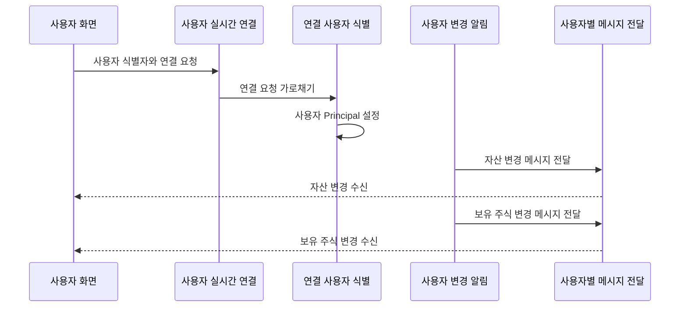

# 사용자 실시간 알림

## 문서 포털

문서의 상세 구현, API, 아키텍처, 트러블슈팅은 아래 문서를 참고하세요.

| 분류 | 문서 | 분류 | 문서 |
| --- | --- | --- | --- |
| 루트 README | [README](../../../README.md) | 서비스 README | [README](../README.md) |
| Engineering Notes | [Engineering Notes](../../../docs/ENGINEERING.md) | Database Schema ERD | [Database Schema ERD](../../../docs/database-schema.md) |
| 01 | [개요](01-overview.md) | 02 | [인증/JWT](02-auth-jwt.md) |
| 03 | [회원가입/프로필](03-user-register-profile.md) | 04 | [자산/주문 검증](04-user-asset-order-validation.md) |
| 05 | [Kafka 정산](05-settlement-kafka.md) | 06 | [관심종목](06-watchlist.md) |
| 07 | [실시간 연결](07-websocket.md) | 08 | [도메인 모델](08-domain-model.md) |
| 09 | [보안 설정](09-security-config.md) | 10 | [user-service 이슈](10-user-service-issues.md) |

## 목차

> [개요](#개요) ·
> [STOMP 설정](#stomp-설정) ·
> [Principal 설정](#principal-설정)

> [전송 큐](#전송-큐) ·
> [전송 시점](#전송-시점) ·
> [실시간 알림 흐름](#실시간-알림-흐름) ·
> [핵심 구현 파일](#핵심-구현-파일)
## 개요

user-service는 STOMP over SockJS 방식으로 사용자별 자산과 보유 주식 변경을 전송한다. WebSocket endpoint는 `/ws-user`이며, 메시지는 Spring의 user destination을 사용해 특정 사용자 큐로 전송된다.

## STOMP 설정

`WebSocketConfig` 설정:

- endpoint: `/ws-user`
- SockJS 사용
- simple broker prefix: `/queue`
- application destination prefix: `/app`
- user destination prefix: `/user`
- heartbeat: 10초 송신/수신

## Principal 설정

`configureClientInboundChannel()`에서 STOMP `CONNECT` 메시지를 가로챈다. CONNECT native header의 `userId` 값을 읽고, 값이 있으면 `StompPrincipal(userId)`를 설정한다.

## 전송 큐

`UserWebsocketService`는 `SimpMessagingTemplate.convertAndSendToUser()`를 사용한다.

| 메서드 | Queue | Payload |
| --- | --- | --- |
| `sendUserAsset(user)` | `/user/queue/asset` | 총 보유 자산(`asset`), 주문 가능 현금(`availableAsset`) |
| `sendUserStock(userId, hs, stockCode)` | `/user/queue/havestock` | 종목 코드(`stockCode`), 보유 주식 ID(`id`), 보유 수량(`quantity`), 주문 가능 수량(`availableQuantity`), 평균 매입가(`averagePrice`) |

보유 주식이 없거나 수량이 0 이하이면 보유 수량(`quantity`), 주문 가능 수량(`availableQuantity`), 평균 매입가(`averagePrice`)를 0으로 보낸다.

## 전송 시점

자산 알림은 다음 처리 후 전송된다.

- 매수 주문 검증 후 주문 가능 현금(`availableAsset`) 차감
- 주문 정정 검증 후 예약 금액/수량 조정
- 주문 취소 후 예약 금액/수량 복구
- Kafka 정산 후 실제 자산 변경

보유 주식 알림은 Kafka 정산 후 사용자별로 전송된다.

## 실시간 알림 흐름

## 핵심 구현 파일

기준 경로

`StockBackEndDistributed/user-service/src/main/java/Poi/Stock`

| 파일 |
| --- |
| `config/WebSocketConfig.java` |
| `config/StompPrincipal.java` |
| `features/UserWebsocket/UserWebsocketService.java` |
| `features/User/UserAssetService.java` |

[문서 맨 위로](#top)

