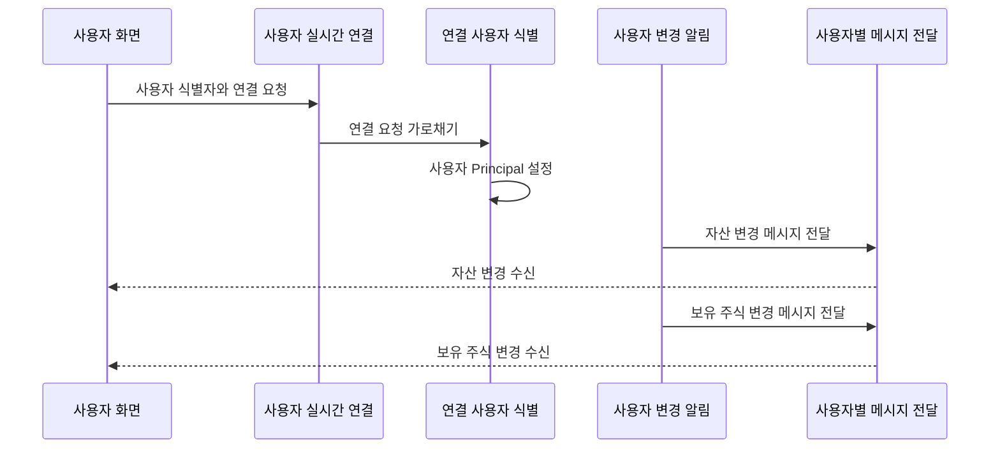

<a id="top"></a>

# 사용자 실시간 알림

## 문서 포털

문서의 상세 구현, API, 아키텍처, 트러블슈팅은 아래 문서를 참고하세요.

| 분류 | 문서 | 분류 | 문서 |
| --- | --- | --- | --- |
| 주식 README | [README](../../../README.md) | 사용자 서비스 README | [README](../README.md) |
| 설계 노트 | [Engineering Notes](../../../docs/ENGINEERING.md) | 데이터베이스 ERD | [Database Schema ERD](../../../docs/database-schema.md) |
| 개요 | [개요](01-overview.md) | 인증/JWT | [인증/JWT](02-auth-jwt.md) |
| 회원가입/프로필 | [회원가입/프로필](03-user-register-profile.md) | 자산/주문 검증 | [자산/주문 검증](04-user-asset-order-validation.md) |
| Kafka 정산 | [Kafka 정산](05-settlement-kafka.md) | 관심종목 | [관심종목](06-watchlist.md) |
| 실시간 연결 | [실시간 연결](07-websocket.md) | 도메인 모델 | [도메인 모델](08-domain-model.md) |
| 보안 설정 | [보안 설정](09-security-config.md) | 유저 서비스 이슈 | [user-service 이슈](10-user-service-issues.md) |

## 목차

> [개요](#개요) ·
> [실시간 연결 설정](#실시간-연결-설정) ·
> [Principal 설정](#principal-설정)

> [전송 큐](#전송-큐) ·
> [전송 시점](#전송-시점) ·
> [실시간 알림 흐름](#실시간-알림-흐름) ·
> [핵심 구현 파일](#핵심-구현-파일)
## 개요

사용자 실시간 알림은 로그인한 사용자에게 자산과 보유 주식 변경 사항을 즉시 전달합니다.

클라이언트는 사용자 연결용 WebSocket endpoint(`/ws-user`)에 접속하고 전용 Queue를 구독해 변경 이벤트를 수신합니다. 이 연결과 메시지 전달은 SockJS, STOMP와 Spring User Destination으로 구현합니다.


## 실시간 연결 설정

클라이언트 연결과 사용자별 메시지 전달에 필요한 주소 체계와 heartbeat를 설정합니다. 이 설정은 `WebSocketConfig`에서 관리합니다.

- 사용자 WebSocket 연결 endpoint: `/ws-user`
- SockJS 사용
- 서버가 클라이언트에 메시지를 전달하는 simple broker prefix: `/queue`
- 클라이언트가 서버 기능을 호출할 때 사용하는 application destination prefix: `/app`
- 사용자별 메시지를 분리하는 user destination prefix: `/user`
- heartbeat: 10초 송신/수신

### 동작 순서

1. `/queue`, `/app`, `/user` prefix를 역할별로 분리합니다.
2. 단순 브로커에 10초 heartbeat를 설정해 연결 단절을 감지합니다.
3. `/ws-user` endpoint에 SockJS fallback을 적용합니다.

### 핵심 코드

#### 메시지 브로커와 Heartbeat

```java
public void configureMessageBroker(MessageBrokerRegistry config) {
    ThreadPoolTaskScheduler scheduler = new ThreadPoolTaskScheduler();
    scheduler.setPoolSize(1);
    scheduler.setThreadNamePrefix("wss-heartbeat-thread-");
    scheduler.initialize();

    config.enableSimpleBroker("/queue")
            .setHeartbeatValue(new long[] { 10000, 10000 })
            .setTaskScheduler(scheduler);
    config.setApplicationDestinationPrefixes("/app");
    config.setUserDestinationPrefix("/user");
}
```

#### 연결 Endpoint

```java
public void registerStompEndpoints(StompEndpointRegistry registry) {
    registry.addEndpoint("/ws-user")
            .setAllowedOriginPatterns("*")
            .withSockJS();
}
```

브로커 prefix를 송신 방향과 사용자별 수신 방향으로 분리해 해당하는 유저에게 전달합니다. 연결 endpoint와 heartbeat 설정은 브라우저 호환성을 확보하고 끊어진 연결을 서버가 계속 유지하는 문제를 줄입니다.

### 구현 위치

- 메시지 브로커와 heartbeat: `config/WebSocketConfig.java`의 `configureMessageBroker()`
- 연결 endpoint: `config/WebSocketConfig.java`의 `registerStompEndpoints()`

## Principal 설정

`configureClientInboundChannel()`에서 STOMP `CONNECT` 메시지를 가로챕니다. CONNECT native header의 `userId` 값을 읽고, 값이 있으면 `StompPrincipal(userId)`를 설정합니다.

### 동작 순서

1. STOMP `CONNECT` 메시지만 식별합니다.
2. native header의 `userId`를 연결의 Principal로 변환합니다.
3. 이후 사용자별 Queue 전송에서 같은 식별자를 목적지 해석에 사용합니다.

### 핵심 코드

```java
public Message<?> preSend(Message<?> message, MessageChannel channel) {
    StompHeaderAccessor accessor =
            MessageHeaderAccessor.getAccessor(message, StompHeaderAccessor.class);
    if (accessor != null && StompCommand.CONNECT.equals(accessor.getCommand())) {
        String userId = accessor.getFirstNativeHeader("userId");
        if (userId != null) {
            accessor.setUser(new StompPrincipal(userId));
        }
    }
    return message;
}
```

HTTP 세션을 사용하지 않는 연결에서도 사용자별 목적지를 계산하려면 STOMP 연결에 식별 정보가 필요합니다. 이 코드는 `userId` header를 Principal로 변환하며, 변환된 값은 `convertAndSendToUser()`가 개인 Queue를 선택할 때 사용됩니다.

### 구현 위치

- STOMP 사용자 식별: `config/WebSocketConfig.java`의 `configureClientInboundChannel()`

## 전송 큐

`UserWebsocketService`는 `SimpMessagingTemplate.convertAndSendToUser()`를 사용합니다.

| 메서드 | 전송 역할 | WebSocket Queue | Payload |
| --- | --- | --- | --- |
| `sendUserAsset(user)` | 사용자 자산 변경 전송 | `/user/queue/asset` | 총 보유 자산(`asset`), 주문 가능 현금(`availableAsset`) |
| `sendUserStock(userId, hs, stockCode)` | 사용자 보유 종목 변경 전송 | `/user/queue/havestock` | 종목 코드(`stockCode`), 보유 주식 ID(`id`), 보유 수량(`quantity`), 주문 가능 수량(`availableQuantity`), 평균 매입가(`averagePrice`) |

보유 주식이 없거나 수량이 0 이하이면 보유 수량(`quantity`), 주문 가능 수량(`availableQuantity`), 평균 매입가(`averagePrice`)를 0으로 보냅니다.

### 동작 순서

1. 변경된 사용자 자산에서 화면에 필요한 필드만 payload로 구성합니다.
2. 사용자 ID를 기준으로 개인 목적지를 선택합니다.
3. `/queue/asset` 구독자에게 최신 자산을 전달합니다.

### 핵심 코드

```java
public void sendUserAsset(StockUser user) {
    Map<String, Object> payload = new HashMap<>();
    payload.put("asset", user.getAsset());
    payload.put("availableAsset", user.getAvailableAsset());

    log.info("자산 전송 userId={}, asset={}", user.getId(), user.getAsset());
    messagingTemplate.convertAndSendToUser(
            user.getId(), "/queue/asset", payload);
}
```

화면 갱신에 필요한 자산 필드만 전송하기 위한 로직입니다. 개인 Queue에 payload를 전달하며, 결과는 해당 사용자의 자산 화면에 반영됩니다.

### 구현 위치

- 사용자별 자산 전송: `features/UserWebsocket/UserWebsocketService.java`의 `sendUserAsset()`

## 전송 시점

자산 알림은 다음 처리 후 전송됩니다.

- 매수 주문 검증 후 주문 가능 현금(`availableAsset`) 차감
- 주문 정정 검증 후 예약 금액/수량 조정
- 주문 취소 후 예약 금액/수량 복구
- Kafka 정산 후 실제 자산 변경

보유 주식 알림은 Kafka 정산 후 사용자별로 전송됩니다.

### 동작 순서

1. 정산 결과에서 사용자와 종목의 최신 보유 주식을 다시 조회합니다.
2. 자산 변경 메시지를 먼저 전송합니다.
3. 보유 주식 변경 메시지를 같은 사용자에게 전송합니다.

### 핵심 코드

```java
public void sendUpdates(SettlementEvent event,
        Map<String, StockUser> userMap,
        Map<String, HaveStock> haveStockMap) {
    for (haveStockChange change : event.getStockChanges()) {
        StockUser user = userMap.get(change.getUserId());
        if (user != null)
            userWebsocketService.sendUserAsset(user);

        HaveStock hs = haveStockMap.get(change.getUserId());
        userWebsocketService.sendUserStock(
                change.getUserId(), hs, event.getStockCode());
    }
}
```

정산 트랜잭션이 만든 최신 상태를 기준으로 두 알림의 시점을 맞추기 위한 로직입니다. 정산 이벤트와 변경된 객체 Map을 입력받아 자산과 보유 주식 Queue에 차례로 반영합니다.

### 구현 위치

- 정산 후 실시간 갱신: `features/User/UserAssetService.java`의 `sendUpdates()`

## 실시간 알림 흐름



## 핵심 구현 파일

기준 경로

`StockBackEndDistributed/user-service/src/main/java/Poi/Stock`

| 파일 |
| --- |
| `config/WebSocketConfig.java` |
| `config/StompPrincipal.java` |
| `features/UserWebsocket/UserWebsocketService.java` |
| `features/User/UserAssetService.java` |

<div align="right">

[문서 맨 위로](#top)

</div>


