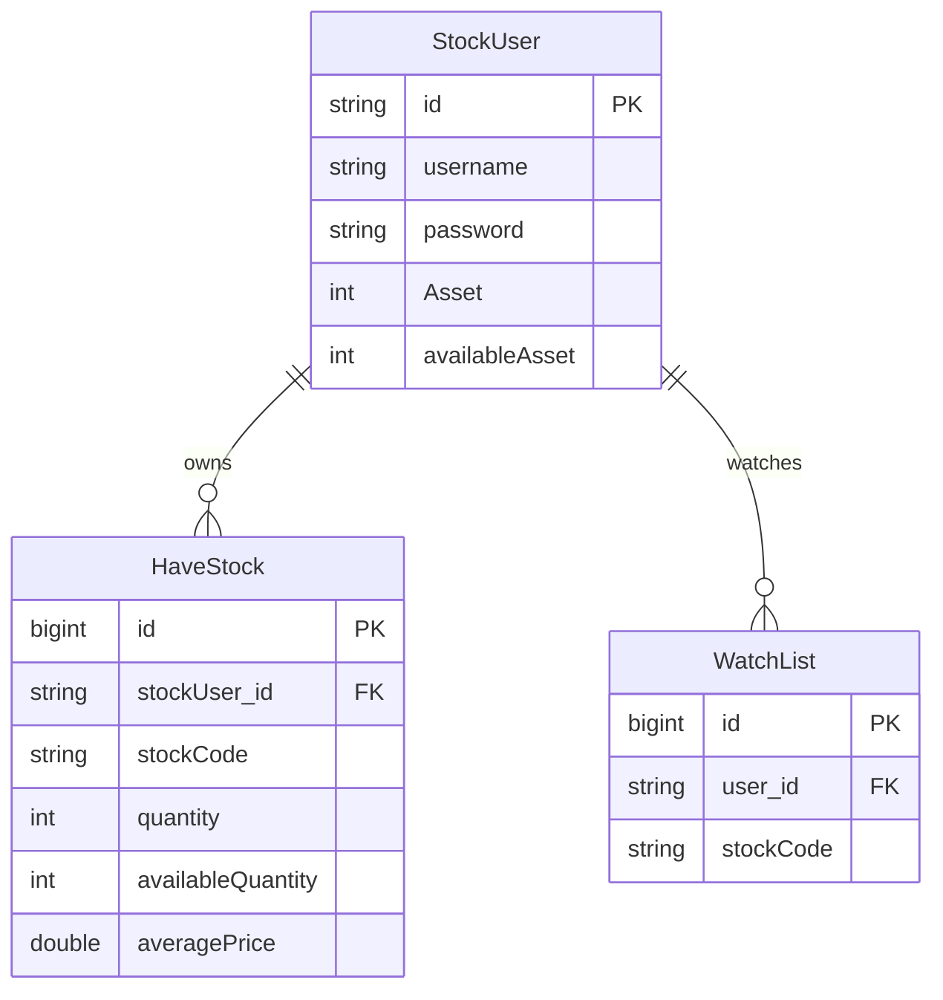

# 도메인 모델

## 문서 포털

문서의 상세 구현, API, 아키텍처, 트러블슈팅은 아래 문서를 참고하세요.

| 분류 | 문서 | 분류 | 문서 |
| --- | --- | --- | --- |
| 주식 README | [README](../../../README.md) | 사용자 서비스 README | [README](../README.md) |
| 설계 노트 | [Engineering Notes](../../../docs/ENGINEERING.md) | 데이터베이스 ERD | [Database Schema ERD](../../../docs/database-schema.md) |
| 개요 | [개요](01-overview.md) | 인증/JWT | [인증/JWT](02-auth-jwt.md) |
| 회원가입/프로필 | [회원가입/프로필](03-user-register-profile.md) | 자산/주문 검증 | [자산/주문 검증](04-user-asset-order-validation.md) |
| Kafka 정산 | [Kafka 정산](05-settlement-kafka.md) | 관심종목 | [관심종목](06-watchlist.md) |
| 실시간 연결 | [실시간 연결](07-websocket.md) | 도메인 모델 | [도메인 모델](08-domain-model.md) |
| 보안 설정 | [보안 설정](09-security-config.md) | 유저 서비스 이슈 | [user-service 이슈](10-user-service-issues.md) |

## 목차

> [개요](#개요) ·
> [StockUser](#stockuser) ·
> [HaveStock](#havestock)

> [WatchList](#watchlist) ·
> [데이터 구조](#데이터-구조) ·
> [테이블 비교](#테이블-비교) ·
> [조회 저장소](#조회-저장소) ·
> [DTO와 이벤트](#dto와-이벤트) ·
> [핵심 구현 파일](#핵심-구현-파일)
## 개요

user-service의 핵심 도메인은 사용자, 보유 주식, 관심종목입니다. 사용자 자산은 총 보유 자산(`Asset`)과 주문 가능 현금(`availableAsset`)으로 분리하고, 보유 주식은 보유 수량(`quantity`)과 주문 가능 수량(`availableQuantity`)으로 분리합니다.

## 데이터 구조

사용자 한 명은 여러 보유 주식과 관심종목을 가질 수 있습니다. `HaveStock.stockUser_id`와 `WatchList.user_id`는 모두 `StockUser.id`를 참조하며, 코드에 별도 인덱스나 유니크 제약은 선언되어 있지 않습니다.

## 테이블 비교

| 구분 | 테이블 | PK | 사용자 FK | 주요 데이터 |
| --- | --- | --- | --- | --- |
| 사용자 | `StockUser` | 문자열 `id` | 없음 | 이름, 비밀번호, 총자산, 주문 가능 현금 |
| 보유 주식 | `HaveStock` | 자동 증가 `id` | `stockUser_id` | 종목 코드, 보유·주문 가능 수량, 평균 매입가 |
| 관심종목 | `WatchList` | 자동 증가 `id` | `user_id` | 종목 코드 |

### 구현 위치

- 사용자 엔티티: `features/User/StockUser.java`
- 보유 주식 엔티티: `features/User/HaveStock.java`
- 관심종목 엔티티: `features/WatchList/WatchList.java`

## StockUser

사용자 인증 정보와 자산을 저장합니다. `holdings`와 `watchLists`는 컬럼이 아니라 하위 엔티티를 조회하기 위한 1:N 컬렉션입니다.

## HaveStock

사용자별 종목 보유 수량과 주문 가능 수량, 평균 매입가를 저장합니다.

`updateAveragePrice()` (추가 매수 체결을 평균 매입가와 보유 수량에 반영하는 기능)는 추가 매수 수량과 가격을 기준으로 평균 매입가(`averagePrice`)를 갱신하고 보유 수량(`quantity`)을 증가시킵니다.

## WatchList

사용자가 선택한 관심 종목 코드를 저장합니다. 사용자 참조는 `user_id` FK로 연결됩니다.

## 조회 저장소

### StockUserRepository

`JpaRepository<StockUser, String>`을 상속합니다. 사용자 ID가 primary key다.

### HaveStockRepository

주요 메서드:

- `findByStockUserAndStockCode(stockUser, stockCode)`
- `findByStockUser(stockUser)`
- `findByStockCode(stockCode)`
- `findByUserIdsAndStockCode(userIds, stockCode)`

### WatchListRepository

주요 메서드:

- `deleteByStockUserIdAndStockCode(userId, stockCode)`
- `findByStockUserId(userId)`
- `existsByStockUserIdAndStockCode(userId, stockCode)`

## DTO와 이벤트

| 클래스 | 용도 |
| --- | --- |
| `ApiResponse` | 공통 API 응답 wrapper |
| `LoginDTO` | 로그인 요청 |
| `UserRegisterDto` | 회원가입 요청 |
| `ProfileDTO` | 프로필 응답 |
| `getHaveStockDTO` | 보유 주식 응답 |
| `SettlementEvent` | Kafka 정산 이벤트 |

`getAssetDTO`도 존재하지만 현재 컨트롤러 흐름에서 직접 사용되는 코드는 확인되지 않습니다.

## 핵심 구현 파일

기준 경로

`StockBackEndDistributed/user-service/src/main/java/Poi/Stock`

| 파일 |
| --- |
| `features/User/StockUser.java` |
| `features/User/HaveStock.java` |
| `features/WatchList/WatchList.java` |
| `repository/StockUserRepository.java` |
| `repository/HaveStockRepository.java` |
| `repository/WatchListRepository.java` |
| `DTO/user/ApiResponse.java` |
| `DTO/user/LoginDTO.java` |
| `DTO/user/UserRegisterDto.java` |
| `DTO/user/ProfileDTO.java` |
| `DTO/user/getHaveStockDTO.java` |
| `object/SettlementEvent.java` |
| `util/EnumUtil.java` |

[문서 맨 위로](#top)

