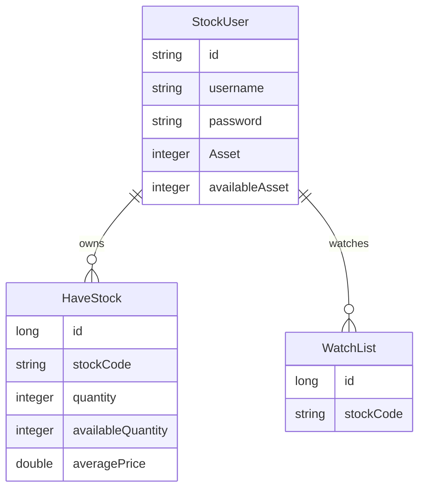

# 도메인 모델

## 문서 포털

문서의 상세 구현, API, 아키텍처, 트러블슈팅은 아래 문서를 참고하세요.

| 분류 | 문서 | 분류 | 문서 |
| --- | --- | --- | --- |
| 루트 README | [README](../../../README.md) | 서비스 README | [README](../README.md) |
| Engineering Notes | [Engineering Notes](../../../docs/ENGINEERING.md) | Database Schema ERD | [Database Schema ERD](../../../docs/database-schema.md) |
| 01 | [개요](01-overview.md) | 02 | [인증/JWT](02-auth-jwt.md) |
| 03 | [회원가입/프로필](03-user-register-profile.md) | 04 | [자산/주문 검증](04-user-asset-order-validation.md) |
| 05 | [Kafka 정산](05-settlement-kafka.md) | 06 | [관심종목](06-watchlist.md) |
| 07 | [실시간 연결](07-websocket.md) | 08 | [도메인 모델](08-domain-model.md) |
| 09 | [보안 설정](09-security-config.md) | 10 | [user-service 이슈](10-user-service-issues.md) |

## 목차

> [개요](#개요) ·
> [StockUser](#stockuser) ·
> [HaveStock](#havestock)

> [WatchList](#watchlist) ·
> [조회 저장소](#조회-저장소) ·
> [DTO와 이벤트](#dto와-이벤트) ·
> [모델 관계](#모델-관계) ·
> [핵심 구현 파일](#핵심-구현-파일)
## 개요

user-service의 핵심 도메인은 사용자, 보유 주식, 관심종목이다. 사용자 자산은 총 보유 자산(`Asset`)과 주문 가능 현금(`availableAsset`)으로 분리하고, 보유 주식은 보유 수량(`quantity`)과 주문 가능 수량(`availableQuantity`)으로 분리한다.

## StockUser

테이블:

- `StockUser`

주요 필드:

- `id`
- `username`
- `password`
- 총 보유 자산(`Asset`)
- 주문 가능 현금(`availableAsset`)
- `holdings`
- `watchLists`

관계:

- `StockUser` 1:N `HaveStock`
- `StockUser` 1:N `WatchList`

## HaveStock

테이블:

- `HaveStock`

주요 필드:

- `id`
- `stockUser`
- `stockCode`
- 보유 수량(`quantity`)
- 주문 가능 수량(`availableQuantity`)
- 평균 매입가(`averagePrice`)

`updateAveragePrice()` (추가 매수 체결을 평균 매입가와 보유 수량에 반영하는 기능)는 추가 매수 수량과 가격을 기준으로 평균 매입가(`averagePrice`)를 갱신하고 보유 수량(`quantity`)을 증가시킨다.

## WatchList

테이블:

- `WatchList`

주요 필드:

- `id`
- `stockUser`
- `stockCode`

## 조회 저장소

### StockUserRepository

`JpaRepository<StockUser, String>`을 상속한다. 사용자 ID가 primary key다.

### HaveStockRepository

주요 메서드:

- `findByStockUserAndStockCode(stockUser, stockCode)`
- `findByStockUser(stockUser)`
- `findByStockCode(stockCode)`
- `findByUserIdsAndStockCode(userIds, stockCode)`

### WatchListRepository

주요 메서드:

- `deleteByStockUserIdAndStockCode(userId, stockCode)`
- `findByStockUserId(userId)`
- `existsByStockUserIdAndStockCode(userId, stockCode)`

## DTO와 이벤트

| 클래스 | 용도 |
| --- | --- |
| `ApiResponse` | 공통 API 응답 wrapper |
| `LoginDTO` | 로그인 요청 |
| `UserRegisterDto` | 회원가입 요청 |
| `ProfileDTO` | 프로필 응답 |
| `getHaveStockDTO` | 보유 주식 응답 |
| `SettlementEvent` | Kafka 정산 이벤트 |

`getAssetDTO`도 존재하지만 현재 컨트롤러 흐름에서 직접 사용되는 코드는 확인되지 않는다.

## 모델 관계

## 핵심 구현 파일

기준 경로

`StockBackEndDistributed/user-service/src/main/java/Poi/Stock`

| 파일 |
| --- |
| `features/User/StockUser.java` |
| `features/User/HaveStock.java` |
| `features/WatchList/WatchList.java` |
| `repository/StockUserRepository.java` |
| `repository/HaveStockRepository.java` |
| `repository/WatchListRepository.java` |
| `DTO/user/ApiResponse.java` |
| `DTO/user/LoginDTO.java` |
| `DTO/user/UserRegisterDto.java` |
| `DTO/user/ProfileDTO.java` |
| `DTO/user/getHaveStockDTO.java` |
| `object/SettlementEvent.java` |
| `util/EnumUtil.java` |

[문서 맨 위로](#top)

