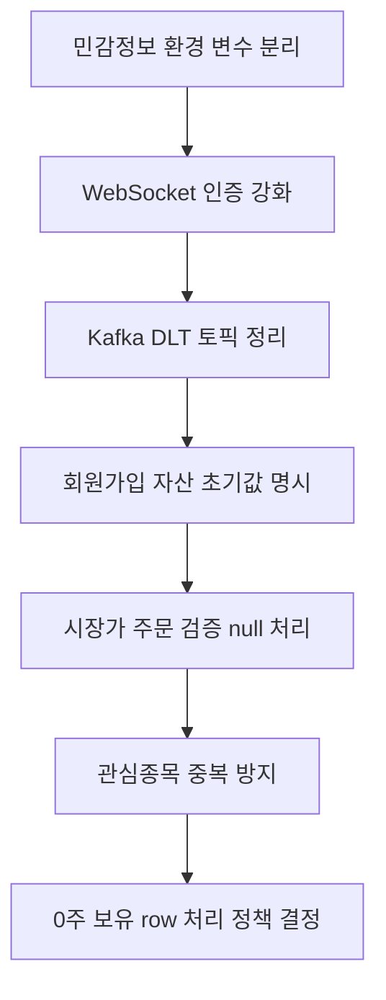

<a id="top"></a>

# user-service 현재 이슈와 개선 필요 항목

## 문서 포털

문서의 상세 구현, API, 아키텍처, 트러블슈팅은 아래 문서를 참고하세요.

| 분류 | 문서 | 분류 | 문서 |
| --- | --- | --- | --- |
| 주식 README | [README](../../../README.md) | 사용자 서비스 README | [README](../README.md) |
| 설계 노트 | [Engineering Notes](../../../docs/ENGINEERING.md) | 데이터베이스 ERD | [Database Schema ERD](../../../docs/database-schema.md) |
| 개요 | [개요](01-overview.md) | 인증/JWT | [인증/JWT](02-auth-jwt.md) |
| 회원가입/프로필 | [회원가입/프로필](03-user-register-profile.md) | 자산/주문 검증 | [자산/주문 검증](04-user-asset-order-validation.md) |
| Kafka 정산 | [Kafka 정산](05-settlement-kafka.md) | 관심종목 | [관심종목](06-watchlist.md) |
| 실시간 연결 | [실시간 연결](07-websocket.md) | 도메인 모델 | [도메인 모델](08-domain-model.md) |
| 보안 설정 | [보안 설정](09-security-config.md) | 유저 서비스 이슈 | [user-service 이슈](10-user-service-issues.md) |

## 목차

> [개요](#개요) ·
> [검증 결과](#검증-결과) ·
> [민감정보 관리](#민감정보-관리) ·
> [stock.service.url 중복 선언](#stockserviceurl-중복-선언) ·
> [WebSocket userId 신뢰 문제](#websocket-userid-신뢰-문제) ·
> [Kafka DLT 토픽명 불일치 가능성](#kafka-dlt-토픽명-불일치-가능성)

> [회원가입 자산 초기값 누락 가능성](#회원가입-자산-초기값-누락-가능성) ·
> [관심종목 중복 추가 가능성](#관심종목-중복-추가-가능성) ·
> [시장가 주문 검증 null 처리 위험](#시장가-주문-검증-null-처리-위험) ·
> [정산 후 0주 보유 데이터 처리](#정산-후-0주-보유-데이터-처리) ·
> [사용되지 않는 DTO](#사용되지-않는-dto) ·
> [개선 우선순위](#개선-우선순위)

## 개요

이 문서는 현재 `StockBackEndDistributed/user-service` 코드 기준으로 확인된 위험 요소와 개선 필요 항목을 정리합니다. 기능 문서에는 실제 존재하는 구현만 설명하고, 불안정하거나 깨질 수 있는 부분은 이 문서에 모았습니다.

## 검증 결과

다음 명령으로 Java 컴파일은 성공했습니다.

```bash
.\gradlew.bat compileJava
```

## 민감정보 관리

`application-docker.properties`에 DB, Redis, JWT 관련 민감정보가 직접 들어 있습니다.

문서에는 값을 기록하지 않습니다. 해당 값들은 환경 변수로 분리 필요합니다.

핵심 구현 파일:

기준 경로

`StockBackEndDistributed/user-service/src/main/resources`

| 파일 |
| --- |
| `application-docker.properties` |

## stock.service.url 중복 선언

`application-docker.properties`에 `stock.service.url`이 두 번 선언되어 있습니다. 같은 key가 중복되면 뒤쪽 값이 최종 적용됩니다.

개선 필요:

- 환경별 설정을 분리하거나 중복 선언을 제거해야 합니다.

## WebSocket userId 신뢰 문제

`WebSocketConfig`는 STOMP CONNECT native header의 `userId` 값을 그대로 `StompPrincipal`로 설정합니다.

문제:

- JWT 검증 없이 클라이언트가 보낸 `userId`를 신뢰합니다.
- 다른 사용자 ID를 넣어 연결하면 사용자 큐 spoofing 위험이 있습니다.

핵심 구현 파일:

기준 경로

`StockBackEndDistributed/user-service/src/main/java/Poi/Stock/config`

| 파일 |
| --- |
| `WebSocketConfig.java` |
| `StompPrincipal.java` |

## Kafka DLT 토픽명 불일치 가능성

정산에 실패한 이벤트를 보관하는 Kafka DLT Topic(`settlement-topic-DLT`)으로 실패 이벤트를 전송합니다. 이 처리는 `KafkaProducer.sendToSettlementDLT()`가 담당합니다.

반면 실패 이벤트를 재처리하는 Consumer는 주문 실패용 DLT Topic(`order-topic.DLT`)을 구독합니다. 이 처리는 `KafkaConsumer.consumeDLT()`가 담당합니다.

문제:

- producer가 보내는 DLT 토픽과 consumer가 듣는 DLT 토픽이 다릅니다.
- 의도한 재처리 흐름이 동작하지 않을 수 있습니다.

핵심 구현 파일:

기준 경로

`StockBackEndDistributed/user-service/src/main/java/Poi/Stock/features/Kafka`

| 파일 |
| --- |
| `KafkaConsumer.java` |
| `KafkaProducer.java` |

## 회원가입 자산 초기값 누락 가능성

`UserService.registerUser()` (회원가입시 생성하는 기능)는 `StockUser` 생성 시 총 보유 자산(`Asset`)과 주문 가능 현금(`availableAsset`) 초기값을 설정하지 않습니다.

문제:

- DB default가 없다면 이후 자산 검증 로직에서 null 문제가 발생할 수 있습니다.

핵심 구현 파일:

기준 경로

`StockBackEndDistributed/user-service/src/main/java/Poi/Stock/features/User`

| 파일 |
| --- |
| `UserService.java` |
| `StockUser.java` |

## 관심종목 중복 추가 가능성

`WatchListService.addWatch()` (관심종목 추가ㅉ)는 이미 등록된 관심종목인지 확인하지 않고 새 `WatchList`를 저장합니다.

문제:

- DB unique 제약이 없다면 같은 사용자/종목 조합이 중복 저장될 수 있습니다.

핵심 구현 파일:

기준 경로

`StockBackEndDistributed/user-service/src/main/java/Poi/Stock`

| 파일 |
| --- |
| `features/WatchList/WatchListService.java` |
| `repository/WatchListRepository.java` |

## 시장가 주문 검증 null 처리 위험

주문 생성 전 자산 검증 흐름은 request body의 `tradePrice`를 `Integer`로 읽은 뒤 서비스 계층에서 `int price`로 처리합니다. 컨트롤러 구현은 `UserAssetController.validateOrder()` (주문 검증 요청 수신 기능), 서비스 구현은 `UserAssetService.validateOrder()` (자산 또는 보유 수량 검증 기능)에서 담당합니다.

문제:

- 시장가 주문처럼 가격이 null로 들어오면 unboxing 또는 계산 과정에서 문제가 생길 수 있습니다.

핵심 구현 파일:

기준 경로

`StockBackEndDistributed/user-service/src/main/java/Poi/Stock/features/User`

| 파일 |
| --- |
| `UserAssetController.java` |
| `UserAssetService.java` |

## 정산 후 0주 보유 데이터 처리

매도 정산으로 보유 수량(`HaveStock.quantity`)이 0이 되어도 엔티티 삭제 로직은 없습니다. WebSocket 알림에서는 보유 수량(`quantity`)이 0이면 클라이언트가 제거할 수 있도록 payload를 보내지만 DB row는 남을 수 있습니다.

핵심 구현 파일:

기준 경로

`StockBackEndDistributed/user-service/src/main/java/Poi/Stock/features`

| 파일 |
| --- |
| `User/UserAssetService.java` |
| `UserWebsocket/UserWebsocketService.java` |

## 사용되지 않는 DTO

`getAssetDTO`는 현재 컨트롤러 흐름에서 직접 사용되는 코드가 확인되지 않습니다.

핵심 구현 파일:

기준 경로

`StockBackEndDistributed/user-service/src/main/java/Poi/Stock/DTO/user`

| 파일 |
| --- |
| `getAssetDTO.java` |

## 개선 우선순위



<div align="right">

[문서 맨 위로](#top)

</div>


