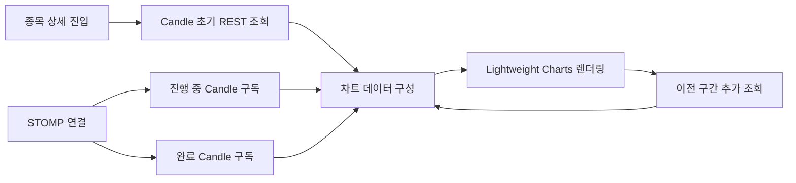

<a id="top"></a>

# 주식 거래 플랫폼 프론트엔드

Next.js App Router와 React로 구현한 주식 거래 플랫폼의 사용자 화면입니다. 시장·관심 종목 조회, 종목 상세 거래, 주문과 자산 확인을 제공하며 REST API로 초기 데이터를 조회한 뒤 STOMP WebSocket으로 시세와 주문 상태를 갱신합니다.

## 목차

> [프론트엔드 구조](#프론트엔드-구조) ·
> [주요 화면 미리보기](#주요-화면-미리보기) ·
> [차트와 실시간 갱신](#차트와-실시간-갱신) ·
> [WebSocket 연결 구조](#websocket-연결-구조) ·
> [상태 관리](#상태-관리) ·
> [주요 컴포넌트와 디렉터리](#주요-컴포넌트와-디렉터리) ·
> [실행 방법](#실행-방법) ·
> [관련 문서와 트러블슈팅](#관련-문서와-트러블슈팅)


## 관련 문서와 트러블슈팅

| 기능 | 문서 | 기능 | 문서 |
| --- | --- | --- | --- |
| 인증 | [인증](docs/01-auth.md) | 종목 목록 | [종목 목록](docs/02-stock-list.md) |
| 종목 상세 | [종목 상세](docs/03-stock-detail.md) | 차트 | [차트](docs/04-chart.md) |
| 주문 | [주문](docs/05-order.md) | 호가·체결 | [호가·체결](docs/06-orderbook-execution.md) |
| 사용자 자산 | [사용자 자산](docs/07-user-asset.md) | 관심 종목 | [관심 종목](docs/08-watchlist.md) |
| WebSocket | [WebSocket](docs/09-websocket.md) | 프론트 이슈 | [프론트 이슈](docs/10-frontend-issues.md) |
| 트러블슈팅 | [프론트 트러블슈팅](docs/11-troubleshooting.md) | 전체 시스템 | [공통 트러블슈팅](../docs/TROUBLESHOOTING.md) |


## 프론트엔드 구조

| 영역 | 사용 기술 및 역할 |
| --- | --- |
| 애플리케이션 | Next.js 16 App Router, React 19 |
| 스타일 | Tailwind CSS 4, 전역·기능별 CSS |
| 차트 | Lightweight Charts 5 |
| 실시간 통신 | `@stomp/stompjs`, SockJS |
| 전역 상태 | React Context, Zustand |
| API 계층 | `lib/`의 도메인별 요청 함수와 `util/apiClient.js` |

- `app/` : 라우팅과 공통 레이아웃
- `features/` : 기능별 화면과 비즈니스 로직
- `lib/` : REST API 통신
- `util/websocket/` : WebSocket 연결 및 STOMP 구독
- `context/`, `store/` : 전역 상태 관리

## 주요 화면 미리보기

### 시장 및 상세 거래 화면

| 메인 시장 화면 | 상세 거래 화면 |
| --- | --- |
|  |  |
| 실시간 종목 순위와 사용자 자산을 확인하는 화면 | 차트, 호가, 주문, 자산을 함께 확인하는 화면 |

### 매수·매도·주문 정정·취소 UI

| 매수 주문 | 매도 주문 |
| --- | --- |
|  |  |

| 대기 주문 및 취소 | 주문 정정 |
| --- | --- |
|  |  |
| 대기 주문을 조회하고 취소하는 UI | 대기 주문의 가격과 수량을 변경하는 UI |

| 주문 정정과 자산 반영 |  |
| --- | --- |
|  |  |

### 호가창과 자산 사이드바

| 실시간 호가창 | 자산 및 주문 사이드바 |
| --- | --- |
|  |  |
| 매도·매수 호가와 잔량을 표시 | 보유 자산과 대기 주문을 한 화면에서 확인 |

### 분봉·일봉·월봉·연봉 차트

| 분봉 차트 | 분봉 주기 선택 |
| --- | --- |
|  |  |
| 체결 흐름과 이동평균선을 표시 | 1분부터 240분까지 조회 주기를 선택 |

| 일봉 차트 | 월봉 차트 |
| --- | --- |
|  |  |

| 연봉 차트 |  |
| --- | --- |
|  |  |

## 차트와 실시간 갱신



`features/StockDetail/Chart/useChart.js`가 초기 Candle을 조회하고 차트 데이터 피드를 관리합니다. 진행 중 Candle과 완료 Candle은 종목 코드와 차트 주기에 맞는 STOMP topic을 구독해 기존 Candle을 갱신하거나 새 Candle을 추가합니다. 차트의 과거 영역으로 이동하면 이전 구간을 추가 조회합니다.

지원 화면은 분봉(1~240분), 일봉, 월봉, 연봉이며 `ChartComponent.jsx`가 캔들 및 이동평균선을 렌더링합니다.

## WebSocket 연결 구조

최상위 `app/layout.js`에서 인증 Context 안에 주문·종목·사용자 WebSocket Provider를 배치합니다. 각 Provider는 환경 변수로 지정한 서비스 endpoint에 SockJS/STOMP로 연결하고, 기능별 hook이 필요한 topic만 구독한 뒤 화면에서 벗어날 때 구독을 해제합니다.

| 연결 | Context | 주요 구독 데이터 |
| --- | --- | --- |
| 주문 서비스 | `OrderWebSocketContext` | Candle, 호가, 체결, 사용자 주문 상태 |
| 종목 서비스 | `StockWebSocketContext` | 종목별 실시간 시세와 종목 목록 |
| 사용자 서비스 | `UserWebSocketContext` | 사용자 자산과 보유 종목 |

주요 구독 hook은 `useCandleSocket.js`, `useHogaSocket.js`, `useExecutionSocket.js`, `useOrderSocket.js`, `useStocksSocket.js`, `useUserHaveAssetSocket.js`입니다.

## 상태 관리

| 방식 | 대상 |
| --- | --- |
| `AuthContext` | 로그인 사용자, 인증 확인, 로그인·로그아웃 |
| WebSocket Context | 서비스별 STOMP client와 연결 상태 |
| `UserHaveAssetProvider` | 자산, 보유 종목, 대기 주문, 알림 등 사용자 실시간 데이터 |
| Zustand | 주문 정정·취소 UI와 차트 선택 상태 |
| 기능별 hook | 화면 로컬 상태, API 호출, 구독 수명 주기 |

## 주요 컴포넌트와 디렉터리

```text
StockFrontEnd/
├─ app/                         # App Router 페이지와 레이아웃
│  ├─ (normal)/                # 메인 시장 화면
│  ├─ stock/[stockCode]/       # 종목 상세 거래 화면
│  ├─ watchlist/               # 관심 종목
│  ├─ myorder/                 # 대기 주문
│  └─ mycompletedorder/        # 체결 주문
├─ features/
│  ├─ StockList/               # 종목 목록
│  ├─ StockDetail/
│  │  ├─ Chart/                # Candle 차트와 주기 선택
│  │  ├─ StockHeader/          # 종목 시세 헤더
│  │  └─ MainContent/          # 호가, 체결, 보유 종목, 주문
│  └─ UI/SideBar/              # 자산·주문 사이드바
├─ context/AuthContext.js      # 인증 전역 상태
├─ store/                      # Zustand UI 상태
├─ lib/                        # 도메인별 REST API 함수
├─ util/apiClient.js           # 공통 API 요청 처리
├─ util/websocket/             # STOMP Context와 구독 hook
└─ docs/                       # 화면·기능별 프론트 문서
```

## 실행 방법

### 요구 사항

- Node.js와 npm
- 연결할 사용자·종목·주문 백엔드 서비스

### 환경 변수

로컬 환경의 `.env.local`에 아래 endpoint를 설정합니다. 실제 주소와 민감 정보는 README에 기록하지 않습니다.

```dotenv
NEXT_PUBLIC_BACKEND_API_URL=
NEXT_PUBLIC_USER_API_URL=
NEXT_PUBLIC_STOCK_API_URL=
NEXT_PUBLIC_ORDER_API_URL=
NEXT_PUBLIC_USER_WEBSOCKET_API_URL=
NEXT_PUBLIC_STOCK_WEBSOCKET_API_URL=
NEXT_PUBLIC_WEBSOCKET_API_URL=
```

### 개발 서버

```bash
cd StockFrontEnd
npm install
npm run dev
```

기본 개발 주소는 `http://localhost:3000`입니다. PowerShell 실행 정책으로 `npm`이 실행되지 않으면 `npm.cmd install`, `npm.cmd run dev`를 사용합니다.

### 검증과 프로덕션 실행

```bash
npm.cmd run lint
npm.cmd run build
npm.cmd run start
```


문제가 발생하면 환경 변수의 API·WebSocket endpoint, 백엔드 서비스 실행 여부, 브라우저 네트워크 탭의 STOMP 연결 상태를 먼저 확인합니다.

<div align="right">

[문서 맨 위로](#top)

</div>
