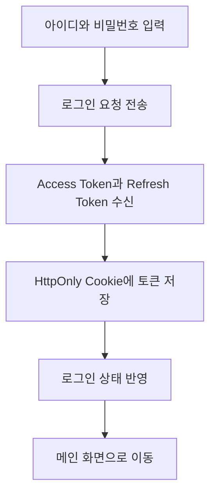
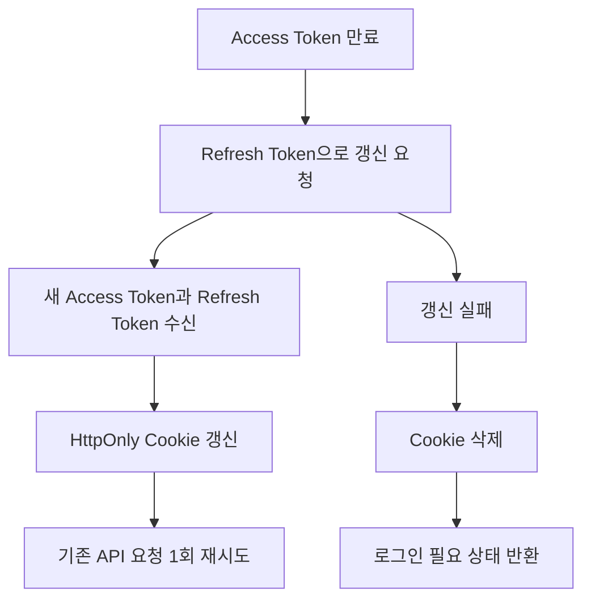

<a id="top"></a>

# 인증 기능

## 문서 포털

상세 구현, API, 아키텍처와 트러블슈팅 정보는 아래 문서에서 확인할 수 있습니다.

| 분류 | 문서 | 분류 | 문서 |
| --- | --- | --- | --- |
| 주식 README | [README](../../README.md) | 주식 거래 플랫폼 README | [README](../README.md) |
| 설계 노트 | [Engineering Notes](../../docs/ENGINEERING.md) | 데이터베이스 ERD | [Database Schema ERD](../../docs/database-schema.md) |
| 인증 | [인증](01-auth.md) | 종목 목록 | [종목 목록](02-stock-list.md) |
| 종목 상세 | [종목 상세](03-stock-detail.md) | 차트 | [차트](04-chart.md) |
| 주문 | [주문](05-order.md) | 호가/체결 | [호가/체결](06-orderbook-execution.md) |
| 자산 | [자산](07-user-asset.md) | 관심종목 | [관심종목](08-watchlist.md) |
| 실시간 연결 | [실시간 연결](09-websocket.md) | 프론트엔드 이슈 | [프론트엔드 이슈](10-frontend-issues.md) |

## 목차

> [개요](#개요) ·
> [인증 상태 관리](#인증-상태-관리) ·
> [로그인](#로그인) ·
> [세션 확인](#세션-확인) ·
> [로그아웃](#로그아웃)

> [회원가입](#회원가입) ·
> [쿠키](#쿠키) ·
> [인증 요청과 토큰 갱신](#인증-요청과-토큰-갱신) ·
> [흐름](#흐름) ·
> [환경 변수](#환경-변수) ·
> [핵심 구현 파일](#핵심-구현-파일)

## 개요

인증 기능은 JWT 형식의 Access Token과 Refresh Token으로 사용자를 식별합니다. 토큰은 HttpOnly Cookie에 저장하고, 현재 사용자 상태는 `AuthContext`로 애플리케이션 전체에서 공유합니다.

## 인증 상태 관리

애플리케이션 전체에서 같은 로그인 상태를 사용하도록 현재 사용자와 초기 세션 확인 상태를 관리합니다. 로그인·로그아웃 결과는 모든 화면에 공유하며, 이 전역 상태는 `AuthContext`가 제공합니다.

### 동작 순서

1. 현재 사용자와 세션 확인 상태를 전역 상태로 생성합니다.
2. 화면이 시작되면 저장된 세션을 확인합니다.
3. 로그인·로그아웃 결과를 사용자 상태에 반영합니다.

### 핵심 코드

```jsx
export function AuthProvider({ children }) {
  const [user, setUser] = useState(null);
  const [loading, setLoading] = useState(true);

  useEffect(() => {
    loadUser();
  }, []);

  // 생략: loadUser(), login(), logout()
  return (
    <AuthContext.Provider value={{ user, loading, login, logout }}>
      {children}
    </AuthContext.Provider>
  );
}
```

페이지마다 인증 상태를 별도로 조회하면 화면 전환 시 사용자 상태가 어긋날 수 있어 인증 수명주기를 하나의 Provider로 모읍니다. `user`와 초기 확인 상태(`loading`)를 입력 없이 생성하고 로그인·로그아웃 함수를 함께 제공합니다. 결과는 모든 하위 화면의 접근 제어와 사용자 UI에 동일하게 반영됩니다.

### 구현 위치

- Provider와 전역 상태: `context/AuthContext.js`
- 최상위 Provider 적용: `app/layout.js`

## 로그인

로그인 API에서 Access Token과 Refresh Token을 발급받아 HttpOnly Cookie에 저장하고 전역 인증 상태를 갱신합니다.

### 동작 순서

1. 사용자 인증을 처리하는 로그인 API(`POST {USER_URL}/auth/login`)에 아이디와 비밀번호를 전송합니다.
2. 사용자 식별자, Access Token과 Refresh Token을 수신합니다.
3. 두 토큰을 HttpOnly Cookie에 저장합니다.
4. 로그인 결과의 사용자 식별자를 전역 상태에 반영하며, `AuthContext`를 사용합니다.
5. 성공하면 메인 화면 `/`로 이동하고, 실패하면 오류 메시지를 표시합니다.

### 핵심 코드

```js
export async function loginHandler(id, password) {
  const response = await fetch(`${USER_URL}/auth/login`, {
    method: 'POST',
    headers: { 'Content-Type': 'application/json' },
    body: JSON.stringify({ id, password }),
  });
  const data = await response.json();

  // 생략: 서버 오류 응답 처리
  if (data.success && data.data?.accessToken) {
    await setTokenCookies(data.data.accessToken, data.data.refreshToken);
    return { success: true, data: data.data.userId };
  }
  return data;
}
```

브라우저 JavaScript에 토큰을 노출하지 않으면서 로그인 상태를 공유하기 위한 서버 처리입니다. 아이디와 비밀번호를 입력받아 로그인 API를 호출하고, 성공 응답의 Access Token과 Refresh Token을 HttpOnly Cookie에 저장합니다. 반환된 사용자 식별자는 `AuthContext`에 반영되어 로그인 후 화면 전환의 기준이 됩니다.

### 구현 위치

- 로그인 폼: `features/login/LoginForm.jsx`, `features/login/useLogin.js`
- 로그인 요청과 Cookie 저장: `lib/auth.js`의 `loginHandler()`
- 전역 상태: `context/AuthContext.js`의 `login()`

## 세션 확인

새로고침 후에도 로그인 상태를 복원하기 위해 저장된 Access Token을 확인합니다. 이 단계에서는 백엔드 API 호출이나 토큰 재발급을 수행하지 않습니다.

### 동작 순서

1. 서버에서 Access Token Cookie를 읽습니다.
2. 저장된 토큰의 payload와 만료 시각을 JWT 형식에 따라 확인합니다.
3. 유효하면 `sub`를 사용자 식별자로 사용하고, 유효하지 않으면 비로그인 상태로 처리합니다.
4. 확인 결과와 로딩 완료 여부를 전역 상태에 반영하며, `AuthContext`의 `user`와 `loading`을 갱신합니다.

### 핵심 코드

```js
export async function checkSession() {
  const accessToken = await getAccessToken();
  if (!accessToken) return { success: false };

  try {
    const payload = JSON.parse(
      Buffer.from(accessToken.split('.')[1], 'base64url').toString()
    );
    if (payload.exp && payload.exp * 1000 < Date.now()) {
      return { success: false };
    }
    return { success: true, data: payload.sub };
  } catch {
    return { success: false };
  }
}
```

새로고침할 때마다 별도 사용자 API를 호출하지 않고 로그인 상태를 복원하기 위한 처리입니다. Access Token Cookie를 입력으로 JWT payload와 만료 시각을 검증하고 유효한 `sub`를 사용자 식별자로 반환합니다. 토큰 누락·만료·파싱 실패는 비로그인 결과가 되어 `AuthContext`의 초기 상태에 반영됩니다.

### 구현 위치

- 세션 검사: `lib/auth.js`의 `checkSession()`
- 상태 복원: `context/AuthContext.js`의 `loadUser()`

## 로그아웃

서버에 로그아웃을 요청하고 인증 Cookie와 전역 사용자 상태를 제거합니다. 서버 요청이 실패해도 로컬 Cookie는 삭제합니다.

### 동작 순서

1. 서버 인증 상태를 종료하는 로그아웃 API(`POST {USER_URL}/auth/logout`)를 Access Token과 함께 호출합니다.
2. Access Token과 Refresh Token Cookie를 삭제합니다.
3. 로그아웃 상태를 모든 화면에 반영하도록 전역 사용자 값을 `null`로 변경하며, `AuthContext`를 사용합니다.
4. 헤더에서 실행한 경우 메인 화면 `/`로 이동합니다.

### 핵심 코드

```js
export async function logoutHandler() {
  const accessToken = await getAccessToken();
  await fetch(`${USER_URL}/auth/logout`, {
    method: 'POST',
    headers: {
      'Content-Type': 'application/json',
      ...(accessToken && { Authorization: `Bearer ${accessToken}` }),
    },
  }).catch(() => {});

  await clearTokenCookies();
  return { success: true };
}
```

서버 로그아웃 장애가 브라우저의 세션 종료를 막지 않도록 원격 처리와 로컬 정리를 분리합니다. 현재 Access Token을 서버에 전달하지만 호출 실패는 흡수하고 두 인증 Cookie는 항상 삭제합니다. 결과적으로 서버 응답 여부와 관계없이 클라이언트의 인증 상태가 종료됩니다.

### 구현 위치

- 로그아웃 요청과 Cookie 삭제: `lib/auth.js`의 `logoutHandler()`
- 전역 상태: `context/AuthContext.js`의 `logout()`
- 화면 이동: `features/UI/useHeader.js`의 `handleLogout()`

## 회원가입

아이디, 사용자 이름과 비밀번호를 JSON으로 전송해 사용자를 등록합니다.

### 동작 순서

1. `id`, `username`, `password`를 입력합니다.
2. 새 사용자를 등록하는 회원가입 API(`POST {USER_URL}/user/register`)에 입력 정보를 전송합니다.

### 핵심 코드

```js
export async function RegisterSumbitApi(formData) {
  return await fetch(`${USER_URL}/user/register`, {
    method: "POST",
    headers: {
      "Content-Type": "application/json"
    },
    body: JSON.stringify(formData)
  });
}
```

회원가입 화면과 사용자 서비스 사이의 요청 형식을 한곳에서 고정하기 위한 API 계층입니다. 아이디·사용자 이름·비밀번호를 포함한 `formData`를 JSON으로 변환해 사용자 등록 endpoint에 전달합니다. HTTP 응답은 회원가입 hook으로 반환되어 성공 안내나 오류 처리에 사용됩니다.

### 구현 위치

- 회원가입 폼: `features/register/RegisterForm.jsx`, `features/register/useRegister.js`
- 회원가입 요청: `lib/user.js`의 `RegisterSumbitApi()`

## 쿠키

Access Token과 Refresh Token은 Next.js 서버의 `cookies()` API로 설정하므로 브라우저 JavaScript에서 접근할 수 없는 HttpOnly Cookie입니다. 운영 환경에서는 `secure: true`를 적용합니다.

| Cookie | 만료 시간 | 옵션 |
| --- | --- | --- |
| `accessToken` | 30분 | `httpOnly: true`, `sameSite: 'lax'`, `path: '/'` |
| `refreshToken` | 7일 | `httpOnly: true`, `sameSite: 'lax'`, `path: '/'` |

### 동작 순서

1. 로그인 또는 토큰 갱신 결과에서 두 토큰을 받습니다.
2. Access Token은 30분, Refresh Token은 7일 동안 HttpOnly Cookie로 저장합니다.
3. 로그아웃 또는 인증 갱신 실패 시 두 Cookie를 삭제합니다.

### 핵심 코드

```js
export async function setTokenCookies(accessToken, refreshToken) {
  const cookieStore = await cookies();
  cookieStore.set(ACCESS_TOKEN, accessToken, {
    httpOnly: true,
    secure: process.env.NODE_ENV === 'production',
    sameSite: 'lax',
    maxAge: 60 * 30,
    path: '/',
  });
  // 생략: Refresh Token도 동일한 옵션과 7일 만료 시간으로 저장한다.
}
```

인증 토큰을 클라이언트 스크립트에서 분리해 XSS 노출 범위를 줄이기 위한 저장 정책입니다. 로그인이나 갱신 결과를 입력으로 HttpOnly Cookie를 만들고 운영 환경에서는 Secure 옵션을 적용합니다. 서로 다른 만료 시간은 짧은 Access Token과 장기 세션 복구용 Refresh Token의 역할을 구분합니다.

### 구현 위치

- Cookie 조회·저장·삭제: `util/cookieUtils.js`

## 인증 요청과 토큰 갱신

공통 API 요청 계층이 Access Token을 인증 헤더에 추가합니다. API가 `401 Unauthorized`를 반환하면 Refresh Token으로 토큰을 재발급하고 기존 요청을 한 번만 재시도합니다.

### 동작 순서

1. Access Token을 `Authorization: Bearer {Access Token}` 헤더에 추가합니다.
2. `{ auth: true }` 요청에 토큰이 없으면 `401`과 로그인 필요 상태를 반환합니다.
3. 보호된 요청이 `401` 응답을 반환하면 토큰 재발급 API(`POST {USER_URL}/auth/refresh`)에 Refresh Token을 전송합니다.
4. 재발급에 성공하면 Cookie를 갱신하고 기존 요청을 한 번 재시도합니다.
5. 재발급에 실패하면 Cookie를 삭제하고 `401`과 로그인 필요 상태를 반환합니다.

### 핵심 코드

```js
if (res.status === 401) {
  const refreshed = await tryRefresh();
  if (refreshed) {
    const newToken = await getAccessToken();
    const retryRes = await fetch(url, {
      ...fetchOptions,
      headers: {
        ...(!isFormData && { 'Content-Type': 'application/json' }),
        Authorization: `Bearer ${newToken}`,
        ...fetchOptions.headers,
      },
    });
  }
}
```

Access Token 만료를 각 화면에서 직접 처리하지 않도록 공통 요청 계층에서 복구합니다. 보호된 요청의 `401` 응답과 Refresh Token을 입력으로 새 Access Token을 발급받아 원래 요청을 한 번만 재시도합니다. 성공 결과는 최초 요청의 호출자에게 그대로 반환되고, 갱신 실패 시 인증 Cookie가 제거됩니다.

### 구현 위치

- 공통 API 요청과 재시도: `util/apiClient.js`의 `apiFetch()`
- 토큰 재발급: `util/apiClient.js`의 `tryRefresh()`

## 흐름

### 로그인 흐름



### 토큰 갱신 흐름



## 환경 변수

인증 API 주소는 `util/URLconfig.js`에서 다음 환경 변수를 읽습니다.

- `NEXT_PUBLIC_USER_API_URL`: 로그인, 로그아웃, 회원가입과 토큰 갱신 주소입니다.
- `NEXT_PUBLIC_BACKEND_API_URL`: SSO 인증 URL 조회 주소입니다.

## 핵심 구현 파일

기준 경로

`StockFrontEnd`

| 파일 |
| --- |
| `app/layout.js` |
| `context/AuthContext.js` |
| `lib/auth.js` |
| `lib/user.js` |
| `util/cookieUtils.js` |
| `util/apiClient.js` |
| `util/URLconfig.js` |
| `features/login/LoginForm.jsx` |
| `features/login/useLogin.js` |
| `features/register/RegisterForm.jsx` |
| `features/register/useRegister.js` |
| `features/UI/useHeader.js` |
| `features/UI/HeaderProfile.js` |

## 관련 문서

- [주문 문서](05-order.md)
- [사용자 자산 문서](07-user-asset.md)
- [실시간 연결 문서](09-websocket.md)
- [프론트엔드 이슈 문서](10-frontend-issues.md)

<div align="right">

[문서 맨 위로](#top)

</div>
