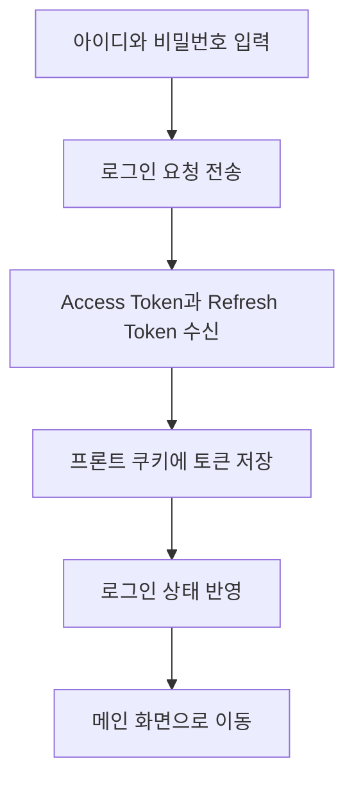
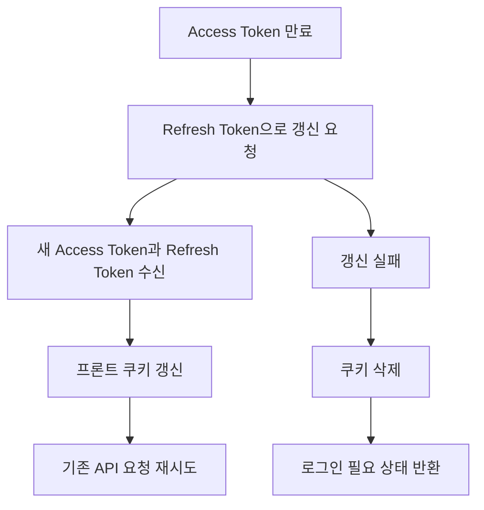

# 인증 기능

## 문서 포털

문서의 상세 구현, API, 아키텍처, 트러블슈팅은 아래 문서를 참고하세요.

| 분류 | 문서 | 분류 | 문서 |
| --- | --- | --- | --- |
| 루트 README | [README](../../README.md) | 서비스 README | [README](../README.md) |
| Engineering Notes | [Engineering Notes](../../docs/ENGINEERING.md) | Database Schema ERD | [Database Schema ERD](../../docs/database-schema.md) |
| 01 | [인증](01-auth.md) | 02 | [종목 목록](02-stock-list.md) |
| 03 | [종목 상세](03-stock-detail.md) | 04 | [차트](04-chart.md) |
| 05 | [주문](05-order.md) | 06 | [호가/체결](06-orderbook-execution.md) |
| 07 | [자산](07-user-asset.md) | 08 | [관심종목](08-watchlist.md) |
| 09 | [실시간 연결](09-websocket.md) | 10 | [프론트엔드 이슈](10-frontend-issues.md) |

## 목차

> [개요](#개요) ·
> [핵심 구현 파일](#핵심-구현-파일) ·
> [인증 상태 관리](#인증-상태-관리) ·
> [로그인](#로그인) ·
> [세션 확인](#세션-확인) ·
> [로그아웃](#로그아웃)

> [회원가입](#회원가입) ·
> [쿠키](#쿠키) ·
> [API 요청과 토큰 갱신](#api-요청과-토큰-갱신) ·
> [흐름](#흐름) ·
> [환경 변수](#환경-변수)

## 개요

프론트엔드 인증은 로그인 API 요청, JWT 쿠키 저장, 클라이언트 인증 상태 관리로 구성된다. 토큰은 `httpOnly` 쿠키로 관리하며, 클라이언트에서는 `AuthContext`를 통해 로그인 상태와 로그인/로그아웃 동작을 사용한다.

## 인증 상태 관리

`context/AuthContext.js`는 전역 인증 상태를 제공한다.

- `user`: 현재 로그인 사용자 식별자
- `loading`: 세션 확인 중 여부
- `login(id, password)`: 로그인 처리
- `logout()`: 로그아웃 처리

`app/layout.js`에서 `AuthProvider`가 전체 앱을 감싸므로 하위 컴포넌트는 `useAuth()`로 인증 상태를 사용할 수 있다.

## 로그인

로그인 화면은 `USER_URL/auth/login`으로 사용자 인증 정보를 보낸다. 로그인에 성공하면 응답의 `accessToken`과 `refreshToken`을 프론트엔드 쿠키에 저장한다.

프론트엔드는 토큰을 쿠키에 저장하고 이후 API 요청에 사용한다. refresh token의 서버 저장, 검증, 폐기는 user-service가 담당한다.

`useLogin.js`는 로그인 폼 상태를 관리한다.

- `id`, `password`, `errorMessage` 상태 관리
- `handleSubmit()`에서 로그인 요청 실행
- 로그인 성공 시 `/`로 이동
- 실패 시 에러 메시지 상태 갱신

아이디/비밀번호 찾기 팝업과 SSO 로그인 URL 이동 함수도 존재한다. SSO URL 생성은 `lib/auth.js`의 `handleSSOLogin(platform)`이 담당한다.

## 세션 확인

`checkSession()` (현재 쿠키 기준 세션 유효성을 확인하는 기능)은 `accessToken` 쿠키를 읽고 JWT payload를 디코딩해 만료 여부를 확인한다. 유효하면 `payload.sub` 값을 사용자 식별자로 반환한다.

## 로그아웃

`logoutHandler()` (로그아웃 요청)는 `USER_URL/auth/logout`으로 보내고, 성공 여부와 관계없이 로컬 쿠키를 삭제한다.

헤더 영역은 로그아웃 처리 후 `/`로 이동하는 동작을 제공한다.
구현은 `handleLogout()` (헤더 로그아웃 처리 기능)에서 담당한다.

## 회원가입

회원가입 화면은 `useRegister.js`와 `RegisterForm.jsx`로 구성된다.
`id`, `username`, `password`를 `formData`로 관리하고, 제출 시 회원가입 API 요청을 보낸다.
회원가입 요청 구현은 `RegisterSumbitApi()` (회원가입 API 요청 기능)에서 담당한다.

회원가입 엔드포인트:

- `POST {USER_URL}/user/register`

## 쿠키

`util/cookieUtils.js`는 다음 쿠키 유틸을 제공한다.

- `getAccessToken()`
- `getRefreshToken()`
- `setTokenCookies(accessToken, refreshToken)`
- `clearTokenCookies()`
- `getSessionCookie()`

`accessToken`은 30분, `refreshToken`은 7일 만료로 설정되어 있다.

## API 요청과 토큰 갱신

`apiFetch()` (인증 헤더와 토큰 갱신을 공통 처리하는 fetch 기능)는 공통 fetch 래퍼다.

- `auth: true` 옵션이 있으면 access token이 없을 때 401 응답을 반환한다.
- 요청 헤더에 `Authorization: Bearer {accessToken}`을 붙인다.
- 응답이 401이면 `tryRefresh()`로 refresh token을 사용해 access token을 재발급한다.
- 재발급 성공 시 원래 요청을 한 번 재시도한다.
- 재발급 실패 시 쿠키를 삭제하고 로그인 필요 응답을 반환한다.

## 흐름

### 로그인 흐름

### 토큰 갱신 흐름

## 환경 변수

인증 관련 API 주소는 `util/URLconfig.js`에서 가져온다.

- `NEXT_PUBLIC_USER_API_URL`
- `NEXT_PUBLIC_BACKEND_API_URL`

## 핵심 구현 파일

기준 경로

`StockFrontEnd`

| 파일 |
| --- |
| `app/layout.js` |
| `context/AuthContext.js` |
| `lib/auth.js` |
| `lib/user.js` |
| `util/cookieUtils.js` |
| `util/apiClient.js` |
| `util/URLconfig.js` |
| `features/login/LoginForm.jsx` |
| `features/login/useLogin.js` |
| `features/register/RegisterForm.jsx` |
| `features/register/useRegister.js` |
| `features/UI/useHeader.js` |
| `features/UI/HeaderProfile.js` |

[문서 맨 위로](#top)

