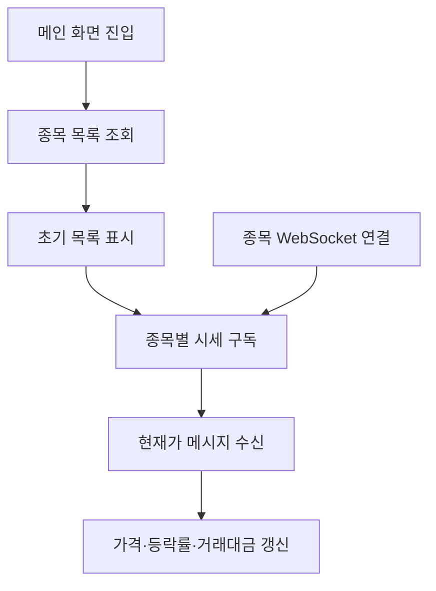

<a id="top"></a>

# 주식 목록 기능

## 문서 포털

상세 구현, API, 아키텍처와 트러블슈팅 정보는 아래 문서에서 확인할 수 있습니다.

| 분류 | 문서 | 분류 | 문서 |
| --- | --- | --- | --- |
| 주식 README | [README](../../README.md) | 주식 거래 플랫폼 README | [README](../README.md) |
| 설계 노트 | [Engineering Notes](../../docs/ENGINEERING.md) | 데이터베이스 ERD | [Database Schema ERD](../../docs/database-schema.md) |
| 인증 | [인증](01-auth.md) | 종목 목록 | [종목 목록](02-stock-list.md) |
| 종목 상세 | [종목 상세](03-stock-detail.md) | 차트 | [차트](04-chart.md) |
| 주문 | [주문](05-order.md) | 호가/체결 | [호가/체결](06-orderbook-execution.md) |
| 자산 | [자산](07-user-asset.md) | 관심종목 | [관심종목](08-watchlist.md) |
| 실시간 연결 | [실시간 연결](09-websocket.md) | 프론트엔드 이슈 | [프론트엔드 이슈](10-frontend-issues.md) |

## 목차

> [개요](#개요) · [화면 구성](#화면-구성) · [데이터 조회와 실시간 갱신](#데이터-조회와-실시간-갱신) · [데이터 흐름](#데이터-흐름) · [핵심 구현 파일](#핵심-구현-파일) · [관련 문서](#관련-문서)

## 개요

주식 목록은 전체 종목의 현재가, 등락률과 거래 정보를 보여줍니다. 화면 진입 시 초기 목록을 조회하고 이후 종목별 가격 메시지로 값을 갱신하며, 이 과정에 REST API와 WebSocket을 사용합니다.

## 화면 구성

메인 화면은 종목명, 현재가, 등락률, 거래대금과 매수·매도 비율을 표로 표시합니다. 가격과 비율은 화면용 형식과 등락 색상으로 변환합니다.

### 구현 위치

- 메인 페이지: `app/(normal)/page.js`
- 목록 화면: `features/StockList/TossStockListForm.jsx`
- 표시 형식: `features/StockList/useStockList.js`

## 데이터 조회와 실시간 갱신

초기 종목 목록을 받은 뒤 각 종목 코드를 기준으로 시세 topic을 구독합니다. 메시지를 받으면 같은 종목의 현재가, 등락률과 거래대금을 교체합니다.

### 동작 순서

1. 메인 화면 진입 시 전체 종목을 조회하는 API(`GET {STOCK_URL}/stock/stocklist`)를 호출합니다.
2. 응답을 초기 종목 목록으로 저장합니다.
3. 종목별 현재가를 수신하는 WebSocket Topic(`/topic/stock/{stockCode}`)을 구독합니다.
4. 수신한 `currentPrice`, `changeRate`, `value`를 목록에 반영합니다.
5. 화면을 벗어나면 구독을 해제합니다.

### 핵심 코드

```js
const data = JSON.parse(message.body);
setStocklist(prev =>
  prev.map(item => {
    const itemStockCode = getStockCode(item);
    if (itemStockCode !== data.stockCode) return item;
    // 생략: item.snapshot이 있는 응답 형태 처리
    return {
      ...item,
      currentPrice: data.currentPrice,
      changeRate: data.changeRate,
      value: data.value,
    };
  })
);
```

변경된 종목만 갱신하기 위한 실시간 병합 로직입니다.`stockCode`가 일치하는 항목을 찾고, 응답 형태에 따라 `snapshot`을 갱신합니다. 결과는 목록 상태에 즉시 반영되어 현재가·등락률·거래대금만 다시 렌더링됩니다.

### 구현 위치

- 목록 조회: `lib/stock.js`의 `stockListApi()`
- 목록 상태: `features/StockList/useStockList.js`
- 실시간 구독: `util/websocket/useStocksSocket.js`
- 연결 Context: `util/websocket/context/StockWebSocketContext.js`

## 데이터 흐름



## 핵심 구현 파일

기준 경로: `StockFrontEnd`

| 파일 |
| --- |
| `app/(normal)/page.js` |
| `features/StockList/TossStockListForm.jsx` |
| `features/StockList/useStockList.js` |
| `lib/stock.js` |
| `util/websocket/context/StockWebSocketContext.js` |
| `util/websocket/useStocksSocket.js` |
| `util/URLconfig.js` |

## 관련 문서

- [종목 상세](03-stock-detail.md)
- [실시간 연결](09-websocket.md)
- [프론트엔드 이슈](10-frontend-issues.md)

<div align="right">[문서 맨 위로](#top)</div>
