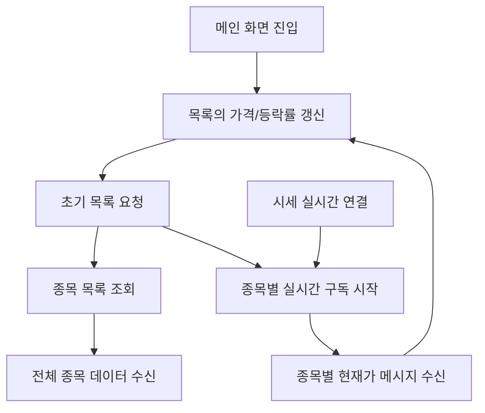

# 주식 목록 기능

## 문서 포털

문서의 상세 구현, API, 아키텍처, 트러블슈팅은 아래 문서를 참고하세요.

| 분류 | 문서 | 분류 | 문서 |
| --- | --- | --- | --- |
| 루트 README | [README](../../README.md) | 서비스 README | [README](../README.md) |
| Engineering Notes | [Engineering Notes](../../docs/ENGINEERING.md) | Database Schema ERD | [Database Schema ERD](../../docs/database-schema.md) |
| 01 | [인증](01-auth.md) | 02 | [종목 목록](02-stock-list.md) |
| 03 | [종목 상세](03-stock-detail.md) | 04 | [차트](04-chart.md) |
| 05 | [주문](05-order.md) | 06 | [호가/체결](06-orderbook-execution.md) |
| 07 | [자산](07-user-asset.md) | 08 | [관심종목](08-watchlist.md) |
| 09 | [실시간 연결](09-websocket.md) | 10 | [프론트엔드 이슈](10-frontend-issues.md) |

## 목차

> [개요](#개요) ·
> [핵심 구현 파일](#핵심-구현-파일) ·
> [화면 구성](#화면-구성) ·
> [데이터 조회](#데이터-조회)

> [실시간 갱신](#실시간-갱신) ·
> [데이터 흐름](#데이터-흐름) ·
> [포맷 유틸](#포맷-유틸)

## 개요

주식 목록 화면은 REST API로 초기 종목 목록을 조회한 뒤, 종목별 WebSocket 구독을 통해 현재가와 등락률을 실시간 갱신한다. 메인 진입 페이지는 App Router의 `(normal)` 그룹 아래에 있다.

## 구성

- 메인 목록 영역
- 실시간 차트 탭
- 지역/거래 기준/기간 필터 UI
- 종목 테이블
- 종목명, 현재가, 등락률, 거래대금, 매수/매도 비율 표시

현재 UI는 기본 화면까지 구현되어 있으며, 관련 기능은 향후 확장하거나 프로젝트 범위에 따라 제외할 예정이다.

## 데이터 조회

`useStockList()`는 최초 렌더링 시 종목 목록 API 요청을 보낸다.

`stockListApi()` (전체 종목 목록 API 요청 기능)는 다음 엔드포인트를 사용한다.

- `GET {STOCK_URL}/stock/stocklist`

응답 데이터는 `initialStocks` 상태에 저장되고, 이후 `useStocksSocket()`에 전달된다.

## 실시간 갱신

`useStocksSocket()` (종목별 실시간 시세를 수신해 목록 상태를 갱신하는 기능)는 각 종목의 stock code를 기준으로 다음 토픽을 구독한다.

메시지를 수신하면 기존 목록에서 같은 종목을 찾아 다음 값을 갱신한다.

- `currentPrice`
- `changeRate`
- `value`

## 데이터 흐름

## 포맷 유틸

`useStockList.js`에는 목록 표시용 유틸이 함께 정의되어 있다.

- `formatPrice(price)`
- `formatChangeRate(rate)`
- `formatValue(value)`
- `getChangeColor(rate)`
- `getTradeRatio(tradeStatus)`

## 핵심 구현 파일

기준 경로

`StockFrontEnd`

| 파일 |
| --- |
| `app/(normal)/page.js` |
| `features/StockList/TossStockListForm.jsx` |
| `features/StockList/useStockList.js` |
| `features/StockList/StockList.css` |
| `lib/stock.js` |
| `util/websocket/context/StockWebSocketContext.js` |
| `util/websocket/useStocksSocket.js` |
| `util/URLconfig.js` |

[문서 맨 위로](#top)

