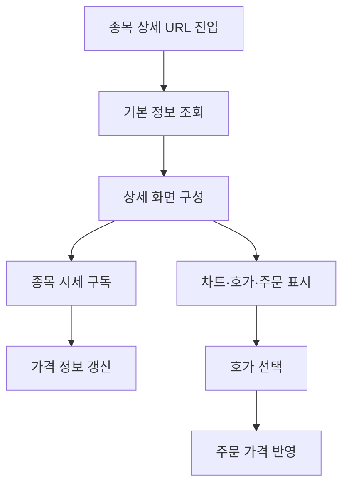

<a id="top"></a>

# 종목 상세 기능

## 문서 포털

상세 구현, API, 아키텍처와 트러블슈팅 정보는 아래 문서에서 확인할 수 있습니다.

| 분류 | 문서 | 분류 | 문서 |
| --- | --- | --- | --- |
| 주식 README | [README](../../README.md) | 주식 거래 플랫폼 README | [README](../README.md) |
| 설계 노트 | [Engineering Notes](../../docs/ENGINEERING.md) | 데이터베이스 ERD | [Database Schema ERD](../../docs/database-schema.md) |
| 인증 | [인증](01-auth.md) | 종목 목록 | [종목 목록](02-stock-list.md) |
| 종목 상세 | [종목 상세](03-stock-detail.md) | 차트 | [차트](04-chart.md) |
| 주문 | [주문](05-order.md) | 호가/체결 | [호가/체결](06-orderbook-execution.md) |
| 자산 | [자산](07-user-asset.md) | 관심종목 | [관심종목](08-watchlist.md) |
| 실시간 연결 | [실시간 연결](09-websocket.md) | 프론트엔드 이슈 | [프론트엔드 이슈](10-frontend-issues.md) |

## 목차

> [개요](#개요) · [화면 구성](#화면-구성) · [상세 정보 갱신](#상세-정보-갱신) · [거래 영역](#거래-영역) · [흐름](#흐름) · [핵심 구현 파일](#핵심-구현-파일) · [관련 문서](#관련-문서)

## 개요

종목 상세 화면은 URL의 종목 코드로 기본 정보를 조회하고 차트, 호가, 주문과 체결 기능을 구성합니다. 현재가는 WebSocket으로 갱신합니다.

## 화면 구성

상단에는 종목명과 가격 정보를 표시하고, 메인 영역에는 차트·호가·주문·보유 종목·체결 패널을 배치합니다.

### 구현 위치

- 동적 라우트: `app/stock/[stockCode]/page.js`
- 상세 화면: `features/StockDetail/StockDetailForm.jsx`
- 가격 헤더: `features/StockDetail/StockHeader/StockPriceHeader.jsx`
- 메인 영역: `features/StockDetail/MainContent/MainContent.jsx`

## 상세 정보 갱신

초기 종목 정보를 표시한 뒤 종목 시세 topic을 구독합니다. 메시지의 현재가, 등락률, 등락값과 시가·고가·저가를 헤더에 반영합니다.

### 동작 순서

1. 종목 상세 화면 라우트(`/stock/{stockCode}`)에서 조회할 종목 코드를 읽습니다.
2. 종목 상세 API로 기본 정보를 조회합니다.
3. 선택 종목의 실시간 시세를 수신하는 WebSocket Topic(`/topic/stock/{stockCode}`)을 구독합니다.
4. 수신한 시세로 상세 헤더를 갱신합니다.

### 핵심 코드

```js
const subscription = client.subscribe(`/topic/stock/${initStock.stockCode}`, message => {
  const data = JSON.parse(message.body);
  setStock(prev => ({
    ...prev,
    changeRate: data.changeRate,
    changeAmount: data.changeAmount,
    openPrice: data.openPrice,
    currentPrice: data.currentPrice,
    highPrice: data.highPrice,
    lowPrice: data.lowPrice,
  }));
});
```

`stockCode`와 시세 메시지를 입력으로 받아 현재가·등락·시가·고가·저가를 기존 상태에 병합합니다. 병합 결과는 가격 헤더에 반영되어 전체 상세 데이터를 다시 조회하지 않아도 됩니다.

### 구현 위치

- 상세 조회: `lib/stock.js`의 `StockDetailApi()`
- 상태 관리: `features/StockDetail/StockHeader/useStockDetail.js`
- 실시간 구독: `util/websocket/useStockDetailSocket.js`

## 거래 영역

메인 영역은 드래그 가능한 패널로 구성됩니다. 호가에서 선택한 가격은 주문 패널의 입력 가격으로 전달합니다.

### 동작 순서

1. 차트, 호가와 주문 패널을 표시합니다.
2. 사용자가 호가 가격을 선택합니다.
3. 선택 값을 `selectedPrice`에 저장합니다.
4. 주문 패널의 매수·매도 가격에 반영합니다.

### 핵심 코드

```js
const [selectedPrice, setSelectedPrice] = useState({ value: null });

const handlePriceSelect = (price) => {
  setSelectedPrice({ value: price });
};
```

호가 선택과 주문 입력을 직접 결합하지 않고 상위 상태를 통해 연결하기 위한 로직입니다. 사용자가 선택한 호가를 입력으로 `selectedPrice`를 갱신하고 매수·매도·정정 패널에 같은 값을 전달합니다. 이 구조는 호가 UI와 주문 UI의 책임을 분리하면서도 가격 입력을 즉시 동기화합니다.

### 구현 위치

- 패널 구성: `features/StockDetail/MainContent/MainContent.jsx`
- 패널 상태: `features/StockDetail/MainContent/useMainContent.js`

## 흐름



## 핵심 구현 파일

기준 경로: `StockFrontEnd`

| 파일 |
| --- |
| `app/stock/[stockCode]/page.js` |
| `features/StockDetail/StockDetailForm.jsx` |
| `features/StockDetail/StockHeader/useStockDetail.js` |
| `features/StockDetail/StockHeader/StockPriceHeader.jsx` |
| `features/StockDetail/MainContent/MainContent.jsx` |
| `features/StockDetail/MainContent/useMainContent.js` |
| `lib/stock.js` |
| `util/websocket/useStockDetailSocket.js` |

## 관련 문서

- [차트](04-chart.md)
- [주문](05-order.md)
- [호가와 체결](06-orderbook-execution.md)

<div align="right">[문서 맨 위로](#top)</div>
