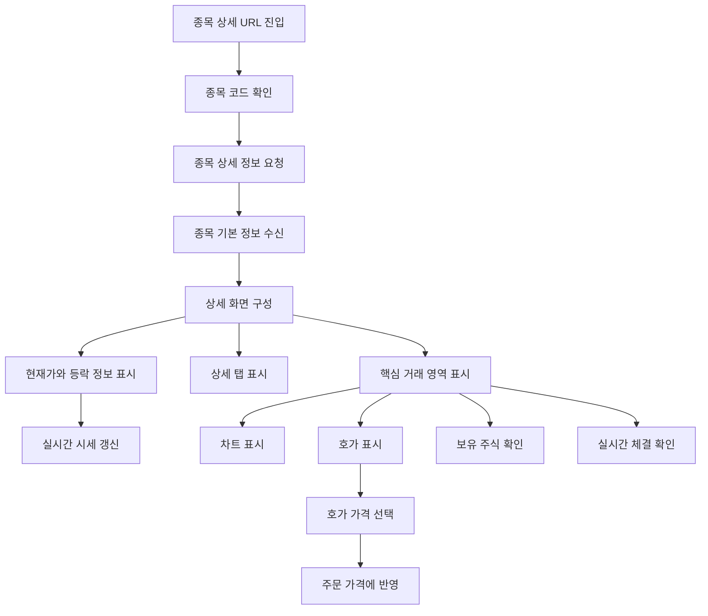

# 종목 상세 기능 화면

## 문서 포털

문서의 상세 구현, API, 아키텍처, 트러블슈팅은 아래 문서를 참고하세요.

| 분류 | 문서 | 분류 | 문서 |
| --- | --- | --- | --- |
| 루트 README | [README](../../README.md) | 서비스 README | [README](../README.md) |
| Engineering Notes | [Engineering Notes](../../docs/ENGINEERING.md) | Database Schema ERD | [Database Schema ERD](../../docs/database-schema.md) |
| 01 | [인증](01-auth.md) | 02 | [종목 목록](02-stock-list.md) |
| 03 | [종목 상세](03-stock-detail.md) | 04 | [차트](04-chart.md) |
| 05 | [주문](05-order.md) | 06 | [호가/체결](06-orderbook-execution.md) |
| 07 | [자산](07-user-asset.md) | 08 | [관심종목](08-watchlist.md) |
| 09 | [실시간 연결](09-websocket.md) | 10 | [프론트엔드 이슈](10-frontend-issues.md) |

## 목차

> [개요](#개요) ·
> [라우팅](#라우팅) ·
> [화면 구성](#화면-구성)

> [실시간 상세 갱신](#실시간-상세-갱신) ·
> [메인 콘텐츠 레이아웃](#메인-콘텐츠-레이아웃) ·
> [흐름](#흐름) ·
> [핵심 구현 파일](#핵심-구현-파일)
## 개요

종목 상세 화면은 종목 코드 기반 동적 라우트로 진입하며, 초기 종목 정보를 REST API로 조회한 뒤 상세 화면 컴포넌트에 전달한다. 상세 화면은 가격 헤더, 탭, 메인 콘텐츠 영역, 롤링 바 형태로 구성된다.

## 화면 구성

`StockDetailForm.jsx`는 다음 컴포넌트를 조합한다.

- `StockPriceHeader`: 종목명, 현재가 등 상단 가격 정보
- `StockTabSelection`: 상세 화면 탭 UI
- `MainContent`: 차트, 호가, 주문, 보유 주식, 체결 영역
- `StockRollingBar`: 하단 롤링 영역

## 실시간 상세 갱신

수신 데이터로 다음 값을 갱신한다.

- `changeRate`
- `changeAmount`
- `openPrice`
- `currentPrice`
- `highPrice`
- `lowPrice`

 화면 표시 전에 `changeRate`를 `Number(...).toFixed(2)`로 변환한다.

## 메인 콘텐츠 레이아웃

`MainContent.jsx`는 분할 가능한 패널 형태로 상세 화면 핵심 기능을 배치한다.

- 차트
- 호가
- 일반 주문
- 보유 주식
- 실시간 체결
- 커뮤니티 영역

분할 크기와 드래그 처리는 `useMainContent.js`에서 관리한다. 호가창에서 선택한 가격은 `selectedPrice` 상태로 저장되고 주문 패널에 전달된다.

## 흐름

## 핵심 구현 파일

기준 경로

`StockFrontEnd`

| 파일 |
| --- |
| `app/stock/[stockCode]/page.js` |
| `app/stock/[stockCode]/layout.js` |
| `features/StockDetail/StockDetailForm.jsx` |
| `features/StockDetail/StockHeader/useStockDetail.js` |
| `features/StockDetail/StockHeader/StockPriceHeader.jsx` |
| `features/StockDetail/StockHeader/StockHeaderName/StockHeaderName.jsx` |
| `features/StockDetail/StockHeader/StockHeaderName/StockHeaderPrice.jsx` |
| `features/StockDetail/StockHeader/StockHeaderTabs/StockHeaderTabs.jsx` |
| `features/StockDetail/StockHeader/StockHeaderTabs/StockHeaderGrid.jsx` |
| `features/StockDetail/StockHeader/StockTabSelection/StockTabSelection.jsx` |
| `features/StockDetail/MainContent/MainContent.jsx` |
| `features/StockDetail/MainContent/useMainContent.js` |
| `features/StockDetail/StockRollingBar/StockRollingBar.jsx` |
| `lib/stock.js` |
| `util/websocket/useStockDetailSocket.js` |

[문서 맨 위로](#top)

