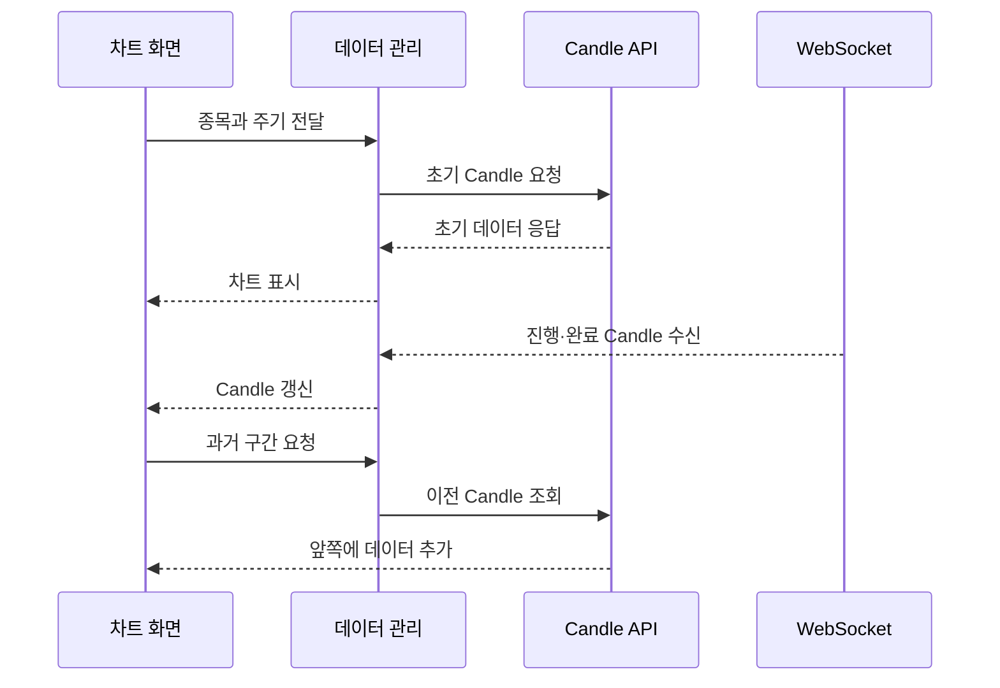

<a id="top"></a>

# 차트 기능

## 문서 포털

상세 구현, API, 아키텍처와 트러블슈팅 정보는 아래 문서에서 확인할 수 있습니다.

| 분류 | 문서 | 분류 | 문서 |
| --- | --- | --- | --- |
| 주식 README | [README](../../README.md) | 주식 거래 플랫폼 README | [README](../README.md) |
| 설계 노트 | [Engineering Notes](../../docs/ENGINEERING.md) | 데이터베이스 ERD | [Database Schema ERD](../../docs/database-schema.md) |
| 인증 | [인증](01-auth.md) | 종목 목록 | [종목 목록](02-stock-list.md) |
| 종목 상세 | [종목 상세](03-stock-detail.md) | 차트 | [차트](04-chart.md) |
| 주문 | [주문](05-order.md) | 호가/체결 | [호가/체결](06-orderbook-execution.md) |
| 자산 | [자산](07-user-asset.md) | 관심종목 | [관심종목](08-watchlist.md) |
| 실시간 연결 | [실시간 연결](09-websocket.md) | 프론트엔드 이슈 | [프론트엔드 이슈](10-frontend-issues.md) |

## 목차

> [개요](#개요) · [차트 주기](#차트-주기) · [초기 데이터와 과거 조회](#초기-데이터와-과거-조회) · [실시간 Candle](#실시간-candle) · [Candle 데이터 구조](#candle-데이터-구조) · [이동평균선](#이동평균선) · [흐름](#흐름) · [핵심 구현 파일](#핵심-구현-파일) · [관련 문서](#관련-문서)

## 개요

차트는 Lightweight Charts로 Candle과 이동평균선을 표시합니다. 초기·과거 데이터는 REST API로 조회하고 진행·완료 Candle은 WebSocket으로 반영합니다.

## 차트 주기

선택한 분봉·일봉·월봉·연봉 주기와 뷰포트 상태를 Zustand로 공유합니다. 선택 값은 API 조회와 WebSocket 구독 기준으로 사용합니다.

### 동작 순서

1. 사용자가 분 또는 기간 표시 값을 선택합니다.
2. 화면 표시 값을 서버가 사용하는 Candle 유형으로 변환합니다.
3. 선택한 유형을 초기 조회와 WebSocket 구독 기준에 반영합니다.

### 핵심 코드

```js
const useChartButtonStore = create((set, get) => ({
  // 생략: 차트 주기와 메뉴 상태
  setResolution: (num) => {
    const targetKey = Object.keys(ChartMinuteEnum).find(
        (key) => ChartMinuteEnum[key] === String(num)
    );
    set({
        selectedMinute: String(num),
        selectedChartTime: targetKey || 'ONE_MINUTE',
        isResolutionOpen: false
    });
  },
}));
```

화면의 표시 값과 백엔드 Candle enum이 달라 생기는 주기 불일치를 막기 위한 변환입니다. 사용자가 선택한 분 값을 입력으로 서버 유형(`selectedChartTime`)을 찾고 표시용 값과 함께 전역 상태에 저장합니다. 동일한 결과가 REST 조회와 WebSocket 구독에 사용되어 두 데이터 경로가 같은 주기를 바라봅니다.

### 구현 위치

- 주기 선택 UI: `features/StockDetail/Chart/ChartSelectMenu.jsx`
- 전역 상태: `store/chartButtonStore.js`
- 주기 정의: `util/function/ChartTimeEnum.ts`

## 초기 데이터와 과거 조회

처음에는 초기 Candle API를 호출합니다. 사용자가 과거 영역으로 이동하면 가장 오래된 Candle을 기준으로 조회 범위를 계산해 앞쪽에 데이터를 추가합니다.

### 동작 순서

1. 차트의 초기 Candle을 조회하는 API(`GET {ORDER_API_URL}/candle/{stockCode}/init?type={type}`)를 호출합니다.
2. 응답을 시간순으로 정규화해 차트에 표시합니다.
3. 과거 영역 진입 시 `startTime`과 `endTime`을 계산합니다.
4. 과거 Candle을 기간별로 조회하는 API(`GET {ORDER_API_URL}/candle/{stockCode}`)로 이전 구간을 요청합니다.
5. 새 데이터를 기존 배열 앞에 추가하고 화면 위치를 유지합니다.

### 핵심 코드

```js
const fetchInitialCandles = useCallback(async () => {
    if (!stockCode || !type) return;
    datafeedRef.current = new Datafeed();
    try {
        const res = await getCandleInitApi(stockCode, type);
        const enrichedCandles = enrichLastCandleMA(res.data);
        datafeedRef.current.setInitialData(enrichedCandles);
        onCandleUpdateRef.current?.({ type: 'init', candles: enrichedCandles });
    } catch (err) {
        console.error(err);
    }
}, [stockCode, type]);
```

조회 결과와 실시간 데이터를 하나의 Datafeed에서 이어 붙이기 위해 종목이나 주기가 바뀔 때 데이터 원본을 초기화합니다. 종목 코드와 선택 주기로 초기 Candle을 조회하고 마지막 Candle의 누락된 이동평균을 보완합니다. 정리된 배열은 Datafeed와 차트 callback에 동시에 전달되어 첫 렌더링의 기준이 됩니다.

### 구현 위치

- Candle API: `lib/candle.js`
- 데이터 관리: `features/StockDetail/Chart/useChart.js`의 `Datafeed`
- 차트 렌더링: `features/StockDetail/Chart/ChartComponent.jsx`

## 실시간 Candle

진행 중 Candle은 같은 시간 구간을 갱신하고, 완료 Candle은 확정 데이터로 반영합니다. 분·시간 계열은 `ONE_MINUTE`, 주·월·연 계열은 `DAY` topic을 구독한 뒤 화면 주기에 맞게 집계합니다.

### 동작 순서

1. 선택 주기를 구독용 타입으로 변환합니다.
2. 진행 중 Candle을 수신하는 WebSocket Topic(`/topic/candle/{stockCode}/{subscribeType}`)을 구독합니다.
3. 완료된 Candle을 수신하는 WebSocket Topic(`/topic/candle/completed/{stockCode}/{subscribeType}`)을 구독합니다.
4. 진행 Candle을 병합하고 완료 Candle을 확정합니다.
5. 화면을 벗어나거나 주기가 바뀌면 기존 구독을 해제합니다.

### 핵심 코드

```js
const subscribeType = getSubscribeType(type);

useEffect(() => {
    if (!client || !connected || !stockCode || !subscribeType) return;

    const subscription = client.subscribe(`/topic/candle/${stockCode}/${subscribeType}`, message => {
        setLiveCandle(toCandlePayload(JSON.parse(message.body)));
    });

    return () => subscription.unsubscribe();
}, [client, connected, stockCode, subscribeType]);
```

화면 주기와 서버 발행 주기가 다를 수 있어 선택 값을 구독용 유형으로 먼저 정규화합니다. 연결 상태·종목 코드·주기를 입력으로 진행 중 Candle Topic을 구독하고 메시지를 공통 payload로 변환합니다. 종목이나 주기가 바뀔 때 기존 구독을 해제해 이전 시계열이 현재 차트에 섞이는 문제를 막습니다.

### 구현 위치

- Candle 구독: `util/websocket/useCandleSocket.js`
- 병합과 정규화: `features/StockDetail/Chart/useChart.js`
- 주문 WebSocket: `util/websocket/context/OrderWebSocketContext.js`

## Candle 데이터 구조

Candle은 데이터베이스 엔티티가 아니라 API와 WebSocket에서 받은 데이터를 차트 형식으로 정규화한 객체입니다.

| 구분 | 필드 | 역할 |
| --- | --- | --- |
| 가격 | `open`, `high`, `low`, `close` | 해당 구간의 OHLC 가격 |
| 거래량 | `buyQty`, `sellQty` | 매수·매도 체결 수량 |
| 시간 | `time` | 서버의 `time` 또는 `date`를 통합한 차트 시간 |
| 종류 | `candleType` | 수신한 Candle 주기 |
| 보조 지표 | `movingAverages` | 서버가 전달한 이동평균 데이터 |

진행 Candle과 완료 Candle은 같은 구조를 사용합니다. 두 데이터의 차이는 필드가 아니라 기존 구간을 갱신하는지 확정하는지에 있습니다.

### 동작 순서

1. WebSocket 메시지의 가격·거래량·시간 필드를 읽습니다.
2. 서버의 `time` 또는 `date`를 공통 `time` 필드로 통합합니다.
3. 차트 데이터와 이동평균 처리에서 사용하는 Candle 객체로 반환합니다.

### 핵심 코드

```js
function toCandlePayload(data) {
    return {
        open: data.open,
        low: data.low,
        high: data.high,
        close: data.close,
        buyQty: data.buyQty,
        sellQty: data.sellQty,
        time: data.time || data.date,
        candleType: data.candleType,
        movingAverages: data.movingAverages,
    };
}
```

REST와 WebSocket 응답의 시간 필드 차이가 이후 병합 로직으로 전파되지 않도록 경계에서 Candle 형태를 통일합니다. 수신 객체를 입력으로 OHLC·거래량·주기·이동평균을 선택하고 `time`과 `date`를 하나의 `time`으로 정규화합니다. 결과는 진행·완료 Candle 상태와 차트 Datafeed가 공통으로 사용합니다.

### 구현 위치

- WebSocket payload 정규화: `util/websocket/useCandleSocket.js`의 `toCandlePayload()`
- 차트 데이터 병합: `features/StockDetail/Chart/useChart.js`

## 이동평균선

확정 Candle과 현재 종가로 5·20·60 기간 이동평균을 계산합니다. 계산 결과는 Candle과 함께 차트에 표시합니다.

### 동작 순서

1. 확정 Candle에서 각 기간에 필요한 최근 종가를 선택합니다.
2. 현재 진행 Candle의 종가를 추가합니다.
3. 평균을 계산해 5·20·60 이동평균 값으로 저장합니다.

### 핵심 코드

```js
function calculateLiveMA(confirmedCandles, currentCandle) {
    const ma = {};
    const closes = confirmedCandles.map(c => c.close);

    for (const period of MA_PERIODS) {
        const recentCloses = closes.slice(-(period - 1));
        const allCloses = [...recentCloses, currentCandle.close];
        const sum = allCloses.reduce((a, b) => a + b, 0);
        ma[period] = Math.round((sum / allCloses.length) * 100) / 100;
    }
    return ma;
}
```

서버가 아직 이동평균을 제공하지 않은 진행 Candle에서도 보조선이 끊기지 않도록 현재 값을 계산합니다. 확정 Candle의 최근 종가와 현재 종가를 입력으로 5·20·60 기간 평균을 구합니다. 계산 결과는 진행 Candle의 `movingAverages`에 합쳐져 가격 변화와 함께 보조선에 반영됩니다.

### 구현 위치

- 이동평균 계산: `features/StockDetail/Chart/useChart.js`
- 선 렌더링: `features/StockDetail/Chart/ChartComponent.jsx`

## 흐름



## 핵심 구현 파일

기준 경로: `StockFrontEnd`

| 파일 |
| --- |
| `features/StockDetail/Chart/ChartForm.jsx` |
| `features/StockDetail/Chart/ChartComponent.jsx` |
| `features/StockDetail/Chart/ChartSelectMenu.jsx` |
| `features/StockDetail/Chart/useChart.js` |
| `lib/candle.js` |
| `store/chartButtonStore.js` |
| `util/function/ChartTimeEnum.ts` |
| `util/websocket/useCandleSocket.js` |

## 관련 문서

- [종목 상세](03-stock-detail.md)
- [실시간 연결](09-websocket.md)
- [트러블슈팅](11-troubleshooting.md)

<div align="right">[문서 맨 위로](#top)</div>
