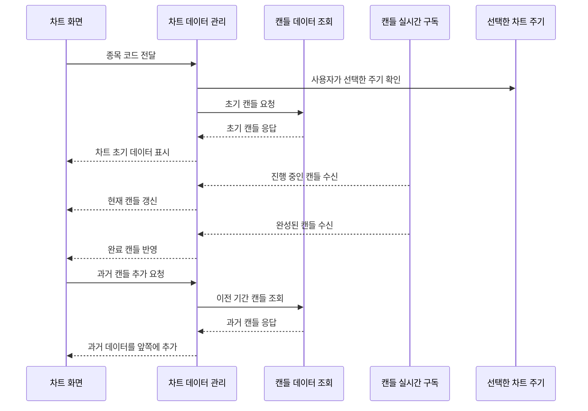

# 차트 기능

## 문서 포털

문서의 상세 구현, API, 아키텍처, 트러블슈팅은 아래 문서를 참고하세요.

| 분류 | 문서 | 분류 | 문서 |
| --- | --- | --- | --- |
| 루트 README | [README](../../README.md) | 서비스 README | [README](../README.md) |
| Engineering Notes | [Engineering Notes](../../docs/ENGINEERING.md) | Database Schema ERD | [Database Schema ERD](../../docs/database-schema.md) |
| 01 | [인증](01-auth.md) | 02 | [종목 목록](02-stock-list.md) |
| 03 | [종목 상세](03-stock-detail.md) | 04 | [차트](04-chart.md) |
| 05 | [주문](05-order.md) | 06 | [호가/체결](06-orderbook-execution.md) |
| 07 | [자산](07-user-asset.md) | 08 | [관심종목](08-watchlist.md) |
| 09 | [실시간 연결](09-websocket.md) | 10 | [프론트엔드 이슈](10-frontend-issues.md) |

## 목차

> [개요](#개요) ·
> [핵심 구현 파일](#핵심-구현-파일) ·
> [차트 시간 상태](#차트-시간-상태) ·
> [초기 데이터 조회](#초기-데이터-조회)

> [실시간 캔들](#실시간-캔들) ·
> [Datafeed](#datafeed) ·
> [이동평균](#이동평균) ·
> [흐름](#흐름)

## 개요

차트 기능은 `lightweight-charts`를 사용해 캔들 데이터를 표시한다. 초기 캔들 데이터는 REST API로 조회하고, 실시간 캔들과 완성 캔들은 WebSocket으로 받아 차트 데이터에 반영한다. 이동평균은 5, 20, 60 기간 기준으로 계산된다.

## 차트 시간 상태

`store/chartButtonStore.js`는 Zustand 기반으로 선택된 차트 주기를 관리한다. `useChart.js`는 이 store의 `selectedChartTime` 값을 사용해 캔들 조회와 WebSocket 구독 기준을 정한다.

store에는 차트 주기 외에도 차트 뷰포트 상태가 있다.

- `visibleBarsCount`
- `rightOffset`
- `setChartViewport(visibleBarsCount, rightOffset)`

## 초기 데이터 조회

`lib/candle.js`는 캔들 API를 제공한다.

- `getCandleInitApi(stockCode, type)`
- `getCandleApi(stockCode, type, startTime, endTime)`

초기 조회 엔드포인트:

- `GET {ORDER_API_URL}/candle/{stockCode}/init?type={type}`

과거 데이터 추가 조회 엔드포인트:

- `GET {ORDER_API_URL}/candle/{stockCode}?type={type}&startTime={startTime}&endTime={endTime}`

`lib/candle.js`는 `startTime`, `endTime`을 KST 기준 문자열로 변환해 query string에 넣는다.

## 실시간 캔들

`useChart.js`는 `useCandleSocket(client, connected, stockCode, type)` 웹소켓을 사용해 실시간 캔들 데이터를 받는다. 여기서 `client`, `connected`는 `OrderWebSocketContext`에서 제공된다.

수신 데이터는 두 종류로 처리된다.

- `liveCandle`: 현재 진행 중인 캔들 갱신
- `completedCandle`: 완성된 캔들 반영

`useCandleSocket.js`의 실제 구독 토픽은 다음과 같다.

- 실시간 캔들: `/topic/candle/{stockCode}/{subscribeType}`
- 완성 캔들: `/topic/candle/completed/{stockCode}/{subscribeType}`

`subscribeType`은 화면에서 선택한 차트 주기를 그대로 쓰지 않고 다음 규칙으로 변환한다.

- 분/시간 계열: `ONE_MINUTE`
- `DAY`: `DAY`
- `WEEK`, `MONTH`, `YEAR`: `DAY`

## Datafeed

`useChart.js` 내부의 `Datafeed` 클래스는 캔들 배열과 과거 데이터 로딩 상태를 관리한다.

주요 역할:

- 초기 캔들 저장
- 가장 오래된 캔들 기준으로 과거 데이터 추가 로딩
- live candle 병합
- completed candle 병합
- 캔들 주기별 시간 정규화
- 마지막 캔들 이동평균 보정

과거 데이터 추가 로딩은 현재 저장된 가장 오래된 캔들 시간을 기준으로 `startTime`, `endTime`을 계산해 캔들 조회 API 요청을 보내는 방식이다.
구현은 `getCandleApi()` (기간 기준 캔들 조회 기능)에서 담당한다.

## 이동평균선

이동평균선의 기간은 다음과 같다.
- 5
- 20
- 60

`calculateLiveMA()`는 확정된 캔들과 현재 캔들의 종가를 이용해 실시간 이동평균을 계산한다.

## 흐름

## 핵심 구현 파일

기준 경로

`StockFrontEnd`

| 파일 |
| --- |
| `features/StockDetail/Chart/ChartForm.jsx` |
| `features/StockDetail/Chart/ChartComponent.jsx` |
| `features/StockDetail/Chart/ChartSelectMenu.jsx` |
| `features/StockDetail/Chart/useChart.js` |
| `features/StockDetail/Chart/ChartForm.css` |
| `features/StockDetail/Chart/ChartSelectMenu.css` |
| `lib/candle.js` |
| `store/chartButtonStore.js` |
| `util/function/ChartTimeEnum.ts` |
| `util/websocket/useCandleSocket.js` |
| `util/websocket/context/OrderWebSocketContext.js` |

[문서 맨 위로](#top)

