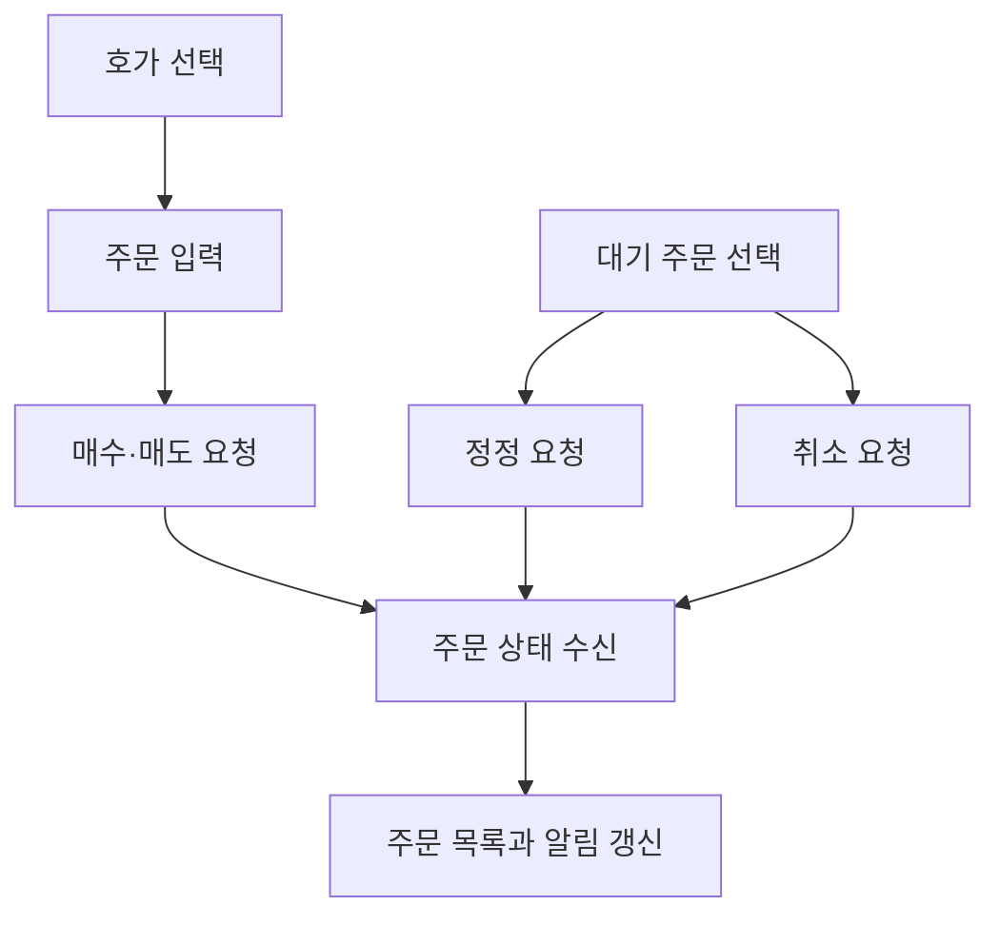

<a id="top"></a>

# 주문 기능

## 문서 포털

상세 구현, API, 아키텍처와 트러블슈팅 정보는 아래 문서에서 확인할 수 있습니다.

| 분류 | 문서 | 분류 | 문서 |
| --- | --- | --- | --- |
| 주식 README | [README](../../README.md) | 주식 거래 플랫폼 README | [README](../README.md) |
| 설계 노트 | [Engineering Notes](../../docs/ENGINEERING.md) | 데이터베이스 ERD | [Database Schema ERD](../../docs/database-schema.md) |
| 인증 | [인증](01-auth.md) | 종목 목록 | [종목 목록](02-stock-list.md) |
| 종목 상세 | [종목 상세](03-stock-detail.md) | 차트 | [차트](04-chart.md) |
| 주문 | [주문](05-order.md) | 호가/체결 | [호가/체결](06-orderbook-execution.md) |
| 자산 | [자산](07-user-asset.md) | 관심종목 | [관심종목](08-watchlist.md) |
| 실시간 연결 | [실시간 연결](09-websocket.md) | 프론트엔드 이슈 | [프론트엔드 이슈](10-frontend-issues.md) |

## 목차

> [개요](#개요) · [주문 생성](#주문-생성) · [주문 정정](#주문-정정) · [주문 취소](#주문-취소) · [주문 데이터 비교](#주문-데이터-비교) · [주문 조회와 실시간 갱신](#주문-조회와-실시간-갱신) · [흐름](#흐름) · [핵심 구현 파일](#핵심-구현-파일) · [관련 문서](#관련-문서)

## 개요

종목 상세 화면에서 매수·매도·대기 주문을 처리합니다. 호가에서 선택한 가격을 주문에 반영하고 주문 상태는 사용자 WebSocket 메시지로 갱신합니다.

## 주문 생성

지정가는 입력 가격을 사용하고 시장가는 `tradePrice`를 `null`로 전송합니다. 요청에는 주문 유형, 종목, 수량과 가격을 포함합니다.

### 동작 순서

1. 매수 또는 매도 탭을 선택합니다.
2. 호가 가격이나 직접 입력한 가격과 수량을 확인합니다.
3. 매수·매도 주문을 생성하는 API(`POST {ORDER_API_URL}/order/trade`)를 호출합니다.
4. 주문 결과는 WebSocket으로 주문 목록에 반영합니다.

### 핵심 코드

```js
async function buyExecuteOrder({ tradeTypeTab }) {
        try {
            const numericPrice = priceType === 'market' ? null : Number(buyPrice.replace(/,/g, ''));
            const res = await orderApi(tradeTypeTab, stockCode,stockName, buyQuantity, numericPrice);
            if (!res.success) {
                throw new Error(res.message || "주문 실패");
            }
            return res.data;
        } catch (err) {
            console.log(err.message);
            return null;
        }
    }
```

화면 입력 형식과 백엔드 주문 형식을 분리해 지정가와 시장가를 같은 API로 처리하기 위한 로직입니다. 주문 유형·종목·수량·화면 가격을 입력받아 숫자 가격으로 정규화하고, 시장가는 `tradePrice`를 `null`로 전달합니다. 접수 성공 이후 목록은 WebSocket 주문 메시지로 갱신되므로 API 결과와 실시간 상태의 책임이 분리됩니다.

### 구현 위치

- 주문 화면: `features/StockDetail/MainContent/Order/OrderForm.jsx`
- 매수·매도 상태: `features/StockDetail/MainContent/Order/Buy/useOrderBuy.js`, `features/StockDetail/MainContent/Order/Sell/useOrderSell.js`
- 주문 API: `lib/order.js`의 `orderApi()`

## 주문 정정

대기 주문의 가격과 수량을 선택해 정정 요청을 전송합니다. 상세 패널과 전역 사이드 패널에서 같은 API를 사용합니다.

### 동작 순서

1. 대기 주문에서 정정 대상을 선택합니다.
2. 주문 정보를 정정 입력 상태로 복사합니다.
3. 대기 주문을 변경하는 정정 API(`POST {ORDER_API_URL}/order/edit`)에 변경 값을 전송합니다.
4. 실시간 주문 메시지로 목록을 갱신합니다.

### 핵심 코드

```js
export async function editOrderApi(orderId,tradeType,stockName,stockCode,quantity,tradePrice) {
  // 생략: 요청 값 로그
  return await apiFetch(`${ORDER_API_URL}/order/edit`,{
    method: 'POST',
    auth: true,
    body: JSON.stringify({
      orderId,
      tradeType,
      stockCode,
      stockName,
      quantity: Number(quantity),
      tradePrice
    }),
  })
}
```

기존 주문을 정확히 식별하면서 생성 주문과 같은 가격 규칙을 재사용하기 위한 정정 로직입니다. 정정 대상의 `orderId`와 거래 정보, 새 수량·가격을 입력받아 시장가 여부를 정규화한 뒤 정정 API를 호출합니다. 성공 결과는 WebSocket 상태 변경으로 주문 목록에 반영되고 실패 메시지는 정정 화면의 오류 상태가 됩니다.

### 구현 위치

- 상세 정정: `features/StockDetail/MainContent/Order/Edit/useOrderEdit.js`
- 사이드 정정: `features/StockDetail/MainContent/Order/Edit/useSideBarEditOrder.js`
- 전역 상태: `store/editStore.js`
- 정정 API: `lib/order.js`의 `editOrderApi()`

## 주문 취소

선택한 대기 주문을 확인한 뒤 주문 ID로 취소합니다.

### 동작 순서

1. 취소할 주문을 선택합니다.
2. 확인 화면에 주문 정보를 표시합니다.
3. 선택한 주문을 취소하는 API(`POST {ORDER_API_URL}/order/cancel/{orderId}`)를 호출합니다.
4. 취소 메시지를 받으면 주문 목록에서 제거합니다.

### 핵심 코드

```js
executeCancel: async () => {
    const { cancelTarget, closeCancel } = get();
    try {
        await cancelOrder(cancelTarget.orderId);
        closeCancel();
    } catch (e) {
        console.error(e);
    }
}
```

화면 종류와 관계없이 같은 취소 대상을 처리하도록 선택 주문을 전역 취소 상태에 보관합니다. 저장된 주문의 `orderId`를 입력으로 취소 API를 호출하고 성공하면 확인 화면을 닫습니다. 실제 목록 제거는 서버의 `CANCELLED` 메시지가 도착했을 때 수행해 서버 상태와 UI 상태를 일치시킵니다.

### 구현 위치

- 취소 화면: `features/StockDetail/MainContent/Order/Cancel/CancelForm.jsx`, `features/StockDetail/MainContent/Order/Cancel/SideBarCancelForm.jsx`
- 취소 상태: `store/cancelStore.js`
- 취소 API: `lib/order.js`의 `cancelOrder()`

## 주문 데이터 비교

주문 생성·정정 요청과 실시간 주문 응답은 목적이 달라 포함하는 필드가 다릅니다.

| 데이터 | 공통 필드 | 추가 필드 | 역할 |
| --- | --- | --- | --- |
| 생성 요청 | `tradeType`, `stockCode`, `stockName`, `quantity`, `tradePrice` | 없음 | 신규 주문 접수 |
| 정정 요청 | 생성 요청 필드 전체 | `orderId` | 기존 주문 식별 후 변경 |
| 취소 요청 | 없음 | URL의 `orderId` | 선택한 주문 취소 |
| 실시간 주문 응답 | `orderId`, `tradeType`, `stockCode`, `stockName`, `quantity`, `tradePrice` | `remainingQuantity`, `status`, `executedQuantity` | 목록과 알림 갱신 |

시장가 주문은 생성·정정 요청의 `tradePrice`를 `null`로 전송합니다. 실시간 응답의 `status`는 `PENDING`, `PARTIAL`, `COMPLETED`, `CANCELLED` 중 하나입니다.

### 구현 위치

- 요청 객체 생성: `lib/order.js`
- 실시간 응답 처리: `util/websocket/useOrderSocket.js`

## 주문 조회와 실시간 갱신

종목별·전체·체결 완료 주문을 API로 조회합니다. 사용자 주문 상태를 수신하는 WebSocket Queue(`/user/queue/orders`)에서 `PENDING`, `PARTIAL`, `COMPLETED`, `CANCELLED` 상태를 받아 목록과 알림을 갱신합니다.

### 동작 순서

1. 화면에 필요한 주문 목록을 조회합니다.
2. 로그인 사용자의 주문 queue를 구독합니다.
3. 주문 상태에 따라 항목을 추가·교체·삭제합니다.
4. 결과 알림을 표시합니다.

### 핵심 코드

#### WebSocket 구독

```js
useEffect(() => {
  const sub = client.subscribe('/user/queue/orders', message => {
    const data = JSON.parse(message.body);
    updateOrders(data);
  });
  return () => sub.unsubscribe();
}, [client, connected, user]);
```

#### 상태 갱신

```js
setOrders(prev => {
    switch (data.status) {
        case 'PENDING': {
            const exists = prev.find(o => o.orderId == data.orderId);
            if (exists) {
                return prev.map(o => o.orderId == data.orderId ? { ...o, ...data } : o);
            }
            return [...prev, data];
        }
        // 생략: PARTIAL도 같은 방식으로 추가하거나 교체한다.
        case 'COMPLETED':
        case 'CANCELLED': {
            const exists = prev.find(o => o.orderId == data.orderId);
            if (!exists) return prev;
            return prev.filter(o => o.orderId != data.orderId);
        }
        default: return prev;
    }
});
```

API 조회 이후 발생하는 주문 변화를 추가 요청 없이 동기화하기 위한 두 단계 로직입니다. 사용자 Queue 메시지를 `updateOrders()`로 전달하고 `orderId`와 상태를 기준으로 대기·부분 체결 항목은 추가 또는 교체합니다. 완료·취소 항목은 대기 목록에서 제거되며 같은 메시지는 사용자 알림에도 반영됩니다.

### 구현 위치

- 주문 조회: `lib/order.js`
- 실시간 상태: `util/websocket/useOrderSocket.js`
- 알림: `features/UI/notification/NotificationForm.jsx`

## 흐름



## 핵심 구현 파일

기준 경로: `StockFrontEnd`

| 파일 |
| --- |
| `features/StockDetail/MainContent/Order/OrderForm.jsx` |
| `features/StockDetail/MainContent/Order/Buy/useOrderBuy.js` |
| `features/StockDetail/MainContent/Order/Sell/useOrderSell.js` |
| `features/StockDetail/MainContent/Order/Edit/useOrderEdit.js` |
| `features/StockDetail/MainContent/Order/Cancel/useCancel.js` |
| `lib/order.js` |
| `store/cancelStore.js` |
| `store/editStore.js` |
| `util/websocket/useOrderSocket.js` |

## 관련 문서

- [인증](01-auth.md)
- [호가와 체결](06-orderbook-execution.md)
- [사용자 자산](07-user-asset.md)

<div align="right">[문서 맨 위로](#top)</div>
