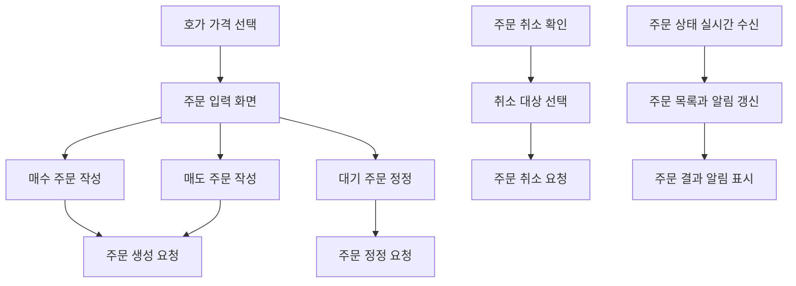

# 주문 기능

## 문서 포털

문서의 상세 구현, API, 아키텍처, 트러블슈팅은 아래 문서를 참고하세요.

| 분류 | 문서 | 분류 | 문서 |
| --- | --- | --- | --- |
| 루트 README | [README](../../README.md) | 서비스 README | [README](../README.md) |
| Engineering Notes | [Engineering Notes](../../docs/ENGINEERING.md) | Database Schema ERD | [Database Schema ERD](../../docs/database-schema.md) |
| 01 | [인증](01-auth.md) | 02 | [종목 목록](02-stock-list.md) |
| 03 | [종목 상세](03-stock-detail.md) | 04 | [차트](04-chart.md) |
| 05 | [주문](05-order.md) | 06 | [호가/체결](06-orderbook-execution.md) |
| 07 | [자산](07-user-asset.md) | 08 | [관심종목](08-watchlist.md) |
| 09 | [실시간 연결](09-websocket.md) | 10 | [프론트엔드 이슈](10-frontend-issues.md) |

## 목차

> [개요](#개요) ·
> [핵심 구현 파일](#핵심-구현-파일) ·
> [주문 탭](#주문-탭) ·
> [주문 생성](#주문-생성) ·
> [주문 정정](#주문-정정)

> [주문 취소](#주문-취소) ·
> [내 주문 조회](#내-주문-조회) ·
> [주문 실시간 갱신](#주문-실시간-갱신) ·
> [흐름](#흐름)

## 개요

주문 기능은 종목 상세 화면의 주문 패널에서 제공된다. 매수, 매도, 대기 주문 탭을 전환할 수 있고, 주문 생성, 주문 정정, 주문 취소 API를 사용한다.

## 주문 탭

주문(tradeTypeTab) 탭으로 주문을  제어한다.

- `BUY`: 매수
- `SELL`: 매도
- `PENDING`: 대기 주문

호가창에서 선택한 가격은 `selectedPrice`로 전달되어 주문 가격 입력에 활용된다.

## 주문 생성

`orderApi()`는 주문 생성 요청을 담당한다.

엔드포인트:

- `POST {ORDER_API_URL}/order/trade`

요청 데이터:

- `tradeType`
- `stockCode`
- `stockName`
- `quantity`
- `tradePrice`

매수/매도 훅은 `priceType`을 기준으로 지정가와 시장가를 구분한다.

- 지정가: 입력 가격에서 콤마를 제거하고 숫자로 변환해 `tradePrice`로 전달
- 시장가: `tradePrice`를 `null`로 전달

호가에서 가격을 선택하면 현재 탭이 `BUY`일 때는 `buyPrice`, `SELL`일 때는 `sellPrice`에 반영된다. 초기 가격은 `closePrice`가 있으면 종가 기준으로 설정된다.

## 주문 정정

`editOrderApi()`는 주문 정정 요청을 담당한다.

엔드포인트:

- `POST {ORDER_API_URL}/order/edit`

요청 데이터:

- `orderId`
- `tradeType`
- `stockCode`
- `stockName`
- `quantity`
- `tradePrice`

상세 주문 패널 내부의 대기 주문 탭은 `useOrderEdit()`가 관리한다.

- `UserHaveAssetContext()`에서 전체 주문 목록을 읽는다.
- 현재 종목 코드와 같은 주문만 `stockOrders`로 필터링한다.
- `handleEditOpen(order)`로 정정 대상, 가격, 수량을 초기화한다.
- `editExecuteOrder()`로 정정 API 요청을 보낸다.

전역 정정 사이드 패널 상태는 `store/editStore.js`에서 관리한다.

## 주문 취소

`cancelOrder()`는 주문 취소 요청을 담당한다.

엔드포인트:

- `POST {ORDER_API_URL}/order/cancel/{orderId}`

취소 모달/패널 상태는 `store/cancelStore.js`에서 관리한다.

## 내 주문 조회

`lib/order.js`는 다음 조회 API를 제공한다.

- `getMyStockOrder(stockCode)`: 종목별 내 주문
- `getMyAllOrder()`: 전체 미체결/진행 주문
- `getMyCompletedOrder()`: 체결 완료 주문

## 주문 실시간 갱신

`util/websocket/useOrderSocket.js`는 로그인 사용자 기준으로 주문 상태를 구독한다.

구독 토픽:

- `/user/queue/orders`

처리하는 주문 상태:

- `PENDING`
- `PARTIAL`
- `COMPLETED`
- `CANCELLED`

상태에 따라 주문 목록을 추가, 갱신, 삭제하고 알림 목록도 함께 갱신한다.

알림은 `UserHaveAssetProvider`가 제공하는 `notifications`에 저장되고, `features/UI/notification/NotificationForm.jsx`에서 렌더링된다. 각 알림은 3초 뒤 제거된다.

## 흐름

## 핵심 구현 파일

기준 경로

`StockFrontEnd`

| 파일 |
| --- |
| `features/StockDetail/MainContent/Order/OrderForm.jsx` |
| `features/StockDetail/MainContent/Order/Buy/OrderBuyForm.jsx` |
| `features/StockDetail/MainContent/Order/Buy/useOrderBuy.js` |
| `features/StockDetail/MainContent/Order/Sell/OrderSellForm.jsx` |
| `features/StockDetail/MainContent/Order/Sell/useOrderSell.js` |
| `features/StockDetail/MainContent/Order/Edit/OrderPendingForm.jsx` |
| `features/StockDetail/MainContent/Order/Edit/useOrderEdit.js` |
| `features/StockDetail/MainContent/Order/Edit/SideBarEditForm.jsx` |
| `features/StockDetail/MainContent/Order/Edit/useSideBarEditOrder.js` |
| `features/StockDetail/MainContent/Order/Cancel/CancelForm.jsx` |
| `features/StockDetail/MainContent/Order/Cancel/SideBarCancelForm.jsx` |
| `features/StockDetail/MainContent/Order/Cancel/useCancel.js` |
| `features/StockDetail/MainContent/Order/Commonutil/OrderCommon.jsx` |
| `features/StockDetail/MainContent/Order/Commonutil/stockPriceUnit.js` |
| `lib/order.js` |
| `store/cancelStore.js` |
| `store/editStore.js` |
| `util/websocket/useOrderSocket.js` |
| `features/UI/notification/NotificationForm.jsx` |
| `features/UI/notification/useNotification.js` |

[문서 맨 위로](#top)

