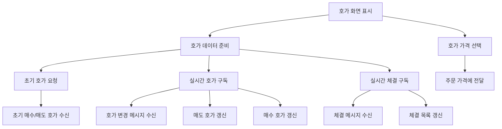

# 호가와 체결 기능

## 문서 포털

문서의 상세 구현, API, 아키텍처, 트러블슈팅은 아래 문서를 참고하세요.

| 분류 | 문서 | 분류 | 문서 |
| --- | --- | --- | --- |
| 루트 README | [README](../../README.md) | 서비스 README | [README](../README.md) |
| Engineering Notes | [Engineering Notes](../../docs/ENGINEERING.md) | Database Schema ERD | [Database Schema ERD](../../docs/database-schema.md) |
| 01 | [인증](01-auth.md) | 02 | [종목 목록](02-stock-list.md) |
| 03 | [종목 상세](03-stock-detail.md) | 04 | [차트](04-chart.md) |
| 05 | [주문](05-order.md) | 06 | [호가/체결](06-orderbook-execution.md) |
| 07 | [자산](07-user-asset.md) | 08 | [관심종목](08-watchlist.md) |
| 09 | [실시간 연결](09-websocket.md) | 10 | [프론트엔드 이슈](10-frontend-issues.md) |

## 목차

> [개요](#개요) ·
> [핵심 구현 파일](#핵심-구현-파일) ·
> [초기 호가 조회](#초기-호가-조회) ·
> [실시간 호가](#실시간-호가)

> [표시 범위](#표시-범위) ·
> [체결 내역](#체결-내역) ·
> [가격 색상](#가격-색상) ·
> [흐름](#흐름)

## 개요

호가 기능은 REST API로 초기 호가 데이터를 가져온 뒤 WebSocket으로 매수/매도 호가 변경을 반영한다. 체결 내역은 종목 WebSocket을 통해 받아 호가 화면과 실시간 체결 영역에서 사용한다.

## 초기 호가 조회

`getOrderbookApi()`는 초기 호가 데이터를 조회한다.

엔드포인트:

- `GET {ORDER_API_URL}/order/orderbook/{stockCode}`

`useHoga.js`는 응답의 `sellOrders`, `buyOrders`를 화면 표시용 데이터로 변환한다.

## 실시간 호가

`useHoga.js`는 주문 실시간 연결 상태를 기준으로 종목별 호가 변경을 구독한다.
구현은 `useHogaSocket()` (호가 변경 메시지 구독 기능)에서 담당한다.

실제 구독 토픽:

- `/topic/hoga/{stockCode}`

콜백:

- `onSellUpdate({ price, qty })`
- `onBuyUpdate({ price, qty })`

수량이 0이면 해당 가격대 호가를 제거하고, 기존 가격대가 있으면 수량을 갱신한다. 없으면 새 가격대를 추가한 뒤 가격 기준으로 정렬한다.

## 표시 범위

`useHoga.js`는 화면에 표시할 호가 개수를 제한한다.

- `MAX_VISIBLE_ORDERS = 10`
- 매도 호가: `sellOrders.slice(-MAX_VISIBLE_ORDERS)`
- 매수 호가: `buyOrders.slice(0, MAX_VISIBLE_ORDERS)`

총 매도/매수 수량과 막대 너비 계산도 이 훅에서 처리한다.

## 체결 내역

`useExecutionSocket()`는 체결 메시지를 구독해 `executions`배열을 제공한다. `stockClient`, `stockConnected`는 `StockWebSocketContext`에서 온다.

실제 구독 토픽:

- `/topic/execution/{stockCode}`

수신 메시지는 다음 필드로 정규화된다.

- `tradeType`
- `price`
- `quantity`
- `changeRate`
- `totalVolume`
- `time`

`useExecutionSocket()` 은 최신 체결을 배열 앞에 추가해 최신순을 유지하고, 최대 100개까지 유지한다.

`useHoga.js`는 `executions[0]?.price`를 `lastExecutionPrice`로 계산한다.

`RealTimeTicks` 영역은 `useRealTimeTicks(stockCode)` 훅을 통해 같은 체결 데이터를 표시한다.

## 흐름

## 핵심 구현 파일

기준 경로

`StockFrontEnd`

| 파일 |
| --- |
| `features/StockDetail/MainContent/HogaChart/HogaChart.jsx` |
| `features/StockDetail/MainContent/HogaChart/useHoga.js` |
| `features/StockDetail/MainContent/HogaChart/HogaChart.css` |
| `features/StockDetail/MainContent/RealTimeTicks/realTimeTicks.jsx` |
| `features/StockDetail/MainContent/RealTimeTicks/useRealTimeTicks.js` |
| `features/StockDetail/MainContent/RealTimeTicks/realTimeTicks.css` |
| `lib/trade.js` |
| `util/websocket/useHogaSocket.js` |
| `util/websocket/useExecutionSocket.js` |
| `util/websocket/context/OrderWebSocketContext.js` |
| `util/websocket/context/StockWebSocketContext.js` |

[문서 맨 위로](#top)

