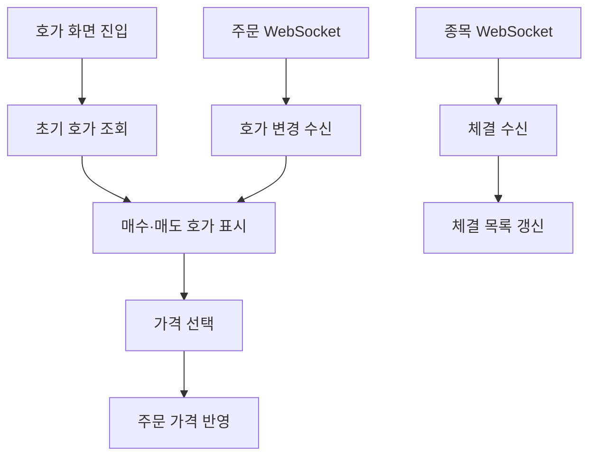

<a id="top"></a>

# 호가와 체결 기능

## 문서 포털

상세 구현, API, 아키텍처와 트러블슈팅 정보는 아래 문서에서 확인할 수 있습니다.

| 분류 | 문서 | 분류 | 문서 |
| --- | --- | --- | --- |
| 주식 README | [README](../../README.md) | 주식 거래 플랫폼 README | [README](../README.md) |
| 설계 노트 | [Engineering Notes](../../docs/ENGINEERING.md) | 데이터베이스 ERD | [Database Schema ERD](../../docs/database-schema.md) |
| 인증 | [인증](01-auth.md) | 종목 목록 | [종목 목록](02-stock-list.md) |
| 종목 상세 | [종목 상세](03-stock-detail.md) | 차트 | [차트](04-chart.md) |
| 주문 | [주문](05-order.md) | 호가/체결 | [호가/체결](06-orderbook-execution.md) |
| 자산 | [자산](07-user-asset.md) | 관심종목 | [관심종목](08-watchlist.md) |
| 실시간 연결 | [실시간 연결](09-websocket.md) | 프론트엔드 이슈 | [프론트엔드 이슈](10-frontend-issues.md) |

## 목차

> [개요](#개요) · [호가 조회와 갱신](#호가-조회와-갱신) · [체결 내역](#체결-내역) · [주문 연동](#주문-연동) · [흐름](#흐름) · [핵심 구현 파일](#핵심-구현-파일) · [관련 문서](#관련-문서)

## 개요

호가창은 초기 매수·매도 호가를 조회하고 WebSocket으로 변경을 반영합니다. 체결 영역은 최신 체결 가격과 수량을 실시간으로 표시합니다.

## 호가 조회와 갱신

초기 호가를 가격순으로 구성한 뒤 종목별 호가 topic을 구독합니다. 수량이 0이면 가격대를 제거하고, 나머지는 추가하거나 수량을 교체합니다.

### 동작 순서

1. 선택 종목의 초기 매수·매도 호가를 조회하는 API(`GET {ORDER_API_URL}/order/orderbook/{stockCode}`)를 호출합니다.
2. 매도·매수 호가를 화면용 배열로 변환합니다.
3. 선택 종목의 호가 변경을 수신하는 WebSocket Topic(`/topic/hoga/{stockCode}`)을 구독합니다.
4. 변경된 가격대와 수량을 반영하고 다시 정렬합니다.
5. 매도·매수 호가를 각각 최대 10개 표시합니다.

### 핵심 코드

```js
export function useHogaSocket(client, connected, stockCode, { onSellUpdate, onBuyUpdate }) {
  useEffect(() => {
    if (!client || !connected || !stockCode) return;

    const sub = client.subscribe(`/topic/hoga/${stockCode}`, message => {
      try {
      const { side, price, qty } = JSON.parse(message.body);
      if (side === 'SELL') onSellUpdate({ price, qty });
      else onBuyUpdate({ price, qty });
      } catch (error) {
        console.error('호가 파싱 실패:', error);
      }
    });

    return () => sub.unsubscribe();
  }, [client, connected, stockCode]);
}
```

초기 호가 전체를 반복 조회하지 않고 변경된 가격대만 반영하기 위한 구독 경계입니다. 종목별 메시지의 방향(`side`), 가격과 수량을 입력으로 매도·매수 갱신 callback을 분리합니다. 종목 전환 시 구독도 함께 종료되어 이전 종목의 호가가 현재 화면에 섞이지 않습니다.

### 구현 위치

- 호가 화면과 상태: `features/StockDetail/MainContent/HogaChart/HogaChart.jsx`, `useHoga.js`
- 초기 조회: `lib/trade.js`의 `getOrderbookApi()`
- 실시간 구독: `util/websocket/useHogaSocket.js`

## 체결 내역

종목별 체결 topic에서 최신 거래를 받아 호가창과 실시간 체결 영역에 공유합니다. 체결 목록은 최신순으로 최대 100개를 유지합니다.

### 동작 순서

1. 선택 종목의 실시간 체결을 수신하는 WebSocket Topic(`/topic/execution/{stockCode}`)을 구독합니다.
2. 가격, 수량, 거래 유형, 등락률과 시간을 정규화합니다.
3. 새 체결을 목록 앞에 추가합니다.
4. 최신 체결 가격과 최대 100개 내역을 화면에 표시합니다.

### 핵심 코드

```js
const subscription = client.subscribe(`/topic/execution/${stockCode}`, message => {
  const data = JSON.parse(message.body);
  const execution = {
    tradeType: data.tradeType,
    price: data.price,
    quantity: data.quantity,
    changeRate: data.changeRate,
    totalVolume: data.totalVolume,
    time: data.time,
  };
  setExecutions(prev => [execution, ...prev.slice(0, 99)]);
});
```

체결이 계속 누적되어 브라우저 상태가 무한히 커지는 문제를 막으면서 최신 거래를 보여주는 로직입니다. 종목 코드로 Topic을 구독하고 수신 메시지를 체결 화면의 필드 구조로 변환합니다. 새 항목은 목록 앞에 추가하고 최대 100개만 유지해 최신 체결 가격과 내역에 반영합니다.

### 구현 위치

- 체결 구독: `util/websocket/useExecutionSocket.js`
- 체결 화면: `features/StockDetail/MainContent/RealTimeTicks/realTimeTicks.jsx`
- 화면 상태: `features/StockDetail/MainContent/RealTimeTicks/useRealTimeTicks.js`

## 주문 연동

사용자가 호가를 선택하면 해당 가격을 종목 상세의 주문 패널로 전달합니다.

### 동작 순서

1. 매수 또는 매도 호가를 선택합니다.
2. 선택 가격을 `selectedPrice`에 저장합니다.
3. 현재 주문 탭의 가격 입력에 반영합니다.

### 핵심 코드

```js
const [selectedPrice, setSelectedPrice] = useState({ value: null });

const handlePriceSelect = (price) => {
  setSelectedPrice({ value: price });
};
```

호가 화면이 주문 폼의 내부 상태를 직접 알지 않도록 callback으로 두 기능을 연결합니다. 사용자가 매수 또는 매도 가격 행을 선택하면 해당 가격을 `onPriceSelect`의 출력으로 전달합니다. 상위 상세 상태가 값을 보관한 뒤 현재 주문 탭의 가격 입력에 반영합니다.

### 구현 위치

- 가격 선택: `features/StockDetail/MainContent/HogaChart/HogaChart.jsx`
- 상태 전달: `features/StockDetail/MainContent/MainContent.jsx`

## 흐름



## 핵심 구현 파일

기준 경로: `StockFrontEnd`

| 파일 |
| --- |
| `features/StockDetail/MainContent/HogaChart/HogaChart.jsx` |
| `features/StockDetail/MainContent/HogaChart/useHoga.js` |
| `features/StockDetail/MainContent/RealTimeTicks/realTimeTicks.jsx` |
| `features/StockDetail/MainContent/RealTimeTicks/useRealTimeTicks.js` |
| `lib/trade.js` |
| `util/websocket/useHogaSocket.js` |
| `util/websocket/useExecutionSocket.js` |

## 관련 문서

- [종목 상세](03-stock-detail.md)
- [주문](05-order.md)
- [실시간 연결](09-websocket.md)

<div align="right">[문서 맨 위로](#top)</div>
