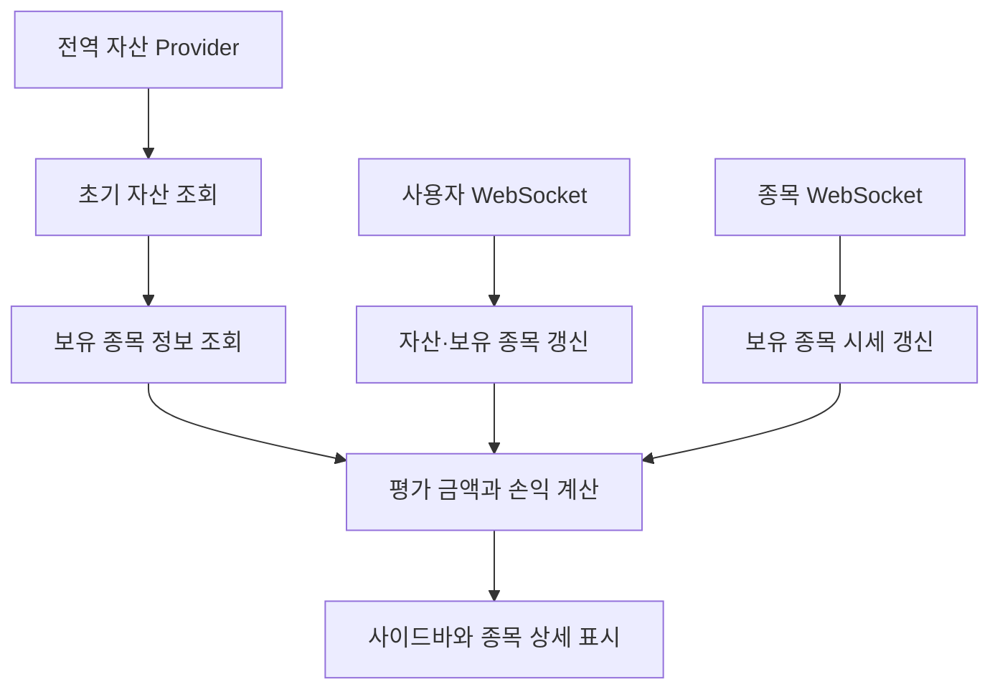

<a id="top"></a>

# 사용자 자산 기능

## 문서 포털

상세 구현, API, 아키텍처와 트러블슈팅 정보는 아래 문서에서 확인할 수 있습니다.

| 분류 | 문서 | 분류 | 문서 |
| --- | --- | --- | --- |
| 주식 README | [README](../../README.md) | 주식 거래 플랫폼 README | [README](../README.md) |
| 설계 노트 | [Engineering Notes](../../docs/ENGINEERING.md) | 데이터베이스 ERD | [Database Schema ERD](../../docs/database-schema.md) |
| 인증 | [인증](01-auth.md) | 종목 목록 | [종목 목록](02-stock-list.md) |
| 종목 상세 | [종목 상세](03-stock-detail.md) | 차트 | [차트](04-chart.md) |
| 주문 | [주문](05-order.md) | 호가/체결 | [호가/체결](06-orderbook-execution.md) |
| 자산 | [자산](07-user-asset.md) | 관심종목 | [관심종목](08-watchlist.md) |
| 실시간 연결 | [실시간 연결](09-websocket.md) | 프론트엔드 이슈 | [프론트엔드 이슈](10-frontend-issues.md) |

## 목차

> [개요](#개요) · [초기 자산 조회](#초기-자산-조회) · [실시간 자산 갱신](#실시간-자산-갱신) · [자산 데이터 비교](#자산-데이터-비교) · [평가 정보와 화면 표시](#평가-정보와-화면-표시) · [흐름](#흐름) · [핵심 구현 파일](#핵심-구현-파일) · [관련 문서](#관련-문서)

## 개요

사용자 자산 기능은 보유 현금, 주문 가능 금액과 보유 종목을 전역 상태로 제공합니다. 자산·주문 변경과 보유 종목 시세를 WebSocket으로 반영합니다.

## 초기 자산 조회

로그인 사용자의 자산과 보유 종목을 조회합니다. 보유 종목 코드는 종목 상세 API에 전달해 현재가 갱신 기준 데이터를 구성합니다.

### 동작 순서

1. 로그인 사용자의 현금과 보유 종목을 조회하는 자산 API(`GET {USER_URL}/user/haveAsset`)를 호출합니다.
2. `haveStocks`, `asset`, `availableAsset`을 저장합니다.
3. 보유 종목의 상세 정보를 일괄 조회하는 API(`POST {STOCK_URL}/stock/stocks/info`)에 종목 코드를 전송합니다.
4. 종목 정보와 보유 수량을 결합합니다.

### 핵심 코드

```js
const getHaveAsset = async () => {
  try {
    const res = await UserHaveAsset();
    if (!res.success) throw new Error(res.message);
    setHaveStocks(res.data.haveStocks);
    setAsset(res.data.asset);
    setAvailableAsset(res.data.availableAsset);
  } catch (err) {
    console.error('보유 주식 조회 실패:', err.message);
  }
};
```

실시간 증분 메시지를 적용하기 전에 일관된 기준 상태를 만들기 위한 초기 조회입니다. 로그인 사용자의 자산 응답을 보유 주식 목록(`haveStocks`), 총 보유 자산(`asset`), 주문 가능 현금(`availableAsset`)으로 분리합니다. 결과는 전역 Provider의 초기값이 되어 이후 WebSocket 변경분과 시세 평가의 기준이 됩니다.

### 구현 위치

- 자산 조회: `lib/user.js`의 `UserHaveAsset()`
- 종목 정보 조회: `lib/stock.js`의 `getStocksByCodesApi()`
- 자산 상태: `util/websocket/useUserHaveAssetSocket.js`

## 실시간 자산 갱신

사용자 queue에서 보유 종목과 자산 변경을 수신합니다. 보유 수량이 0이면 해당 종목을 제거합니다.

### 동작 순서

1. 보유 종목 변경을 수신하는 WebSocket Queue(`/user/queue/havestock`)와 자산 변경을 수신하는 Queue(`/user/queue/asset`)를 구독합니다.
2. 보유 종목 메시지로 항목을 추가·교체·삭제합니다.
3. 자산 메시지로 보유 현금과 주문 가능 금액을 갱신합니다.
4. 보유 종목의 시세 topic을 구독해 현재가를 갱신합니다.

### 핵심 코드

```js
useEffect(() => {
  // 생략: subStock 보유 종목 구독
  const subAsset = userClient.subscribe('/user/queue/asset', message => {
    const data = JSON.parse(message.body);
    setAsset(data.asset);
    setAvailableAsset(data.availableAsset);
  });

  return () => {
    subStock.unsubscribe();
    subAsset.unsubscribe();
  };
}, [userClient, userConnected, user]);
```

주문과 체결 이후 변하는 자산을 화면 재조회 없이 맞추기 위한 사용자 전용 구독입니다. 자산 Queue 메시지의 총 보유 자산과 주문 가능 현금을 입력으로 전역 상태를 교체합니다. Provider가 해제될 때 자산·보유 주식 구독을 함께 정리해 중복 갱신을 방지합니다.

### 구현 위치

- 사용자 구독: `util/websocket/useUserHaveAssetSocket.js`
- 종목 시세: `util/websocket/useStocksSocket.js`
- 전역 Provider: `util/websocket/UserHaveAssetProvider.js`

## 자산 데이터 비교

초기 API 응답은 전체 자산 상태를 제공하고, WebSocket 메시지는 변경된 영역만 전달합니다.

| 데이터 | 필드 | 갱신 방식 |
| --- | --- | --- |
| 초기 자산 응답 | `haveStocks`, `asset`, `availableAsset` | 로그인 후 전체 상태 설정 |
| 보유 종목 메시지 | `stockCode`, `quantity`, `availableQuantity`, `averagePrice` | 종목 추가·교체, 수량 0이면 제거 |
| 보유 종목 메시지의 기존 항목 | 위 필드와 `id` | 서버에 보유 데이터가 있을 때 식별자 포함 |
| 자산 메시지 | `asset`, `availableAsset` | 현금 관련 상태만 교체 |
| 종목 상세 응답 | `snapshot` 또는 최상위 `stockCode` | 보유 종목의 현재가 정보 결합 |

이 구조들은 프론트엔드 상태와 WebSocket payload이며 데이터베이스 테이블을 의미하지 않습니다.

### 구현 위치

- 초기 응답과 메시지 병합: `util/websocket/useUserHaveAssetSocket.js`
- 평가 상태 구성: `util/websocket/UserHaveAssetProvider.js`

## 평가 정보와 화면 표시

보유 수량, 평균 단가와 현재가로 평가 금액·손익·수익률을 계산합니다. 결과는 전역 사이드바와 종목 상세의 보유 정보에 표시합니다.

### 동작 순서

1. 보유 종목과 실시간 시세를 결합합니다.
2. 종목별 평가 금액, 손익과 수익률을 계산합니다.
3. 전체 투자 금액, 손익과 수익률을 계산합니다.
4. 사이드바와 현재 종목 영역에 표시합니다.

### 핵심 코드

```js
const matched = haveStocks?.find(
    h => h.stockCode === stockCode
);

const quantity = matched?.quantity ?? 0;
const avgPrice = matched?.averagePrice ?? 0;
const diff = Math.floor((currentPrice - avgPrice) * quantity);

const rate =
    avgPrice > 0 && quantity > 0
        ? ((diff / (avgPrice * quantity)) * 100).toFixed(2)
        : 0;
```

사용자 서비스의 보유 정보와 종목 서비스의 실시간 시세가 서로 다른 데이터 흐름이므로 종목 코드를 결합 키로 사용합니다. 보유 수량·평균 매입가·현재가를 입력으로 평가 금액, 손익(`diff`)과 수익률(`rate`)을 계산합니다. 결과는 사이드바와 종목 상세의 자산 평가 정보에 공통으로 반영됩니다.

### 구현 위치

- 평가 계산: `util/websocket/UserHaveAssetProvider.js`
- 사이드바: `features/UI/SideBar/SideBar.jsx`
- 종목 보유 정보: `features/StockDetail/MainContent/HaveStockDetail/useHaveStock.js`

## 흐름



## 핵심 구현 파일

기준 경로: `StockFrontEnd`

| 파일 |
| --- |
| `util/websocket/UserHaveAssetProvider.js` |
| `util/websocket/useUserHaveAssetSocket.js` |
| `util/websocket/useOrderSocket.js` |
| `util/websocket/useStocksSocket.js` |
| `lib/user.js` |
| `lib/stock.js` |
| `features/UI/SideBar/SideBar.jsx` |
| `features/StockDetail/MainContent/HaveStockDetail/useHaveStock.js` |

## 관련 문서

- [인증](01-auth.md)
- [주문](05-order.md)
- [실시간 연결](09-websocket.md)

<div align="right">[문서 맨 위로](#top)</div>
