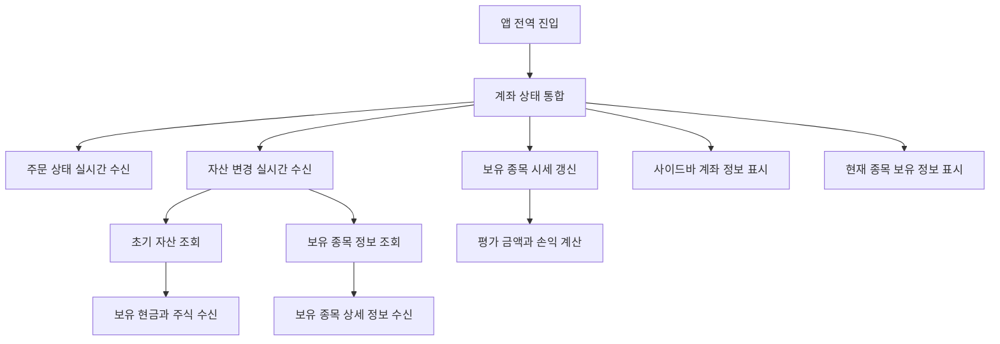

# 사용자 자산 기능

## 문서 포털

문서의 상세 구현, API, 아키텍처, 트러블슈팅은 아래 문서를 참고하세요.

| 분류 | 문서 | 분류 | 문서 |
| --- | --- | --- | --- |
| 루트 README | [README](../../README.md) | 서비스 README | [README](../README.md) |
| Engineering Notes | [Engineering Notes](../../docs/ENGINEERING.md) | Database Schema ERD | [Database Schema ERD](../../docs/database-schema.md) |
| 01 | [인증](01-auth.md) | 02 | [종목 목록](02-stock-list.md) |
| 03 | [종목 상세](03-stock-detail.md) | 04 | [차트](04-chart.md) |
| 05 | [주문](05-order.md) | 06 | [호가/체결](06-orderbook-execution.md) |
| 07 | [자산](07-user-asset.md) | 08 | [관심종목](08-watchlist.md) |
| 09 | [실시간 연결](09-websocket.md) | 10 | [프론트엔드 이슈](10-frontend-issues.md) |

## 목차

> [개요](#개요) ·
> [핵심 구현 파일](#핵심-구현-파일) ·
> [전역 자산 상태 구성](#전역-자산-상태-구성) ·
> [초기 자산 조회](#초기-자산-조회) ·
> [보유 종목 정보 조회](#보유-종목-정보-조회)

> [실시간 자산 갱신](#실시간-자산-갱신) ·
> [평가 정보 계산](#평가-정보-계산) ·
> [사이드바 표시](#사이드바-표시) ·
> [흐름](#흐름)

## 개요

사용자 자산 기능은 로그인 사용자의 보유 현금, 주문 가능 금액, 보유 주식 목록을 조회하고 WebSocket으로 변경 사항을 반영한다. `UserHaveAssetProvider`는 자산뿐 아니라 주문 목록, 주문 알림, 보유 종목 평가 정보도 함께 제공한다.

## 전역 자산 상태 구성

`app/layout.js`에서 `UserHaveAssetProvider`가 전체 앱을 감싼다. 내부적으로 다음 훅을 조합한다.

- `useOrderSocket(client, connected)`: 주문 목록과 주문 알림
- `useUserHaveAssetSocket(userClient, userConnected)`: 보유 주식, 자산, 주문 가능 금액
- `useStocksSocket(stockClient, stockConnected, initialStocks)`: 보유 종목의 현재가 실시간 갱신

## 초기 자산 조회

`UserHaveAsset()`는 사용자 자산을 조회한다.

엔드포인트:

- `GET {USER_URL}/user/haveAsset`

응답 데이터에서 다음 값을 상태로 저장한다.

- `haveStocks`
- `asset`
- `availableAsset`

## 보유 종목 정보 조회

`useUserHaveAssetSocket.js`는 `haveStocks`(가지고 있는 주식)이 있으면 그 주식의 종목 코드 목록을 만들고 보유 종목 상세 정보 조회 요청을 보낸다.
구현은 `getStocksByCodesApi()` (종목코드 기반 조회 기능)에서 담당한다.

엔드포인트:

- `POST {STOCK_URL}/stock/stocks/info`

조회한 종목 정보는 `useStocksSocket()`에 전달되어 보유 종목 현재가를 실시간 갱신하는 기준 데이터로 쓰인다.

## 실시간 자산 갱신

`UserWebSocketContext`가 제공하는 `userClient`를 통해 다음 사용자 큐를 구독한다.

- `/user/queue/havestock`
- `/user/queue/asset`

`/user/queue/havestock` 메시지는 보유 주식 목록을 추가, 수정, 삭제한다. 수량이 0이면 해당 보유 종목을 제거한다.

`/user/queue/asset` 메시지는 `asset`, `availableAsset` 값을 갱신한다.

## 평가 정보 계산

`UserHaveAssetProvider.js`는 보유 주식 수량과 종목 현재가를 조합해 `stocksArray`를 만든다.

각 보유 종목에는 다음 계산값이 추가된다.

- `quantity`
- `avgPrice`
- `evaluatedAmount`
- `diff`
- `rate`

또한 전체 평가 관련 값도 계산한다.

- `totalDiff`
- `totalRate`
- `totalInvestment`

종목 상세의 `HaveStock` 영역은 `useHaveStock({ stockCode })`를 통해 현재 종목의 보유 수량, 평균 단가, 평가 금액, 손익, 수익률을 조회한다.

## 사이드바 표시

`features/UI/SideBar/SideBar.jsx`는 다음 컴포넌트를 조합한다.

- `AccountInfomation`
- `AccountBenner`
- `AccountMoney`
- `HaveMyStockAsset`
- `OrderSideBar`

전역 레이아웃에서 항상 렌더링되므로 사용자는 어느 화면에서든 계좌와 주문 정보를 볼 수 있다.

## 흐름

## 핵심 구현 파일

기준 경로

`StockFrontEnd`

| 파일 |
| --- |
| `util/websocket/UserHaveAssetProvider.js` |
| `util/websocket/useUserHaveAssetSocket.js` |
| `util/websocket/context/UserWebSocketContext.js` |
| `util/websocket/context/OrderWebSocketContext.js` |
| `util/websocket/context/StockWebSocketContext.js` |
| `util/websocket/useOrderSocket.js` |
| `util/websocket/useStocksSocket.js` |
| `lib/user.js` |
| `lib/stock.js` |
| `features/UI/SideBar/SideBar.jsx` |
| `features/UI/SideBar/AccountInfomation.jsx` |
| `features/UI/SideBar/AccountMoney.jsx` |
| `features/UI/SideBar/HaveMyStockAsset.jsx` |
| `features/UI/SideBar/OrderSideBar.jsx` |
| `features/StockDetail/MainContent/HaveStockDetail/HaveStock.jsx` |
| `features/StockDetail/MainContent/HaveStockDetail/useHaveStock.js` |

[문서 맨 위로](#top)

