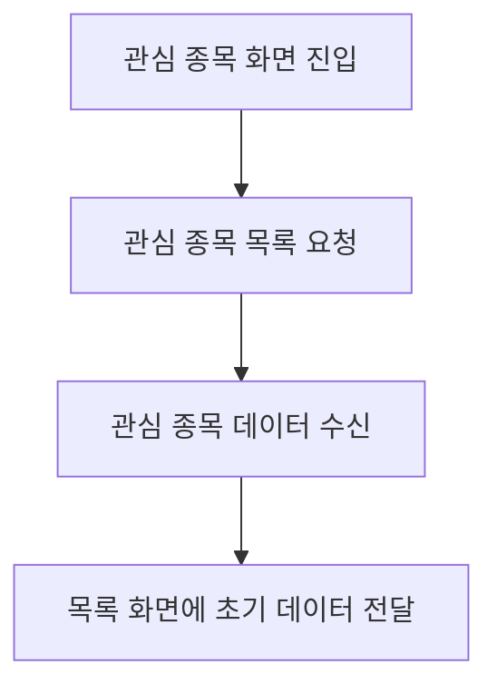

<a id="top"></a>

# 관심 종목 기능

## 문서 포털

상세 구현, API, 아키텍처와 트러블슈팅 정보는 아래 문서에서 확인할 수 있습니다.

| 분류 | 문서 | 분류 | 문서 |
| --- | --- | --- | --- |
| 주식 README | [README](../../README.md) | 주식 거래 플랫폼 README | [README](../README.md) |
| 설계 노트 | [Engineering Notes](../../docs/ENGINEERING.md) | 데이터베이스 ERD | [Database Schema ERD](../../docs/database-schema.md) |
| 인증 | [인증](01-auth.md) | 종목 목록 | [종목 목록](02-stock-list.md) |
| 종목 상세 | [종목 상세](03-stock-detail.md) | 차트 | [차트](04-chart.md) |
| 주문 | [주문](05-order.md) | 호가/체결 | [호가/체결](06-orderbook-execution.md) |
| 자산 | [자산](07-user-asset.md) | 관심종목 | [관심종목](08-watchlist.md) |
| 실시간 연결 | [실시간 연결](09-websocket.md) | 프론트엔드 이슈 | [프론트엔드 이슈](10-frontend-issues.md) |

## 목차

> [개요](#개요) · [관심 종목 API](#관심-종목-api) · [페이지 흐름](#페이지-흐름) · [핵심 구현 파일](#핵심-구현-파일) · [관련 문서](#관련-문서)

## 개요

관심 종목 기능은 로그인 사용자의 관심 목록을 조회하고 종목을 추가·삭제합니다. 모든 요청은 Access Token이 필요한 인증 API입니다.

## 관심 종목 API

목록 화면과 종목 상세에서 같은 API 계층을 사용합니다.

### 동작 순서

1. 사용자의 전체 관심 종목을 조회하는 API(`GET {USER_URL}/watch/list`)를 호출합니다.
2. 선택 종목을 관심 목록에 추가하는 API(`POST {USER_URL}/watch/{stockCode}`)를 호출합니다.
3. 선택 종목을 관심 목록에서 삭제하는 API(`DELETE {USER_URL}/watch/{stockCode}`)를 호출합니다.
4. 특정 종목의 관심 등록 여부를 확인하는 API(`GET {USER_URL}/watch/{stockCode}`)를 호출합니다.

### 핵심 코드

```js
export async function getWatchListApi() {
    return await apiFetch(`${USER_URL}/watch/list`, { auth: true });
}
export async function addWatchApi(stockCode) {
    return await apiFetch(`${USER_URL}/watch/${stockCode}`, { auth: true, method: "POST" });
}
export async function removeWatchApi(stockCode) {
    return await apiFetch(`${USER_URL}/watch/${stockCode}`, { auth: true, method: "DELETE" });
}
export async function isWatchedApi(stockCode) {
    return await apiFetch(`${USER_URL}/watch/${stockCode}`, { auth: true });
}
```

관심 종목을 사용하는 화면마다 인증과 endpoint 조합을 반복하지 않도록 CRUD 요청을 하나의 API 계층에 모읍니다. 목록 조회 또는 종목 코드를 입력으로 조회·추가·삭제·등록 여부 확인 요청을 만들며 모두 인증 옵션을 사용합니다. 응답은 관심 목록의 초기 데이터와 종목 상세의 관심 상태에 반영됩니다.

### 구현 위치

- 목록 조회: `lib/watchlist.js`의 `getWatchListApi()`
- 추가·삭제: `addWatchApi()`, `removeWatchApi()`
- 관심 여부: `isWatchedApi()`
- 공통 인증 요청: `util/apiClient.js`

## 페이지 흐름

관심 종목 페이지는 서버에서 목록을 조회해 화면 컴포넌트에 전달하는 구조입니다. 현재 화면 컴포넌트 누락 상태는 [프론트엔드 이슈](10-frontend-issues.md)에서 관리합니다.

### 동작 순서

1. 관심 종목 목록을 표시하는 화면 라우트(`/watchlist`)에 진입합니다.
2. 인증된 관심 종목 목록을 요청합니다.
3. 응답을 `initialWatchList`로 화면에 전달합니다.

### 구현 위치

- 관심 종목 페이지: `app/watchlist/page.js`
- 페이지 레이아웃: `app/watchlist/layout.js`
- API 계층: `lib/watchlist.js`



## 핵심 구현 파일

기준 경로: `StockFrontEnd`

| 파일 |
| --- |
| `app/watchlist/page.js` |
| `app/watchlist/layout.js` |
| `lib/watchlist.js` |
| `util/apiClient.js` |

## 관련 문서

- [인증](01-auth.md)
- [종목 목록](02-stock-list.md)
- [프론트엔드 이슈](10-frontend-issues.md)

<div align="right">[문서 맨 위로](#top)</div>
