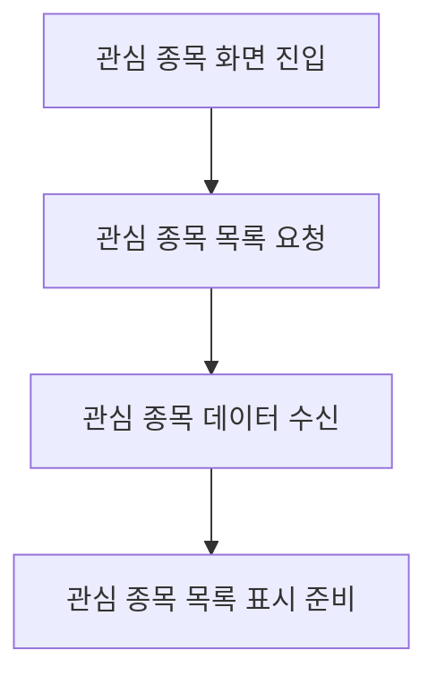

# 관심 종목 기능(현재 미구현)

## 문서 포털

문서의 상세 구현, API, 아키텍처, 트러블슈팅은 아래 문서를 참고하세요.

| 분류 | 문서 | 분류 | 문서 |
| --- | --- | --- | --- |
| 루트 README | [README](../../README.md) | 서비스 README | [README](../README.md) |
| Engineering Notes | [Engineering Notes](../../docs/ENGINEERING.md) | Database Schema ERD | [Database Schema ERD](../../docs/database-schema.md) |
| 01 | [인증](01-auth.md) | 02 | [종목 목록](02-stock-list.md) |
| 03 | [종목 상세](03-stock-detail.md) | 04 | [차트](04-chart.md) |
| 05 | [주문](05-order.md) | 06 | [호가/체결](06-orderbook-execution.md) |
| 07 | [자산](07-user-asset.md) | 08 | [관심종목](08-watchlist.md) |
| 09 | [실시간 연결](09-websocket.md) | 10 | [프론트엔드 이슈](10-frontend-issues.md) |

## 목차

> [개요](#개요) ·
> [API](#api)

> [페이지 흐름](#페이지-흐름) ·
> [종목 상세와의 연결 지점](#종목-상세와의-연결-지점) ·
> [핵심 구현 파일](#핵심-구현-파일)
## 개요

관심 종목 목록 조회, 추가, 삭제, 특정 종목의 관심 여부 조회를 담당한다.

## API

`lib/watchlist.js`는 다음 함수를 제공한다.

### 관심 종목 목록 조회

- 함수: `getWatchListApi()`
- 엔드포인트: `GET {USER_URL}/watch/list`
- 인증 필요: `auth: true`

### 관심 종목 추가

- 함수: `addWatchApi(stockCode)`
- 엔드포인트: `POST {USER_URL}/watch/{stockCode}`
- 인증 필요: `auth: true`

### 관심 종목 삭제

- 함수: `removeWatchApi(stockCode)`
- 엔드포인트: `DELETE {USER_URL}/watch/{stockCode}`
- 인증 필요: `auth: true`

### 관심 여부 조회

- 함수: `isWatchedApi(stockCode)`
- 엔드포인트: `GET {USER_URL}/watch/{stockCode}`
- 인증 필요: `auth: true`

## 페이지 흐름

관심 종목 페이지는 관심 종목 목록을 가져온 뒤 `WatchListForm`에 `initialWatchList`로 전달하려는 구조다. 다만 `WatchListForm` 파일이 현재 존재하지 않아 이 페이지는 빌드되지 않는다.
구현은 `getWatchListApi()` (관심 종목 목록 조회 기능)에서 담당한다.

## 핵심 구현 파일

기준 경로

`StockFrontEnd`

| 파일 |
| --- |
| `app/watchlist/page.js` |
| `app/watchlist/layout.js` |
| `lib/watchlist.js` |
| `app/stock/[stockCode]/page.js` |

[문서 맨 위로](#top)

