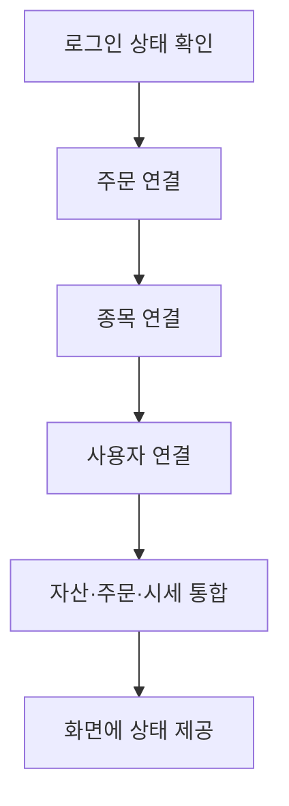
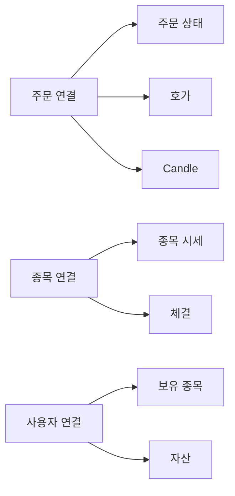

<a id="top"></a>

# 실시간 연결 구조

## 문서 포털

상세 구현, API, 아키텍처와 트러블슈팅 정보는 아래 문서에서 확인할 수 있습니다.

| 분류 | 문서 | 분류 | 문서 |
| --- | --- | --- | --- |
| 주식 README | [README](../../README.md) | 주식 거래 플랫폼 README | [README](../README.md) |
| 설계 노트 | [Engineering Notes](../../docs/ENGINEERING.md) | 데이터베이스 ERD | [Database Schema ERD](../../docs/database-schema.md) |
| 인증 | [인증](01-auth.md) | 종목 목록 | [종목 목록](02-stock-list.md) |
| 종목 상세 | [종목 상세](03-stock-detail.md) | 차트 | [차트](04-chart.md) |
| 주문 | [주문](05-order.md) | 호가/체결 | [호가/체결](06-orderbook-execution.md) |
| 자산 | [자산](07-user-asset.md) | 관심종목 | [관심종목](08-watchlist.md) |
| 실시간 연결 | [실시간 연결](09-websocket.md) | 프론트엔드 이슈 | [프론트엔드 이슈](10-frontend-issues.md) |

## 목차

> [개요](#개요) · [전역 연결 구성](#전역-연결-구성) · [서비스별 연결](#서비스별-연결) · [구독 topic](#구독-topic) · [연결 옵션](#연결-옵션) · [연결 흐름](#연결-흐름) · [환경 변수](#환경-변수) · [핵심 구현 파일](#핵심-구현-파일) · [관련 문서](#관련-문서)

## 개요

실시간 연결은 주문·종목·사용자 서비스의 변경 데이터를 화면에 즉시 전달합니다. 각 서비스에 독립적으로 연결하고 화면 전체에 연결 상태를 공유하며, 이 통신은 SockJS와 STOMP client를 담은 서비스별 Context로 구현합니다.

## 전역 연결 구성

로그인 사용자가 필요한 실시간 데이터를 어디서나 사용할 수 있도록 세 서비스 연결을 최상위 레이아웃에 배치합니다. 주문·자산·시세 데이터는 하나의 자산 상태로 통합하며, 연결과 상태 공유에는 WebSocket Provider를 사용합니다.

### 동작 순서

1. 현재 로그인 상태에서 사용자 식별자를 확인하며, 이 값은 `AuthContext`에서 가져옵니다.
2. 주문, 종목, 사용자 WebSocket 연결을 활성화합니다.
3. 연결 사용자를 구분하도록 사용자 식별자를 연결 헤더의 `userId`로 전달하며, STOMP의 `connectHeaders`를 사용합니다.
4. 기능별 hook이 필요한 topic을 구독합니다.
5. 화면에 실시간 상태를 제공합니다.

### 핵심 코드

```jsx
<AuthProvider>
  <OrderWebSocketProvider>
    <StockWebSocketProvider>
      <UserWebSocketProvider>
        <UserHaveAssetProvider>
          {/* 생략: 공통 화면과 children */}
        </UserHaveAssetProvider>
      </UserWebSocketProvider>
    </StockWebSocketProvider>
  </OrderWebSocketProvider>
</AuthProvider>
```

화면마다 연결을 생성하면 중복 구독과 연결 수명주기 불일치가 발생하므로 서비스 연결을 최상위에서 한 번만 구성합니다. 인증 상태 안에 주문·종목·사용자 Provider를 중첩하고 가장 안쪽에서 자산·주문·시세를 통합합니다. 하위 화면은 연결 생성 없이 Context의 client와 실시간 상태를 입력으로 사용할 수 있습니다.

### 구현 위치

- Provider 구성: `app/layout.js`
- 연결 Context: `util/websocket/context/`
- 상태 통합: `util/websocket/UserHaveAssetProvider.js`



## 서비스별 연결

각 연결은 독립 endpoint와 Context를 사용합니다.

### 동작 순서

1. 주문·호가·Candle 데이터를 수신하기 위해 주문 WebSocket endpoint(`{WEBSOCKET_API_URL}/ws-order`)에 연결합니다.
2. 종목 시세와 체결 데이터를 수신하기 위해 종목 WebSocket endpoint(`{STOCK_WEBSOCKET_API_URL}/ws-stock`)에 연결합니다.
3. 보유 종목과 자산 데이터를 수신하기 위해 사용자 WebSocket endpoint(`{USER_WEBSOCKET_API_URL}/ws-user`)에 연결합니다.
4. 연결 성공 여부와 통신 client를 서비스별 전역 상태에 저장하며, STOMP client와 Context를 사용합니다.

### 핵심 코드

```js
const client = new Client({
  webSocketFactory: () => new SockJS(`${STOCK_WEBSOCKET_API_URL}/ws-stock`),
  connectHeaders: user ? { userId: String(user) } : {},
  reconnectDelay: 5000,
  heartbeatIncoming: 10000,
  heartbeatOutgoing: 10000,
  onConnect: () => {
    console.log('Stock WebSocket 연결 성공');
    setStockConnected(true);
  },
  onDisconnect: () => setStockConnected(false),
  onWebSocketClose: () => setStockConnected(false),
  // 생략: STOMP 오류 처리
});

stockClientRef.current = client;
client.activate();
```

주문·종목·사용자 서비스의 장애와 재연결을 서로 격리하기 위해 서비스마다 독립 STOMP client를 둡니다. endpoint와 사용자 식별자를 입력으로 client를 생성하고 연결 성공·종료 상태를 Context에 기록합니다. 활성화된 client는 참조 객체를 통해 기능별 구독 hook에 공유됩니다.

### 구현 위치

- 주문: `util/websocket/context/OrderWebSocketContext.js`
- 종목: `util/websocket/context/StockWebSocketContext.js`
- 사용자: `util/websocket/context/UserWebSocketContext.js`

## 구독 topic

| 수신 역할 | WebSocket Topic 또는 Queue | 사용 hook |
| --- | --- | --- |
| 종목별 현재가와 등락 정보 수신 | `/topic/stock/{stockCode}` | `useStocksSocket.js`, `useStockDetailSocket.js` |
| 로그인 사용자의 주문 상태 수신 | `/user/queue/orders` | `useOrderSocket.js` |
| 종목별 매수·매도 호가 변경 수신 | `/topic/hoga/{stockCode}` | `useHogaSocket.js` |
| 종목별 실시간 체결 내역 수신 | `/topic/execution/{stockCode}` | `useExecutionSocket.js` |
| 진행 중 Candle 수신 | `/topic/candle/{stockCode}/{subscribeType}` | `useCandleSocket.js` |
| 완료된 Candle 수신 | `/topic/candle/completed/{stockCode}/{subscribeType}` | `useCandleSocket.js` |
| 로그인 사용자의 보유 종목 변경 수신 | `/user/queue/havestock` | `useUserHaveAssetSocket.js` |
| 로그인 사용자의 자산 변경 수신 | `/user/queue/asset` | `useUserHaveAssetSocket.js` |

### 동작 순서

1. 화면 기능이 필요한 서비스 연결과 종목 코드를 확인합니다.
2. 기능에 대응하는 Topic 또는 사용자 Queue를 구독합니다.
3. 메시지를 화면 상태로 변환하고 화면을 벗어나면 구독을 해제합니다.

### 핵심 코드

```js
useEffect(() => {
    if (!client || !connected || !stockCode || !subscribeType) return;

    const subscription = client.subscribe(`/topic/candle/${stockCode}/${subscribeType}`, message => {
        setLiveCandle(toCandlePayload(JSON.parse(message.body)));
    });

    return () => subscription.unsubscribe();
}, [client, connected, stockCode, subscribeType]);
```

하나의 연결 위에서 화면이 필요한 메시지만 받도록 기능별 Topic 구독을 분리합니다. client·연결 상태·종목·주기를 입력으로 진행 중 Candle을 구독하고 공통 payload로 변환합니다. 의존 값이나 화면이 바뀌면 기존 구독을 종료해 중복 메시지와 오래된 종목 데이터 유입을 막습니다.

### 구현 위치

- 구독 hook: `util/websocket/use*Socket.js`
- Candle 주기 변환: `util/websocket/useCandleSocket.js`

## 연결 옵션

연결이 끊기면 5초 뒤 재연결하며, 양방향 heartbeat는 10초로 설정합니다.

### 동작 순서

1. STOMP client 생성 시 재연결 대기 시간을 설정합니다.
2. 서버에서 받는 heartbeat와 서버로 보내는 heartbeat 주기를 설정합니다.
3. 연결이 종료되면 지정된 대기 시간 뒤 연결을 다시 시도합니다.

### 핵심 코드

```js
const client = new Client({
  reconnectDelay: 5000,
  heartbeatIncoming: 10000,
  heartbeatOutgoing: 10000,
});
```

일시적인 네트워크 단절을 사용자 조작 없이 복구하고 반쯤 열린 연결을 탐지하기 위한 공통 정책입니다. STOMP client는 연결 종료 후 5초에 재시도하고 송수신 heartbeat를 10초로 설정합니다. 같은 옵션이 세 Context에 적용되어 서비스별 연결 상태가 일관된 기준으로 복구됩니다.

### 구현 위치

- `reconnectDelay: 5000`: 서비스별 WebSocket Context
- `heartbeatIncoming: 10000`: 서비스별 WebSocket Context
- `heartbeatOutgoing: 10000`: 서비스별 WebSocket Context

## 연결 흐름



## 환경 변수

- `NEXT_PUBLIC_WEBSOCKET_API_URL`
- `NEXT_PUBLIC_STOCK_WEBSOCKET_API_URL`
- `NEXT_PUBLIC_USER_WEBSOCKET_API_URL`

## 핵심 구현 파일

기준 경로: `StockFrontEnd`

| 파일 |
| --- |
| `app/layout.js` |
| `util/websocket/context/OrderWebSocketContext.js` |
| `util/websocket/context/StockWebSocketContext.js` |
| `util/websocket/context/UserWebSocketContext.js` |
| `util/websocket/UserHaveAssetProvider.js` |
| `util/websocket/useStocksSocket.js` |
| `util/websocket/useOrderSocket.js` |
| `util/websocket/useHogaSocket.js` |
| `util/websocket/useExecutionSocket.js` |
| `util/websocket/useCandleSocket.js` |

## 관련 문서

- [차트](04-chart.md)
- [주문](05-order.md)
- [사용자 자산](07-user-asset.md)

<div align="right">[문서 맨 위로](#top)</div>
