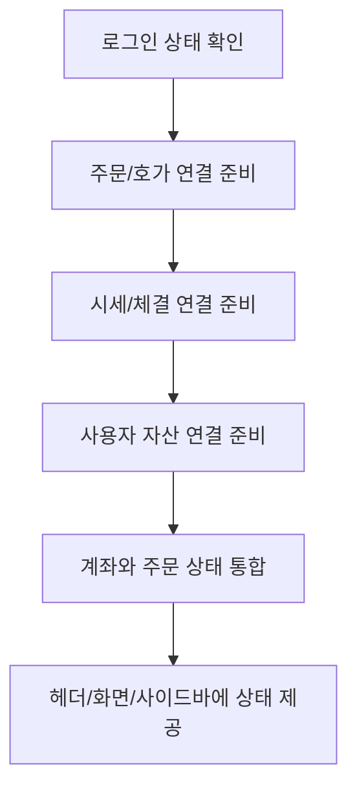
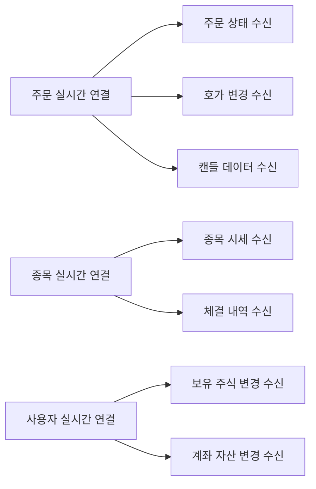

# 실시간 연결 구조

## 문서 포털

문서의 상세 구현, API, 아키텍처, 트러블슈팅은 아래 문서를 참고하세요.

| 분류 | 문서 | 분류 | 문서 |
| --- | --- | --- | --- |
| 루트 README | [README](../../README.md) | 서비스 README | [README](../README.md) |
| Engineering Notes | [Engineering Notes](../../docs/ENGINEERING.md) | Database Schema ERD | [Database Schema ERD](../../docs/database-schema.md) |
| 01 | [인증](01-auth.md) | 02 | [종목 목록](02-stock-list.md) |
| 03 | [종목 상세](03-stock-detail.md) | 04 | [차트](04-chart.md) |
| 05 | [주문](05-order.md) | 06 | [호가/체결](06-orderbook-execution.md) |
| 07 | [자산](07-user-asset.md) | 08 | [관심종목](08-watchlist.md) |
| 09 | [실시간 연결](09-websocket.md) | 10 | [프론트엔드 이슈](10-frontend-issues.md) |

## 목차

> [개요](#개요) ·
> [전역 실시간 연결 구성](#전역-실시간-연결-구성) ·
> [주문 실시간 연결](#주문-실시간-연결) ·
> [종목 실시간 연결](#종목-실시간-연결)

> [사용자 실시간 연결](#사용자-실시간-연결) ·
> [주요 구독 토픽](#주요-구독-토픽) ·
> [인증 헤더](#인증-헤더) ·
> [재연결과 heartbeat](#재연결과-heartbeat) ·
> [연결 흐름](#연결-흐름) ·
> [핵심 구현 파일](#핵심-구현-파일)
## 개요

프론트엔드는 SockJS와 STOMP를 사용해 서버와 실시간 통신한다. WebSocket 연결은 주문, 종목, 사용자 영역으로 분리되어 있으며, 각 Provider가 전역 레이아웃에서 하위 컴포넌트에 client와 연결 상태를 제공한다.

## 전역 실시간 연결 구성

다음 순서로 전체 웹소켓을 구성한다.

## 주문 실시간 연결

파일:

- `util/websocket/context/OrderWebSocketContext.js`

연결 URL:

- `{WEBSOCKET_API_URL}/ws-order`

제공 값:

- `connected`
- `client`

사용 예:

- 주문 상태 구독: `useOrderSocket`
- 호가 구독: `useHogaSocket`
- 캔들 구독: `useCandleSocket`

## 종목 실시간 연결

파일:

- `util/websocket/context/StockWebSocketContext.js`

연결 URL:

- `{STOCK_WEBSOCKET_API_URL}/ws-stock`

제공 값:

- `stockConnected`
- `stockClient`

사용 예:

- 종목 목록 실시간 갱신: `useStocksSocket`
- 종목 상세 실시간 갱신: `useStockDetailSocket`
- 체결 데이터 구독: `useExecutionSocket`

## 사용자 실시간 연결

파일:

- `util/websocket/context/UserWebSocketContext.js`

연결 URL:

- `{USER_WEBSOCKET_API_URL}/ws-user`

제공 값:

- `userConnected`
- `userClient`

사용 예:

- 보유 주식 실시간 갱신
- 계좌 자산 실시간 갱신

## 주요 구독 토픽

| 구분 | 토픽 | 사용 파일 |
| --- | --- | --- |
| 종목 시세 | `/topic/stock/{stockCode}` | `useStocksSocket.js`, `useStockDetailSocket.js` |
| 주문 상태 | `/user/queue/orders` | `useOrderSocket.js` |
| 호가 | `/topic/hoga/{stockCode}` | `useHogaSocket.js` |
| 체결 | `/topic/execution/{stockCode}` | `useExecutionSocket.js` |
| 실시간 캔들 | `/topic/candle/{stockCode}/{subscribeType}` | `useCandleSocket.js` |
| 완성 캔들 | `/topic/candle/completed/{stockCode}/{subscribeType}` | `useCandleSocket.js` |
| 보유 주식 | `/user/queue/havestock` | `useUserHaveAssetSocket.js` |
| 자산 | `/user/queue/asset` | `useUserHaveAssetSocket.js` |

캔들 구독의 `subscribeType`은 차트 주기를 저장하며 저장한 이후 `useCandleSocket.js`에 분/시간 계열을 `ONE_MINUTE`로, `WEEK`, `MONTH`, `YEAR`를 `DAY`로 매핑해 구독한다.

## 인증 헤더

각 WebSocket Provider는 `useAuth()`의 `user` 값이 있으면 STOMP `connectHeaders`에 다음 값을 포함한다.

- `userId: String(user)`

## 재연결과 heartbeat

각 Provider는 다음 연결 옵션을 사용한다.

- `reconnectDelay: 5000`
- `heartbeatIncoming: 10000`
- `heartbeatOutgoing: 10000`

## 연결 흐름

## 핵심 구현 파일

기준 경로

`StockFrontEnd`

| 파일 |
| --- |
| `app/layout.js` |
| `util/websocket/context/OrderWebSocketContext.js` |
| `util/websocket/context/StockWebSocketContext.js` |
| `util/websocket/context/UserWebSocketContext.js` |
| `util/websocket/UserHaveAssetProvider.js` |
| `util/websocket/useStocksSocket.js` |
| `util/websocket/useStockDetailSocket.js` |
| `util/websocket/useOrderSocket.js` |
| `util/websocket/useHogaSocket.js` |
| `util/websocket/useExecutionSocket.js` |
| `util/websocket/useCandleSocket.js` |
| `util/websocket/useUserHaveAssetSocket.js` |
| `util/URLconfig.js` |

[문서 맨 위로](#top)

