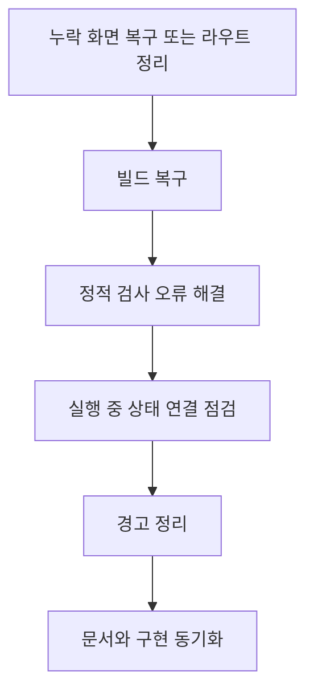

<a id="top"></a>

# 프론트엔드 현재 이슈

## 문서 포털

상세 구현, API, 아키텍처와 트러블슈팅 정보는 아래 문서에서 확인할 수 있습니다.

| 분류 | 문서 | 분류 | 문서 |
| --- | --- | --- | --- |
| 주식 README | [README](../../README.md) | 주식 거래 플랫폼 README | [README](../README.md) |
| 설계 노트 | [Engineering Notes](../../docs/ENGINEERING.md) | 데이터베이스 ERD | [Database Schema ERD](../../docs/database-schema.md) |
| 인증 | [인증](01-auth.md) | 종목 목록 | [종목 목록](02-stock-list.md) |
| 종목 상세 | [종목 상세](03-stock-detail.md) | 차트 | [차트](04-chart.md) |
| 주문 | [주문](05-order.md) | 호가/체결 | [호가/체결](06-orderbook-execution.md) |
| 자산 | [자산](07-user-asset.md) | 관심종목 | [관심종목](08-watchlist.md) |
| 실시간 연결 | [실시간 연결](09-websocket.md) | 프론트엔드 이슈 | [프론트엔드 이슈](10-frontend-issues.md) |

## 목차

> [개요](#개요) · [확인 명령](#확인-명령) · [빌드 실패](#빌드-실패) · [린트 실패](#린트-실패) · [주요 경고](#주요-경고) · [구현 상태](#구현-상태) · [정리 우선순위](#정리-우선순위) · [핵심 구현 파일](#핵심-구현-파일) · [관련 문서](#관련-문서)

## 개요

외부 개발자가 구현된 기능과 아직 검증이 필요한 상태를 혼동하지 않도록 재현 가능한 빌드·린트 오류를 정상 기능 문서와 분리합니다. 각 항목은 현재 실패 원인, 영향을 받는 기능과 복구 우선순위를 보여주며, 정상 동작의 설계는 해당 기능 문서에서 설명합니다.

## 확인 명령

```bash
npm.cmd run lint
npm.cmd run build
```

## 빌드 실패

`npm.cmd run build`는 누락된 화면 컴포넌트 2개 때문에 실패합니다.

### 확인 순서

1. `app/profile/page.js`가 `features/Profile/ProfileForm`을 import합니다.
2. 사용자 프로필을 표시하는 화면 라우트(`/profile`)는 해당 모듈이 없어 빌드에 실패합니다.
3. `app/watchlist/page.js`가 `features/watchList/WatchlistForm`을 import합니다.
4. 관심 종목 목록을 표시하는 화면 라우트(`/watchlist`)는 해당 모듈이 없어 빌드에 실패합니다.

### 구현 위치

- 프로필 페이지: `app/profile/page.js`
- 프로필 API: `lib/profile.js`
- 관심 종목 페이지: `app/watchlist/page.js`
- 관심 종목 API: `lib/watchlist.js`

## 린트 실패

`npm.cmd run lint`는 현재 10개 오류와 67개 경고를 반환합니다.

### 동작 순서

1. 내부 라우팅의 `<a>` 사용이 Next.js Link 규칙 오류를 발생시킵니다.
2. 실시간 연결 상태를 제공하는 세 Context가 렌더링 중 `ref.current`를 읽어 React ref 규칙을 위반합니다.
3. 주문 정정 hook이 effect 안에서 동기적으로 상태를 변경합니다.
4. 오류가 남아 있어 lint 명령은 실패 상태로 종료됩니다.

### 구현 위치

- Link 오류: `app/not-found.js`, `features/UI/Header.js`
- ref 접근: `util/websocket/context/OrderWebSocketContext.js`
- ref 접근: `util/websocket/context/StockWebSocketContext.js`, `util/websocket/context/UserWebSocketContext.js`
- effect 상태 변경: `features/StockDetail/MainContent/Order/Edit/useSideBarEditOrder.js`

## 주요 경고

경고는 빌드를 직접 중단하지 않지만 정리 대상입니다.

### 확인 항목

1. 여러 화면과 hook에 사용하지 않는 import·변수가 남아 있습니다.
2. 차트·주문·WebSocket effect에 의존성 누락 경고가 있습니다.
3. 일부 ``에 최적화 또는 `alt` 속성 경고가 있습니다.
4. 일부 요소에 지원되지 않는 ARIA 속성이 있습니다.

### 구현 위치

- 차트 의존성: `features/StockDetail/Chart/ChartComponent.jsx`
- 주문 의존성: `Order/Buy/useOrderBuy.js`, `Order/Sell/useOrderSell.js`
- 호가 구독 의존성: `util/websocket/useHogaSocket.js`
- 이미지·접근성: `features/UI/`, `features/StockList/`

## 구현 상태

기능 연결 단계에서 확인이 필요한 항목입니다.

### 확인 순서

1. 관심 종목과 프로필 API는 있지만 대응 화면 컴포넌트가 없습니다.
2. 종목 상세는 `isWatchedApi`를 import하지만 결과를 사용하지 않습니다.
3. 대기 주문 정정은 `{ value: price }` 형태의 선택 가격을 숫자처럼 처리할 가능성이 있습니다.
4. `useHogaSocket.js`는 콜백을 effect 의존성에 포함하지 않습니다.

### 구현 위치

- 관심 종목: `app/watchlist/page.js`, `lib/watchlist.js`
- 프로필: `app/profile/page.js`, `lib/profile.js`
- 관심 여부: `app/stock/[stockCode]/page.js`
- 정정 가격: `features/StockDetail/MainContent/Order/OrderForm.jsx`, `features/StockDetail/MainContent/Order/Edit/useOrderEdit.js`
- 호가 구독: `util/websocket/useHogaSocket.js`

## 정리 우선순위



## 핵심 구현 파일

기준 경로: `StockFrontEnd`

| 파일 |
| --- |
| `app/profile/page.js` |
| `app/watchlist/page.js` |
| `app/stock/[stockCode]/page.js` |
| `features/UI/Header.js` |
| `features/StockDetail/MainContent/Order/Edit/useOrderEdit.js` |
| `features/StockDetail/MainContent/Order/Edit/useSideBarEditOrder.js` |
| `util/websocket/context/OrderWebSocketContext.js` |
| `util/websocket/context/StockWebSocketContext.js` |
| `util/websocket/context/UserWebSocketContext.js` |
| `util/websocket/useHogaSocket.js` |

## 관련 문서

- [관심 종목](08-watchlist.md)
- [실시간 연결](09-websocket.md)
- [트러블슈팅](11-troubleshooting.md)
- [Engineering Notes](../../docs/ENGINEERING.md)

<div align="right">[문서 맨 위로](#top)</div>
