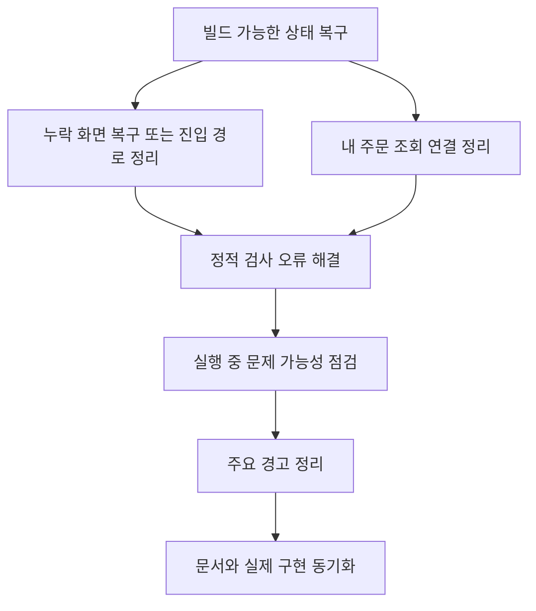

<a id="top"></a>

# 프론트엔드 현재 이슈

## 문서 포털

문서의 상세 구현, API, 아키텍처, 트러블슈팅은 아래 문서를 참고하세요.

| 분류 | 문서 | 분류 | 문서 |
| --- | --- | --- | --- |
| 루트 README | [README](../../README.md) | 서비스 README | [README](../README.md) |
| Engineering Notes | [Engineering Notes](../../docs/ENGINEERING.md) | Database Schema ERD | [Database Schema ERD](../../docs/database-schema.md) |
| 01 | [인증](01-auth.md) | 02 | [종목 목록](02-stock-list.md) |
| 03 | [종목 상세](03-stock-detail.md) | 04 | [차트](04-chart.md) |
| 05 | [주문](05-order.md) | 06 | [호가/체결](06-orderbook-execution.md) |
| 07 | [자산](07-user-asset.md) | 08 | [관심종목](08-watchlist.md) |
| 09 | [실시간 연결](09-websocket.md) | 10 | [프론트엔드 이슈](10-frontend-issues.md) |

## 목차

> [개요](#개요) ·
> [확인 명령](#확인-명령) ·
> [빌드 실패](#빌드-실패) ·
> [린트 실패](#린트-실패)

> [주요 경고](#주요-경고) ·
> [구현 상태상 주의점](#구현-상태상-주의점) ·
> [정리 우선순위](#정리-우선순위)

## 개요

이 문서는 현재 `StockFrontEnd` 코드 기준으로 확인된 빌드/린트 실패와 구현 누락 지점을 정리한다. 기능 문서에는 실제 존재하는 구현만 설명하고, 깨지는 부분은 이 문서에 모았다.

## 확인 명령

PowerShell에서 `npm` shim은 실행 정책으로 막혀 `npm.cmd`로 확인했다.

```bash
npm.cmd run lint
npm.cmd run build
```

## 빌드 실패

`npm.cmd run build`는 실패한다.

### 1. ProfileForm 모듈 없음

파일:

- `StockFrontEnd/app/profile/page.js`

문제:

- `../../features/Profile/ProfileForm` import가 존재하지만 `features/Profile/ProfileForm` 파일 또는 디렉터리가 현재 트리에서 확인되지 않는다.

### 2. MyOrderForm 모듈 없음

파일:

- `StockFrontEnd/app/myorder/page.js`

문제:

- `../../features/myorder/MyOrderForm` import가 존재하지만 `features/myorder/MyOrderForm` 파일 또는 디렉터리가 현재 트리에서 확인되지 않는다.

### 3. WatchListForm 모듈 없음

파일:

- `StockFrontEnd/app/watchlist/page.js`

문제:

- `../../features/watchList/WatchlistForm` import가 존재하지만 `features/watchList/WatchlistForm` 파일이 현재 트리에서 확인되지 않는다.

### 4. getMyOrder export 없음

파일:

- `StockFrontEnd/app/myorder/page.js`
- `StockFrontEnd/lib/trade.js`

문제:

- `app/myorder/page.js`는 `getMyOrder`를 `lib/trade.js`에서 import한다.
- 현재 `lib/trade.js`에는 `getOrderbookApi`만 export되어 있다.
- 내 주문 조회 함수는 `lib/order.js`의 `getMyAllOrder()` 또는 `getMyStockOrder(stockCode)`로 존재한다.

## 린트 실패

`npm.cmd run lint`는 10개 error와 다수 warning으로 실패한다.

### 1. Next Link 규칙 위반

파일:

- `StockFrontEnd/app/not-found.js`
- `StockFrontEnd/features/UI/Header.js`

문제:

- 내부 라우팅에 `<a href="/">`를 사용한다.
- Next.js lint 규칙상 내부 페이지 이동은 `next/link`의 `<Link />`를 사용해야 한다.

### 2. WebSocket Context에서 render 중 ref 접근

파일:

- `StockFrontEnd/util/websocket/context/OrderWebSocketContext.js`
- `StockFrontEnd/util/websocket/context/StockWebSocketContext.js`
- `StockFrontEnd/util/websocket/context/UserWebSocketContext.js`

문제:

- Provider value에서 `ref.current`를 render 중 직접 읽고 있다.
- React lint 규칙 `react-hooks/refs`에 의해 에러로 처리된다.

현재 패턴:

- `client: clientRef.current`
- `stockClient: stockClientRef.current`
- `userClient: userClientRef.current`

### 3. effect 내부 동기 setState

파일:

- `StockFrontEnd/features/StockDetail/MainContent/Order/Edit/useSideBarEditOrder.js`

문제:

- `useEffect` 내부에서 정정 대상 가격을 즉시 입력 상태에 반영한다.
  구현은 `setPrice()` (가격 입력 상태 갱신 기능)에서 담당한다.
- React lint 규칙 `react-hooks/set-state-in-effect`에 의해 에러로 처리된다.

## 주요 경고

린트 경고는 빌드를 직접 막지는 않지만 정리 대상이다.

### unused import/variable

여러 파일에서 사용하지 않는 import와 변수가 있다.

예:

- `StockFrontEnd/app/(normal)/page.js`
- `StockFrontEnd/app/stock/[stockCode]/page.js`
- `StockFrontEnd/features/StockDetail/StockDetailForm.jsx`
- `StockFrontEnd/features/UI/SideBar/SideBar.jsx`
- `StockFrontEnd/lib/candle.js`
- `StockFrontEnd/lib/stock.js`
- `StockFrontEnd/store/chartButtonStore.js`

### React Hook dependency 경고

일부 `useEffect`에서 dependency array 누락 경고가 있다.

예:

- `StockFrontEnd/app/error.js`
- `StockFrontEnd/features/StockDetail/Chart/ChartComponent.jsx`
- `StockFrontEnd/features/StockDetail/MainContent/Order/Buy/useOrderBuy.js`
- `StockFrontEnd/features/StockDetail/MainContent/Order/Sell/useOrderSell.js`
- `StockFrontEnd/util/websocket/useHogaSocket.js`
- `StockFrontEnd/util/websocket/useStockDetailSocket.js`

### img 관련 경고

여러 컴포넌트에서 `` 사용과 `alt` 누락 경고가 있다.

예:

- `StockFrontEnd/features/UI/Header.js`
- `StockFrontEnd/features/UI/HeaderProfile.js`
- `StockFrontEnd/features/UI/SideBar/AccountInfomation.jsx`
- `StockFrontEnd/features/UI/SideBar/HaveMyStockAsset.jsx`
- `StockFrontEnd/features/StockList/TossStockListForm.jsx`

## 구현 상태상 주의점

### 관심 종목 화면

관심 종목 API 래퍼는 존재하지만 `WatchListForm` 화면 파일이 없다. 따라서 `/watchlist` 페이지는 현재 빌드되지 않는다.

핵심 구현 파일:

기준 경로

`StockFrontEnd`

| 파일 |
| --- |
| `app/watchlist/page.js` |
| `lib/watchlist.js` |
### 프로필 화면

프로필 API 래퍼와 페이지는 존재하지만 `ProfileForm` 화면 파일이 없다. 따라서 `/profile` 페이지는 현재 빌드되지 않는다.

핵심 구현 파일:

기준 경로

`StockFrontEnd`

| 파일 |
| --- |
| `app/profile/page.js` |
| `lib/profile.js` |
### 내 주문 화면

`/myorder` 페이지는 존재하지만 화면 컴포넌트와 import API가 맞지 않는다.

핵심 구현 파일:

기준 경로

`StockFrontEnd`

| 파일 |
| --- |
| `app/myorder/page.js` |
| `lib/trade.js` |
| `lib/order.js` |
### 종목 상세 관심 여부

`app/stock/[stockCode]/page.js`에서 `isWatchedApi`를 import하지만 사용하지 않는다. 현재 확인 가능한 코드 기준으로 종목 상세에서 관심 여부 표시 또는 토글 기능은 완성되어 있지 않다.

### 대기 주문 정정 가격 반영

`OrderForm.jsx`는 `useMainContent()`의 `selectedPrice` 객체를 `useOrderEdit(selectedPrice, stockCode, tradeTypeTab)`로 전달한다. 이 값의 형태는 `{ value: price }`다.

반면 `useOrderEdit.js`의 effect는 `selectedPrice.toLocaleString('ko-KR')`처럼 숫자 값으로 취급한다. 대기 주문 정정 상태에서 호가 가격을 선택하면 의도한 가격 문자열이 아니라 객체 문자열이 들어갈 가능성이 있다.

핵심 구현 파일:

기준 경로

`StockFrontEnd/features/StockDetail/MainContent`

| 파일 |
| --- |
| `MainContent.jsx` |
| `Order/OrderForm.jsx` |
| `Order/Edit/useOrderEdit.js` |
### useHogaSocket 콜백 dependency

`useHogaSocket.js`는 effect 내부에서 `onSellUpdate`, `onBuyUpdate`를 사용하지만 dependency array에는 포함하지 않는다. lint warning으로 잡혀 있으며, 콜백이 변경되는 경우 구독 콜백이 최신 함수를 참조하지 않을 수 있다.

핵심 구현 파일:

기준 경로

`StockFrontEnd/util/websocket`

| 파일 |
| --- |
| `useHogaSocket.js` |

## 정리 우선순위



<div align="right">

[문서 맨 위로](#top)

</div>


