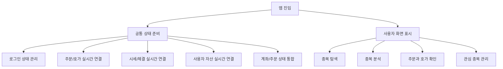

<a id="top"></a>

# StockFrontEnd

[](https://nextjs.org/)
[](https://react.dev/)
[](https://www.typescriptlang.org/)
[](https://zustand-demo.pmnd.rs/)
[](https://stomp-js.github.io/)
[](https://github.com/sockjs/sockjs-client)
[](https://tradingview.github.io/lightweight-charts/)
[](https://tailwindcss.com/)

## 문서 포털

문서의 상세 구현, API, 아키텍처, 트러블슈팅은 아래 문서를 참고하세요.

| 분류 | 문서 | 분류 | 문서 |
| --- | --- | --- | --- |
| 루트 README | [README](../README.md) | 서비스 README | [README](README.md) |
| Engineering Notes | [Engineering Notes](../docs/ENGINEERING.md) | Database Schema ERD | [Database Schema ERD](../docs/database-schema.md) |
| 01 | [인증](docs/01-auth.md) | 02 | [종목 목록](docs/02-stock-list.md) |
| 03 | [종목 상세](docs/03-stock-detail.md) | 04 | [차트](docs/04-chart.md) |
| 05 | [주문](docs/05-order.md) | 06 | [호가/체결](docs/06-orderbook-execution.md) |
| 07 | [자산](docs/07-user-asset.md) | 08 | [관심종목](docs/08-watchlist.md) |
| 09 | [실시간 연결](docs/09-websocket.md) | 10 | [프론트엔드 이슈](docs/10-frontend-issues.md) |

## 목차

> [프로젝트 개요](#프로젝트-개요) ·
> [주요 구현 내용](#주요-구현-내용) ·
> [시스템 아키텍처](#시스템-아키텍처)

> [저장소 구조](#저장소-구조) ·
> [실행 방법](#실행-방법)

## 프로젝트 개요

Next.js 기반 주식 거래 시뮬레이션 프론트엔드입니다. 사용자 인증, 종목 목록/상세, 차트, 호가, 주문, 보유 자산, 관심종목, WebSocket 실시간 갱신 화면을 담당합니다.

프론트엔드는 초기 데이터는 REST API로 조회하고, 이후 바뀌는 주문/호가/체결/시세/Candle/자산 상태는 서비스별 WebSocket 구독으로 반영한다. 실시간 흐름을 이렇게 나눈 배경은 루트의 [Engineering Notes](../docs/ENGINEERING.md)에 정리했습니다.

## 주요 구현 내용

- 로그인, 회원가입, 토큰 쿠키 저장
- 종목 목록과 종목 상세 조회
- 실시간 현재가, 체결, 호가 WebSocket 구독
- Candle 차트 초기 조회와 실시간 Candle 반영
- 매수, 매도, 주문 정정, 주문 취소 UI
- 보유 현금/주식과 평가 정보 표시
- 관심종목 등록, 삭제, 목록 조회

## 시스템 아키텍처



## 저장소 구조

```text
StockFrontEnd/
├─ app/                 # Next.js App Router 페이지
├─ features/            # 화면별 기능 컴포넌트
├─ lib/                 # API 요청 래퍼
├─ store/               # Zustand 상태
├─ util/                # WebSocket 등 공통 유틸
└─ docs/                # 프론트엔드 상세 문서
```

## 실행 방법

```bash
npm install
npm run dev
```

기본 개발 서버는 `http://localhost:3000`에서 실행됩니다.

<div align="right">

[문서 맨 위로](#top)

</div>


