<a id="top"></a>

# Documentation Index

## 문서 포털

문서의 상세 구현, API, 아키텍처, 트러블슈팅은 아래 문서를 참고한다.

| 분류 | 문서 | 분류 | 문서 |
| --- | --- | --- | --- |
| 루트 README | [README](../README.md) | 서비스 README | [프론트엔드](../StockFrontEnd/README.md) |
| Engineering Notes | [Engineering Notes](ENGINEERING.md) | Database Schema ERD | [Database Schema ERD](database-schema.md) |
| Troubleshooting | [Troubleshooting](TROUBLESHOOTING.md) | Docker | [Docker / 인프라](../docker/README.md) |
| user-service | [user-service](../StockBackEndDistributed/user-service/README.md) | stock-service | [stock-service](../StockBackEndDistributed/stock-service/README.md) |
| order-service | [order-service](../StockBackEndDistributed/order-service/README.md) |  |  |

## 목차

> [프로젝트 전체 문서 구조](#프로젝트-전체-문서-구조) ·
> [데이터베이스](#데이터베이스) ·
> [설계 문서](#설계-문서) ·
> [프론트엔드](#프론트엔드) ·
> [사용자 서비스](#사용자-서비스)

> [종목 서비스](#종목-서비스) ·
> [주문 서비스](#주문-서비스) ·
> [현재 이슈와 트러블슈팅](#현재-이슈와-트러블슈팅) ·
> [시스템 구조](#시스템-구조) ·
> [문서 구조 다이어그램](#문서-구조-다이어그램)

프로젝트 문서를 한눈에 찾기 위한 문서 포털입니다. 서비스별 README와 상세 docs 문서를 목적별로 묶어 정리합니다.

주요 설계 배경과 기술 선택 이유는 [Engineering Notes](ENGINEERING.md)에서 확인할 수 있다.

## 프로젝트 전체 문서 구조

```text
Stock/
├─ README.md
├─ docs/
│  ├─ DOCUMENTATION.md
│  ├─ ENGINEERING.md
│  ├─ TROUBLESHOOTING.md
│  └─ database-schema.md
├─ StockFrontEnd/
│  ├─ README.md
│  └─ docs/
├─ StockBackEndDistributed/
│  ├─ user-service/
│  │  ├─ README.md
│  │  └─ docs/
│  ├─ stock-service/
│  │  ├─ README.md
│  │  └─ docs/
│  └─ order-service/
│     ├─ README.md
│     └─ docs/
└─ docker/
```

## 데이터베이스

JPA Entity 기준의 서비스별 ERD와 실제 JPA 연관관계를 정리합니다.

- [Database Schema ERD](database-schema.md)

## 설계 문서

프로젝트를 시작한 이유, MSA/Kafka/Redis/WebSocket/Candle 설계 선택, KIS 연동 중단과 배운 점을 설명합니다.

- [Engineering Notes](ENGINEERING.md)
- [Troubleshooting](TROUBLESHOOTING.md)

## 프론트엔드

프론트엔드 화면, 상태 관리, API 요청, WebSocket 구독 흐름을 다룹니다.

**진입 문서**

- [StockFrontEnd README](../StockFrontEnd/README.md)

**상세 문서**

- [인증](../StockFrontEnd/docs/01-auth.md)
- [종목 목록](../StockFrontEnd/docs/02-stock-list.md)
- [종목 상세](../StockFrontEnd/docs/03-stock-detail.md)
- [차트](../StockFrontEnd/docs/04-chart.md)
- [주문](../StockFrontEnd/docs/05-order.md)
- [호가/체결](../StockFrontEnd/docs/06-orderbook-execution.md)
- [자산](../StockFrontEnd/docs/07-user-asset.md)
- [관심종목](../StockFrontEnd/docs/08-watchlist.md)
- [실시간 연결](../StockFrontEnd/docs/09-websocket.md)
- [프론트엔드 이슈](../StockFrontEnd/docs/10-frontend-issues.md)

## 사용자 서비스

인증, 사용자, 자산, 관심종목, 주문 검증, Kafka 정산 흐름을 다룹니다.

**진입 문서**

- [user-service README](../StockBackEndDistributed/user-service/README.md)

**상세 문서**

- [개요](../StockBackEndDistributed/user-service/docs/01-overview.md)
- [인증/JWT](../StockBackEndDistributed/user-service/docs/02-auth-jwt.md)
- [회원가입/프로필](../StockBackEndDistributed/user-service/docs/03-user-register-profile.md)
- [자산/주문 검증](../StockBackEndDistributed/user-service/docs/04-user-asset-order-validation.md)
- [Kafka 정산](../StockBackEndDistributed/user-service/docs/05-settlement-kafka.md)
- [관심종목](../StockBackEndDistributed/user-service/docs/06-watchlist.md)
- [실시간 연결](../StockBackEndDistributed/user-service/docs/07-websocket.md)
- [도메인 모델](../StockBackEndDistributed/user-service/docs/08-domain-model.md)
- [보안 설정](../StockBackEndDistributed/user-service/docs/09-security-config.md)
- [user-service 이슈](../StockBackEndDistributed/user-service/docs/10-user-service-issues.md)

## 종목 서비스

종목 API, 실시간 시세 캐시, Kafka 체결 반영, WebSocket 시세 발행, Scheduler를 다룹니다.

**진입 문서**

- [stock-service README](../StockBackEndDistributed/stock-service/README.md)

**상세 문서**

- [개요](../StockBackEndDistributed/stock-service/docs/01-overview.md)
- [종목 API](../StockBackEndDistributed/stock-service/docs/02-stock-api.md)
- [실시간 시세 캐시](../StockBackEndDistributed/stock-service/docs/03-realtime-stock-cache.md)
- [Kafka 체결 처리](../StockBackEndDistributed/stock-service/docs/04-kafka-trade-execution.md)
- [실시간 연결](../StockBackEndDistributed/stock-service/docs/05-websocket.md)
- [주기 작업](../StockBackEndDistributed/stock-service/docs/06-scheduler.md)
- [Candle 구조](../StockBackEndDistributed/stock-service/docs/07-candle-structure.md)
- [외부 시세 연동 사용 중단](../StockBackEndDistributed/stock-service/docs/08-external-market-data-disabled.md)
- [도메인 모델](../StockBackEndDistributed/stock-service/docs/09-domain-model.md)
- [stock-service 이슈](../StockBackEndDistributed/stock-service/docs/10-stock-service-issues.md)
- [stock-service 트러블슈팅](../StockBackEndDistributed/stock-service/docs/11-troubleshooting.md)

## 주문 서비스

주문 API, Kafka 주문 처리, 호가장, 매칭 엔진, 정산 이벤트, Candle 차트, WebSocket 발행을 다룹니다.

**진입 문서**

- [order-service README](../StockBackEndDistributed/order-service/README.md)

**상세 문서**

- [개요](../StockBackEndDistributed/order-service/docs/00-order-service-overview.md)
- [주문 API](../StockBackEndDistributed/order-service/docs/01-order-api.md)
- [Kafka 주문 흐름](../StockBackEndDistributed/order-service/docs/02-kafka-order-flow.md)
- [정산/체결 이벤트](../StockBackEndDistributed/order-service/docs/03-settlement-and-trade-events.md)
- [호가장](../StockBackEndDistributed/order-service/docs/04-orderbook.md)
- [매칭 엔진](../StockBackEndDistributed/order-service/docs/05-matching-engine.md)
- [Candle 차트 흐름](../StockBackEndDistributed/order-service/docs/06-candle-chart-flow.md)
- [실시간 발행 흐름](../StockBackEndDistributed/order-service/docs/07-websocket-flow.md)
- [Bot 거래 구조](../StockBackEndDistributed/order-service/docs/08-bot-trading-flow.md)
- [초기화/주기 작업](../StockBackEndDistributed/order-service/docs/09-initialization-and-scheduler.md)
- [order-service 이슈](../StockBackEndDistributed/order-service/docs/10-order-service-issues.md)
- [order-service 트러블슈팅](../StockBackEndDistributed/order-service/docs/11-troubleshooting.md)

## 현재 이슈와 트러블슈팅

현재 발견된 문제점, 깨지는 부분, 개선 필요 항목과 서비스별 문제 해결 과정을 모아둔 문서입니다.

- [프론트엔드 이슈](../StockFrontEnd/docs/10-frontend-issues.md)
- [user-service 이슈](../StockBackEndDistributed/user-service/docs/10-user-service-issues.md)
- [stock-service 이슈](../StockBackEndDistributed/stock-service/docs/10-stock-service-issues.md)
- [stock-service 트러블슈팅](../StockBackEndDistributed/stock-service/docs/11-troubleshooting.md)
- [order-service 이슈](../StockBackEndDistributed/order-service/docs/10-order-service-issues.md)
- [order-service 트러블슈팅](../StockBackEndDistributed/order-service/docs/11-troubleshooting.md)

## 시스템 구조

구조, 흐름, 도메인 모델, Scheduler, WebSocket, Kafka 등 시스템 이해에 필요한 문서입니다.

**전체 및 서비스 개요**

- [프로젝트 루트 README](../README.md)
- [Engineering Notes](ENGINEERING.md)
- [Troubleshooting](TROUBLESHOOTING.md)
- [Database Schema ERD](database-schema.md)
- [user-service 개요](../StockBackEndDistributed/user-service/docs/01-overview.md)
- [stock-service 개요](../StockBackEndDistributed/stock-service/docs/01-overview.md)
- [order-service 개요](../StockBackEndDistributed/order-service/docs/00-order-service-overview.md)

**백엔드 흐름**

- [user-service Kafka 정산](../StockBackEndDistributed/user-service/docs/05-settlement-kafka.md)
- [stock-service Kafka 체결 처리](../StockBackEndDistributed/stock-service/docs/04-kafka-trade-execution.md)
- [order-service Kafka 주문 흐름](../StockBackEndDistributed/order-service/docs/02-kafka-order-flow.md)
- [order-service 정산/체결 이벤트](../StockBackEndDistributed/order-service/docs/03-settlement-and-trade-events.md)
- [order-service 호가장](../StockBackEndDistributed/order-service/docs/04-orderbook.md)
- [order-service 매칭 엔진](../StockBackEndDistributed/order-service/docs/05-matching-engine.md)

**실시간 연결 / 주기 작업 / 도메인**

- [프론트엔드 실시간 연결](../StockFrontEnd/docs/09-websocket.md)
- [사용자 서비스 실시간 알림](../StockBackEndDistributed/user-service/docs/07-websocket.md)
- [종목 서비스 시세 실시간 발행](../StockBackEndDistributed/stock-service/docs/05-websocket.md)
- [주문 서비스 실시간 발행 흐름](../StockBackEndDistributed/order-service/docs/07-websocket-flow.md)
- [종목 서비스 주기 작업](../StockBackEndDistributed/stock-service/docs/06-scheduler.md)
- [주문 서비스 초기화와 주기 작업](../StockBackEndDistributed/order-service/docs/09-initialization-and-scheduler.md)
- [user-service 도메인 모델](../StockBackEndDistributed/user-service/docs/08-domain-model.md)
- [stock-service 도메인 모델](../StockBackEndDistributed/stock-service/docs/09-domain-model.md)

## 문서 구조 다이어그램

```mermaid
flowchart TD
    Root["프로젝트 README"] --> Index["문서 포털"]
    Root --> RootDocs["공통 설계 문서"]
    RootDocs --> DatabaseSchema["데이터베이스 스키마"]
    RootDocs --> Engineering["설계 배경과 기술 선택"]
    Index --> FE["프론트엔드 문서"]
    Index --> User["사용자 서비스 문서"]
    Index --> Stock["종목 서비스 문서"]
    Index --> Order["주문 서비스 문서"]
    Index --> Database["데이터베이스 문서"]
    Index --> Engineering
    Database --> DatabaseSchema

    FE --> FEReadme["프론트엔드 개요"]
    FE --> FEDocs["프론트엔드 기능 문서"]

    User --> UserReadme["사용자 서비스 개요"]
    User --> UserDocs["사용자 기능 문서"]

    Stock --> StockReadme["종목 서비스 개요"]
    Stock --> StockDocs["종목 기능 문서"]

    Order --> OrderReadme["주문 서비스 개요"]
    Order --> OrderDocs["주문 기능 문서"]

    Index --> Trouble["현재 이슈와 트러블슈팅"]
    Trouble --> FEIssue["프론트엔드 이슈"]
    Trouble --> UserIssue["사용자 서비스 이슈"]
    Trouble --> StockIssue["종목 서비스 이슈"]
    Trouble --> OrderIssue["주문 서비스 이슈"]
    Trouble --> StockTrouble["종목 서비스 트러블슈팅"]
    Trouble --> OrderTrouble["주문 서비스 트러블슈팅"]

    Index --> Arch["시스템 구조와 흐름"]
    Arch --> Kafka["이벤트 흐름"]
    Arch --> WS["실시간 전달 흐름"]
    Arch --> Domain["도메인 모델"]
    Arch --> Scheduler["주기 작업 흐름"]
```



<div align="right">

[문서 맨 위로](#top)

</div>


