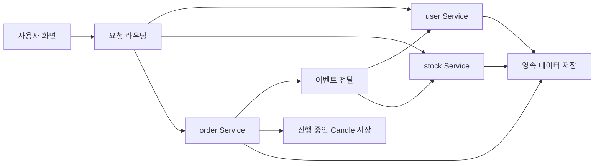
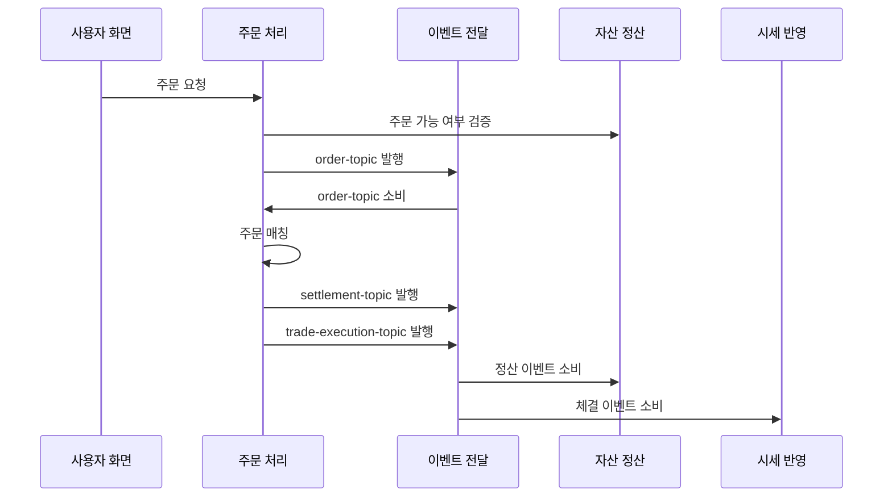
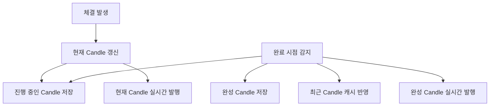

# 설계 문서

## 문서 포털

문서의 상세 구현, API, 아키텍처, 트러블슈팅은 아래 문서를 참고한다.

| 분류 | 문서 | 분류 | 문서 |
| --- | --- | --- | --- |
| 루트 README | [README](../README.md) | 서비스 README | [프론트엔드](../StockFrontEnd/README.md) |
| 설계 문서 | [Engineering Notes](ENGINEERING.md) | Database Schema ERD | [Database Schema ERD](database-schema.md) |
| 트러블슈팅 | [Troubleshooting](TROUBLESHOOTING.md) | Docker | [Docker / 인프라](../docker/README.md) |
| user-service | [user-service](../StockBackEndDistributed/user-service/README.md) | stock-service | [stock-service](../StockBackEndDistributed/stock-service/README.md) |
| order-service | [order-service](../StockBackEndDistributed/order-service/README.md) |  |  |

## 목차

> [프로젝트를 시작한 이유](#프로젝트를-시작한-이유) ·
> [왜 MSA를 선택했는가](#왜-msa를-선택했는가) ·
> [왜 Kafka를 사용했는가](#왜-kafka를-사용했는가) ·
> [왜 Redis를 사용했는가](#왜-redis를-사용했는가) ·
> [왜 OrderBook을 메모리에서 관리하는가](#왜-orderbook을-메모리에서-관리하는가)

> [왜 WebSocket을 사용했는가](#왜-websocket을-사용했는가) ·
> [왜 Candle을 Redis에 먼저 저장하는가](#왜-candle을-redis에-먼저-저장하는가) ·
> [실패했던 시도: KIS 연동](#실패했던-시도-kis-연동) ·
> [대표 트러블슈팅](#대표-트러블슈팅) ·
> [프로젝트를 통해 배운 점](#프로젝트를-통해-배운-점)

## 프로젝트를 시작한 이유

이전 프로젝트에서 WebSocket과 Kafka를 활용한 모의 결제 시스템을 구현한 경험이 있었다. 이번 프로젝트에서는 그 경험을 확장해 실시간 이벤트 기반 시스템을 직접 설계해보고자 했다.

주식 거래 시스템은 주문, 체결, 시세, 차트가 모두 실시간으로 연결되는 도메인이기 때문에 Kafka와 WebSocket을 중심으로 한 구조를 적용하기에 적합하다고 판단했다.

프로젝트는 초기에는 모놀리스 구조로 시작했으며, 이후 책임을 명확히 분리하고 결합도를 낮추기 위해 user-service, stock-service, order-service의 MSA 구조로 리팩터링했다.

## 왜 MSA를 선택했는가

이 프로젝트에서는 주문 처리, 시세 조회, 사용자 자산 관리의 성격이 서로 달랐으며 하나의 서비스에서 모두 처리하면 기능 변경 시 영향 범위가 커지고, 주문 처리 로직과 사용자 관리 로직이 강하게 결합된다.

따라서 도메인 책임을 기준으로 서비스를 분리하기 위해 MSA 구조를 선택했다.

| 서비스 | 책임 | 변경 이유 |
| --- | --- | --- |
| `user-service` | 인증, 사용자, 자산, 관심종목, 주문 검증, 정산 | 사용자/자산 정책 변경 |
| `stock-service` | 종목 조회, 실시간 시세 캐시, 체결 이벤트 반영 | 시세 표시/통계 정책 변경 |
| `order-service` | 주문 API, 호가장, 매칭, 정산 이벤트, Candle, WebSocket | 주문 처리와 체결 규칙 변경 |

주문 체결 로직이 복잡해질수록 인증/자산 로직, 종목 시세 로직과 같은 서비스 안에 두면 변경 범위가 커진다. 그래서 주문 매칭은 `order-service`, 자산 검증과 정산은 `user-service`, 체결 이후 현재가 반영은 `stock-service`로 나누었다.

단점도 있다. 서비스 간 HTTP 연동, Kafka topic, WebSocket topic, 설정 파일이 늘어나면서 운영 복잡도는 올라갔다. 이 프로젝트에서는 그 복잡도를 감수하고 경계를 분리하는 쪽을 선택했다.

## 왜 Kafka를 사용했는가

Kafka는 단순히 처리량을 분산하기 위한 목적만이 아니라, MSA 환경에서 분리된 서비스 간 이벤트를 안정적으로 전달하기 위해 도입했다.

주문은 `order-service` API에서 바로 매칭되지 않는다. 주문 가능 여부를 `user-service`에 검증한 뒤 Kafka를 통해 `order-service`로 발행되고, Consumer가 이를 소비해 종목별 락을 잡고 매칭을 수행한다.

서비스간의 통신은 체결 이후에는 두 방향의 이벤트가 발생한다.

- `settlement-topic`: `user-service`가 소비해 사용자 현금과 보유 주식을 정산한다.
- `trade-execution-topic`: `stock-service`가 소비해 종목 현재가, 거래량, 등락률 등 실시간 시세 캐시를 갱신한다.

Kafka를 사용한 더 중요한 이유는 체결 이후 여러 서비스가 같은 결과를 각자의 책임에 맞게 반영하도록 만들기 위해서다.

## 왜 Redis를 사용했는가

Redis는 메모리 기반 데이터 저장소라 빠른 읽기/쓰기와 자주 변경되는 데이터를 처리하는 데 적합하다. 이 프로젝트에서는 Candle처럼 지속적으로 조회·갱신되는 데이터를 Redis에서 관리하도록 설계했다.

Redis는 두 가지 성격의 데이터에 사용된다.

첫째, `user-service`의 사용자 인증을 위한 토큰으로 로그인 후 발급한 refresh token을 Redis에 저장하고, 재발급 흐름에서 저장된 토큰을 확인한다.

둘째, `order-service`는 현재 진행 중인 Candle(차트 봉)을 DB가 아닌 Redis에 저장한다. 체결이 발생할 때마다 현재 1분봉/일봉 값을 계속 갱신된다. Scheduler가 정해진 분/일 시간이 되면 DB와 메모리 캐시에 반영하는 구조를 선택했다.

## 왜 OrderBook을 메모리에서 관리하는가

호가장은 매칭 중에 가장 자주 읽고 쓰는 자료구조다. 매수/매도 최우선 가격을 찾고, 같은 가격대에서는 먼저 들어온 주문부터 체결해야 한다. 입출력이 활발하며 조회가 무겁기때문에 `order-service`는 종목별 `OrderBook`을 메모리에 보관하고, 가격 정렬과 주문 순서 관리를 위해 다음 구조를 사용한다.

- 매수 호가: 높은 가격 우선
- 매도 호가: 낮은 가격 우선
- 같은 가격대: `PriceLevel`의 주문 큐

DB는 체결 결과와 주문 상태를 저장하는 역할에 가깝고, 매칭 루프의 실시간 자료구조로 사용하지 않았다. DB 조회 기반으로 최우선 호가를 매번 계산하면 매칭 로직이 느려지고, 가격/시간 우선순위를 코드에서 명확히 다루기 어렵다.

메모리 관리의 단점은 서버 재시작 시 복구가 필요하다는 점이다. 이를 보완하기 위해 서버 시작 시 DB의 `PENDING`, `PARTIAL` 주문을 읽어 호가장을 다시 구성하는 초기화 흐름이 있다.

## 왜 WebSocket을 사용했는가

주문/체결 화면은 사용자가 새로고침하거나 반복 조회하지 않아도 상태가 바뀌어야 한다. REST API는 초기 데이터를 조회하는 데 적합하지만, 이후 발생하는 변경 사항을 실시간으로 전달하기에는 적합하지 않아
WebSocket을 사용했다.

현재 WebSocket은 다음 변경을 화면으로 전달한다.

| 서비스 | 발행 데이터 |
| --- | --- |
| `order-service` | 호가, 주문 상태, 현재 Candle, 완성 Candle, 주문 실패 메시지 |
| `stock-service` | 현재가 스냅샷, 체결 데이터 |
| `user-service` | 사용자 자산, 보유 주식 변경 |

이 구조에서 REST는 초기 데이터 조회, WebSocket은 이후 변경분 전달이라는 역할을 갖는다.

## 왜 Candle을 Redis에 먼저 저장하는가

진행 중인 Candle은 체결이 발생할 때마다 계속 변경된다.

매번 DB에 저장하거나 조회하면 불필요한 I/O가 발생하므로 Redis에서 현재 상태를 관리하도록 설계했다.

진행중인 차트 분/일봉은 완료되기 전까지 계속 바뀌며 체결이 발생할 때마다 종가, 고가, 저가, 거래량이 갱신된다.

체결 발생 시 `order-service`의 Candle 흐름이 Redis에 현재 Candle을 먼저 반영하고, Scheduler가 완료된 Candle을 DB와 캐시에 반영한 뒤 WebSocket으로 발행하는 형태다.

이 설계의 목적은 진행 중인 Candle과 확정된 Candle을 분리하며 Redis는 계속 바뀌는 현재 Candle을 담고, DB는 완료된 Candle을 담는다.

## 실패했던 시도: KIS 연동

외부 시세 연동을 위해 KIS 연동 코드를 만들었지만 현재 주요 흐름에서는 사용하지 않는다.

중단한 이유는 프로젝트 내부의 체결 기반 캐시 데이터와 외부 시세 데이터 사이에 불일치가 생겼기 때문이다. 이 프로젝트의 주문, 체결, 호가, Candle은 내부 시뮬레이션 데이터로 움직인다. 여기에 실제 외부 시세를 섞으면 현재가, 등락률, 차트, 체결 내역이 서로 다른 기준을 갖게 된다.

그래서 현재 시세 갱신 설명은 다음 흐름을 기준으로 한다.

- `order-service`의 체결
- `trade-execution-topic` 발행
- 체결 이벤트 소비
- 실시간 시세 캐시 갱신
- WebSocket 시세 발행

KIS 관련 코드는 잔여 코드 성격이며, 현재 활성 시세 흐름으로 설명하지 않는다.

## 트러블슈팅 및 느낀점

문제 해결 과정은 [Troubleshooting](TROUBLESHOOTING.md)을 참고한다.

[문서 맨 위로](#top)

