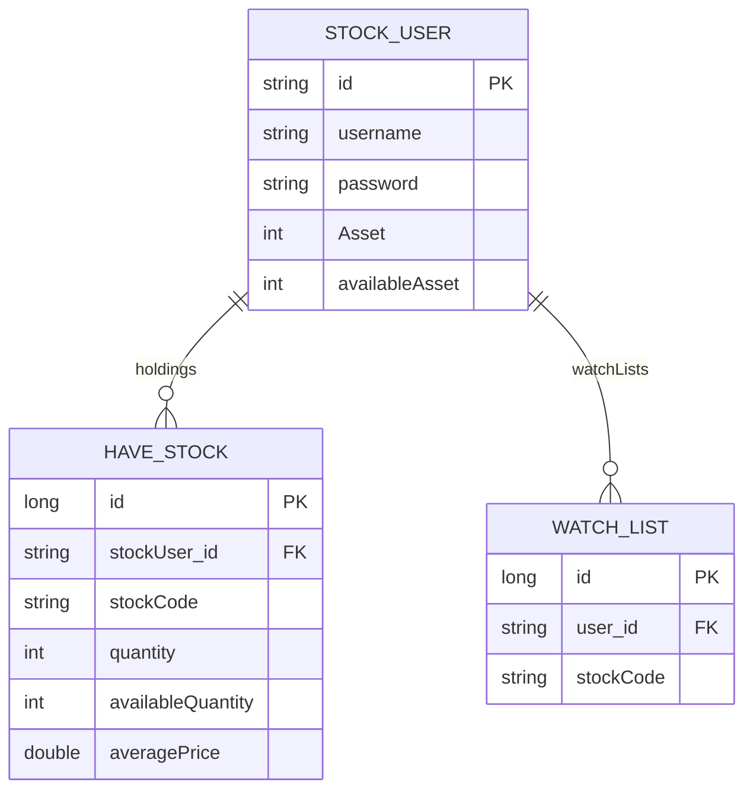
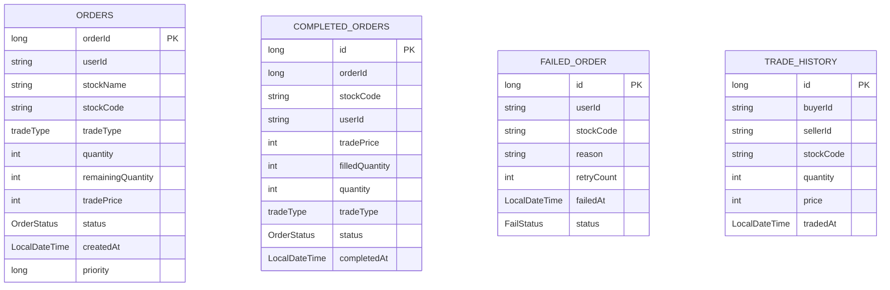
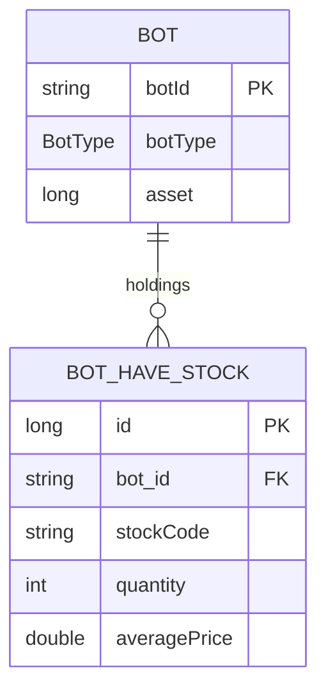
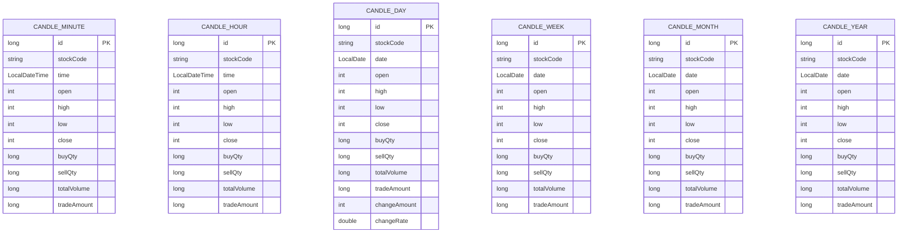
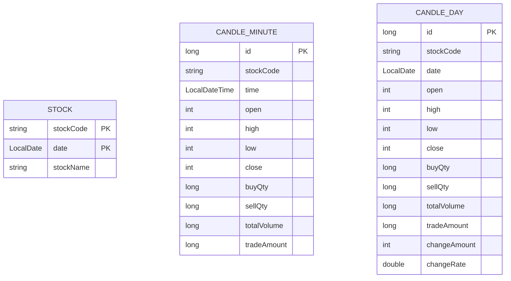

# Database Schema ERD

## 문서 포털

문서의 상세 구현, API, 아키텍처, 트러블슈팅은 아래 문서를 참고하세요.

| 분류 | 문서 | 분류 | 문서 |
| --- | --- | --- | --- |
| 루트 README | [README](../README.md) | 서비스 README | [프론트엔드](../StockFrontEnd/README.md) |
| Engineering Notes | [Engineering Notes](ENGINEERING.md) | Database Schema ERD | [Database Schema ERD](database-schema.md) |
| user-service | [user-service](../StockBackEndDistributed/user-service/README.md) | stock-service | [stock-service](../StockBackEndDistributed/stock-service/README.md) |
| order-service | [order-service](../StockBackEndDistributed/order-service/README.md) | Docker | [Docker / 인프라](../docker/README.md) |

## 목차

> [사용자 서비스](#사용자-서비스) ·
> [주문 서비스](#주문-서비스)

> [종목 서비스](#종목-서비스)

이 문서는 프로젝트의 JPA Entity를 기준으로 작성한 Mermaid ERD이다. 실제 코드에 선언된 Entity와 JPA 연관관계만 관계선으로 표현한다.

- 단순 `userId`, `stockCode`, `orderId` 문자열/숫자 필드는 외래키처럼 사용되더라도 JPA 관계 애너테이션이 없으면 관계선으로 표시하지 않는다.
- `@ManyToOne`, `@OneToMany` 등 JPA 연관관계가 있는 경우에만 Mermaid 관계선으로 표시한다.
- 각 서비스는 별도 애플리케이션이므로 서비스별로 ERD를 분리한다.

## 사용자 서비스

### ERD

### 관계 설명

| 관계 | 코드 기준 |
| --- | --- |
| `StockUser` 1:N `HaveStock` | `StockUser.holdings`의 `@OneToMany(mappedBy = "stockUser")`, `HaveStock.stockUser`의 `@ManyToOne`, `@JoinColumn(name = "stockUser_id")` |
| `StockUser` 1:N `WatchList` | `StockUser.watchLists`의 `@OneToMany(mappedBy = "stockUser")`, `WatchList.stockUser`의 `@ManyToOne`, `@JoinColumn(name = "user_id")` |

### 핵심 구현 파일

기준 경로

`StockBackEndDistributed/user-service/src/main/java/Poi/Stock`

| Entity | 파일 |
| --- | --- |
| StockUser | `features/User/StockUser.java` |
| HaveStock | `features/User/HaveStock.java` |
| WatchList | `features/WatchList/WatchList.java` |

## 주문 서비스

### Order Domain ERD

| Entity | 파일 |
| --- | --- |
| Order | `features/Order/Order.java` |
| CompletedOrder | `features/CompletedOrder/CompletedOrder.java` |
| FailedOrder | `features/FailedOrder/FailedOrder.java` |
| TradeHistory | `features/TradeHistory/TradeHistory.java` |

Order Domain에는 현재 JPA 연관관계가 선언되어 있지 않다. `CompletedOrder.orderId`는 원본 주문 ID를 값으로 저장하지만 `Order`와 JPA 관계로 매핑되어 있지 않다.

### Bot Domain ERD

| Entity | 파일 |
| --- | --- |
| Bot | `features/Bot/Bot.java` |
| BotHaveStock | `features/Bot/BotHaveStock.java` |

Bot Domain의 실제 JPA 연관관계는 `BotHaveStock.bot`의 `@ManyToOne(fetch = FetchType.LAZY)`이다.

### Candle Domain ERD

Candle Entity들은 `order-service` 안에 있지만 주문 Entity와 JPA 관계로 연결되어 있지 않다. 체결 기반 Candle 저장/조회 흐름에서 사용하는 별도 Candle Domain으로 분리한다.

| Entity | 파일 |
| --- | --- |
| CandleMinute | `CandleMinute.java` |
| CandleHour | `CandleHour.java` |
| CandleDay | `CandleDay.java` |
| CandleWeek | `CandleWeek.java` |
| CandleMonth | `CandleMonth.java` |
| CandleYear | `CandleYear.java` |

세부 기준 경로

`features/Candle/Entity`

### 관계 설명

| 관계 | 코드 기준 |
| --- | --- |
| `Bot` 1:N `BotHaveStock` | `BotHaveStock.bot`의 `@ManyToOne(fetch = FetchType.LAZY)` |
| Order Domain | 현재 JPA 연관관계 없음 |
| Candle Domain | 현재 JPA 연관관계 없음 |

### 관계선으로 표시하지 않은 참조

| 참조 필드 | 이유 |
| --- | --- |
| `CompletedOrder.orderId` | 원본 주문 ID를 값으로 복사하지만 `Order`와 JPA 관계가 없다. |
| `Order.userId`, `CompletedOrder.userId`, `FailedOrder.userId`, `TradeHistory.buyerId`, `TradeHistory.sellerId` | 사용자 식별자를 문자열로 저장하지만 user-service Entity와 JPA 관계가 없다. |
| `Order.stockCode`, `CompletedOrder.stockCode`, `FailedOrder.stockCode`, `TradeHistory.stockCode`, Candle 계열 `stockCode`, `BotHaveStock.stockCode` | 종목 코드를 값으로 저장하지만 `Stock`과 JPA 관계가 없다. |

### 핵심 구현 파일

기준 경로

`StockBackEndDistributed/order-service/src/main/java/Poi/Stock`

## 종목 서비스

### ERD

### 관계 설명

`stock-service`의 Entity에는 현재 `@ManyToOne`, `@OneToMany`, `@OneToOne`, `@ManyToMany`로 선언된 JPA 연관관계가 없다. `CandleMinute.stockCode`와 `CandleDay.stockCode`는 종목 코드를 값으로 저장하지만 `Stock` Entity와 JPA 관계로 매핑되어 있지 않다.

### 핵심 구현 파일

기준 경로

`StockBackEndDistributed/stock-service/src/main/java/Poi/Stock`

| Entity | 파일 |
| --- | --- |
| Stock | `features/Stock/Stock.java` |
| CandleMinute | `features/Candle/CandleMinute.java` |
| CandleDay | `features/Candle/CandleDay.java` |

[문서 맨 위로](#top)

